 # The One Flow 

 > Flow orchestration is the core function of Standard OPS. approve visually dragging and arranging atomic Plugin with different functions on the canvas, system Workflow in different Scene can be realized. 

 # Standard OPS Flow 

 The operation step sorted out according to the actual operation Scene Operation are flexibly combined approve different flow logics (parallel, Branch, conditional parallel). 

 # Standard OPS Plugin 

 The smallest execute unit in Standard OPS. It is Two according to the Business Name logic of each ESB Components, and rich form interfaces and verification logic are added.  For example, a Script execute of One Job System, a New Cluster of a CMDB, and a emailNotice of PaaS. 

 Of course, in addition to the Standard Plugin packaged by the BlueKing system, you can Develop third-party plug-ins by yourself, such as an Operation atom of the company's internal system, an operation of the cloud Service, etc. 

 # Practical demonstration 

 Here's an example of the simplest Flow orchestration: execute One Script and then send a message notification. 

 ## 1. Create a add Flow 

 Under demo experience Business Name, Flow-add 

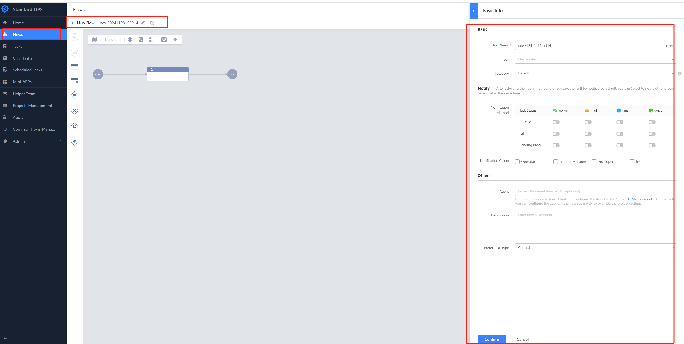

 ## 2. Orchestration Flow In this process, we use One calling Job System to execute a Script, and then add a notification Node 

 Double-click Node to open the setting panel and Choose the Job System (JOB)-execute Plugin: 

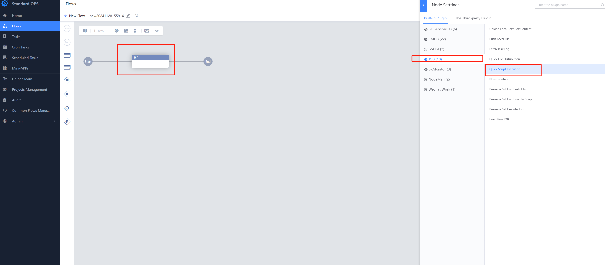

 Setting the One nodes 

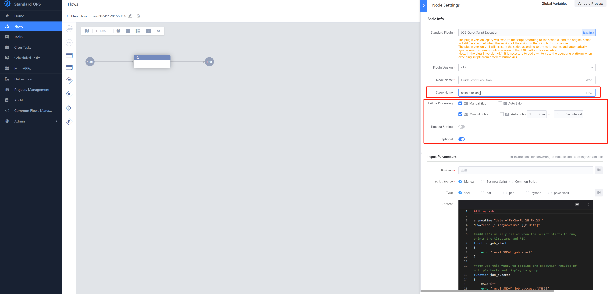

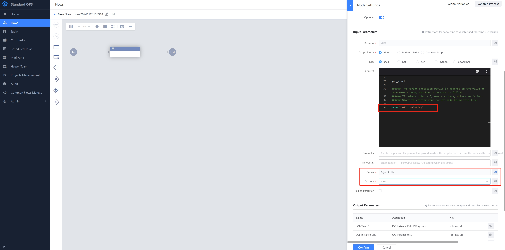

 Append One message notification Plugin. For quick Operation on the canvas, see [Quick Operations on Standard OPS Canvas (1)](https://bk.tencent.com/s-mart/community/question/10032)

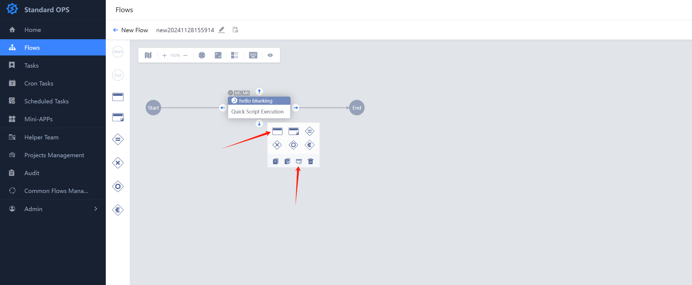

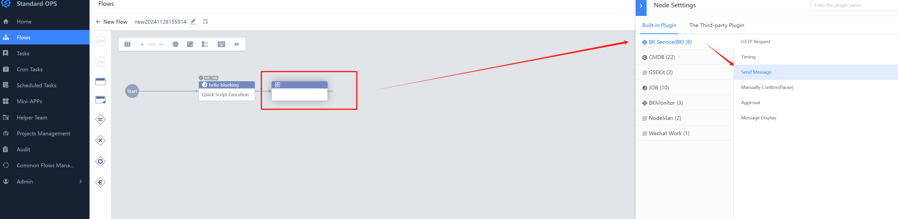

 setting Message Notification node 

 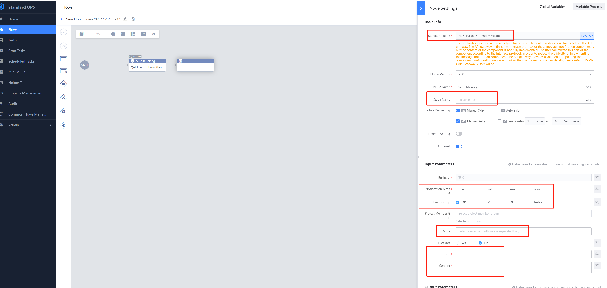

 ## 3. New task 

 Flow is the template of Task. After the process is setting, you can New task execute 

 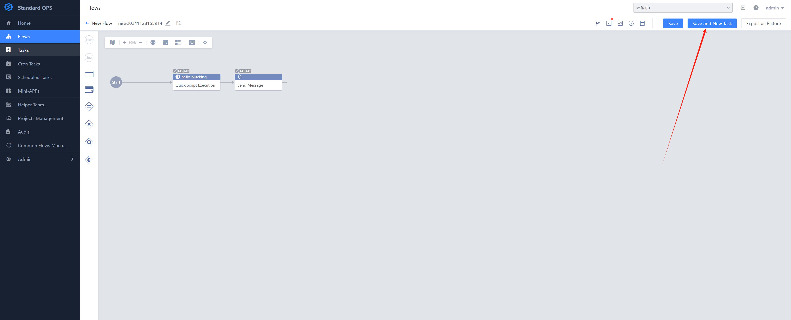

 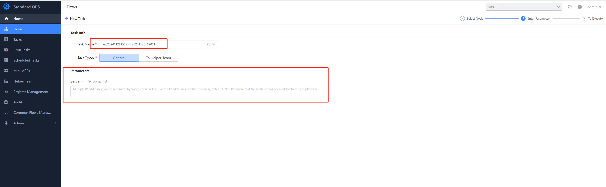

 ## 4. Execute the Checks
 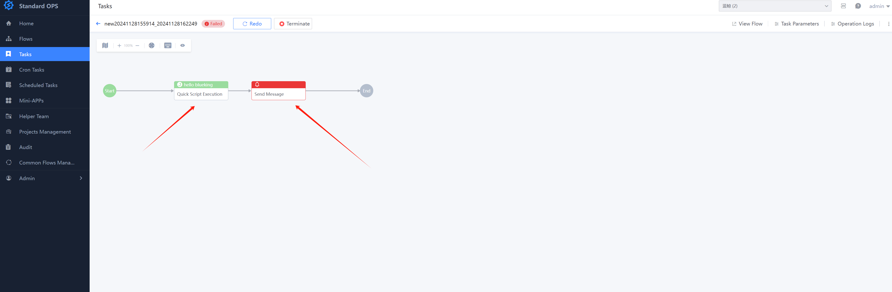
 You can click the Node Check the pipelinesDetail, such as Script execution, or location to the Job System to view the detailed pipelinesHistory 

 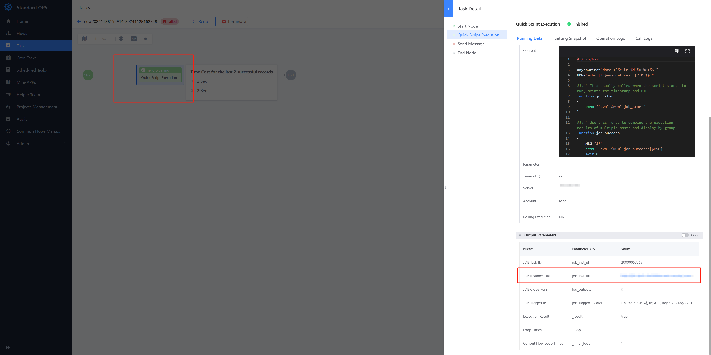
 view failed node 

 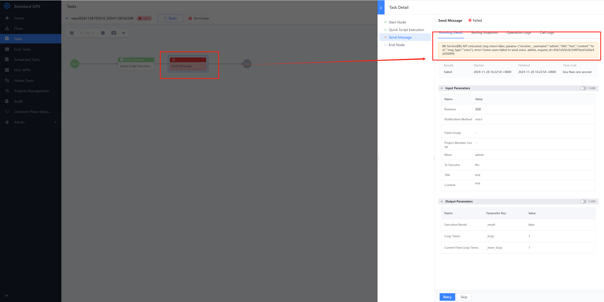

 After resolving the Error, you can hover over the Failure Node, Click Retry, or select SKIP. 

 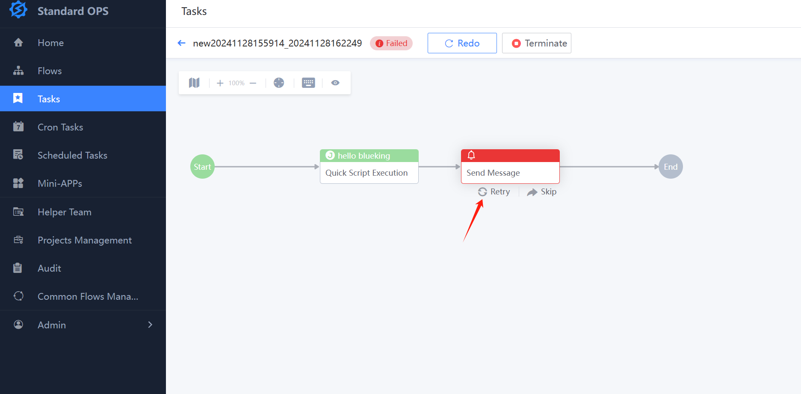

 edit Checks Parameter 

 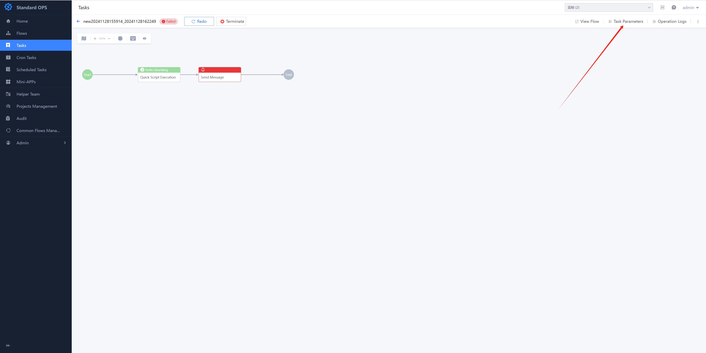

 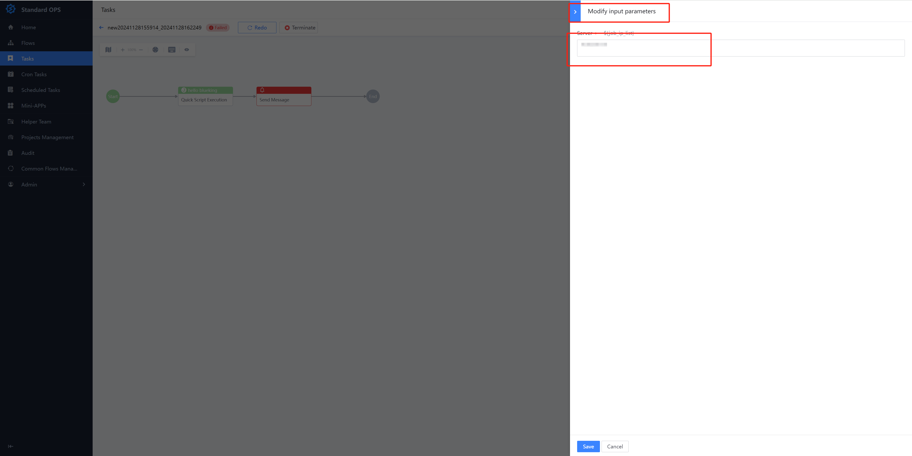

 More information 

 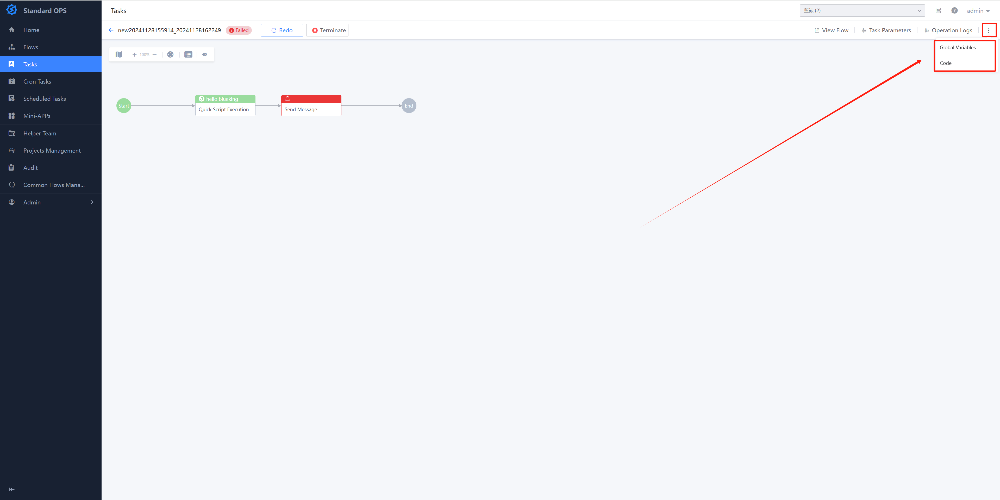

 The above demonstrates One simplest Flow orchestration without complex Branch flow logic. For more Advance process orchestration, please view [7.0 Product Feature Usage Series](bk.tencent.com/s-mart/community/question/9761?type=answer) Standard OPS part. 

 