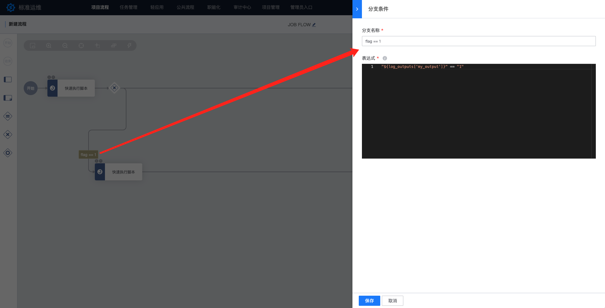
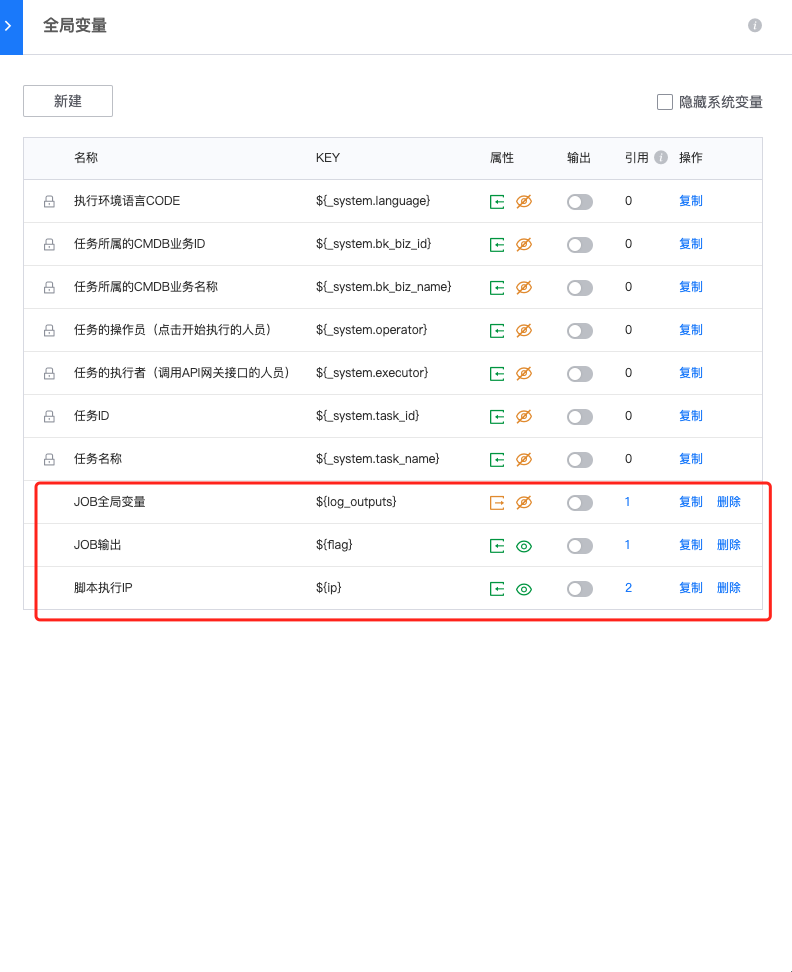
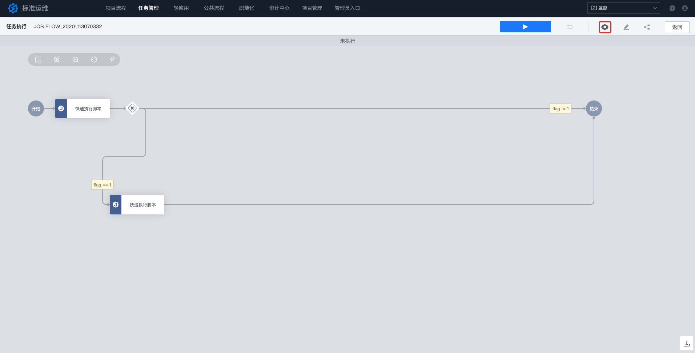
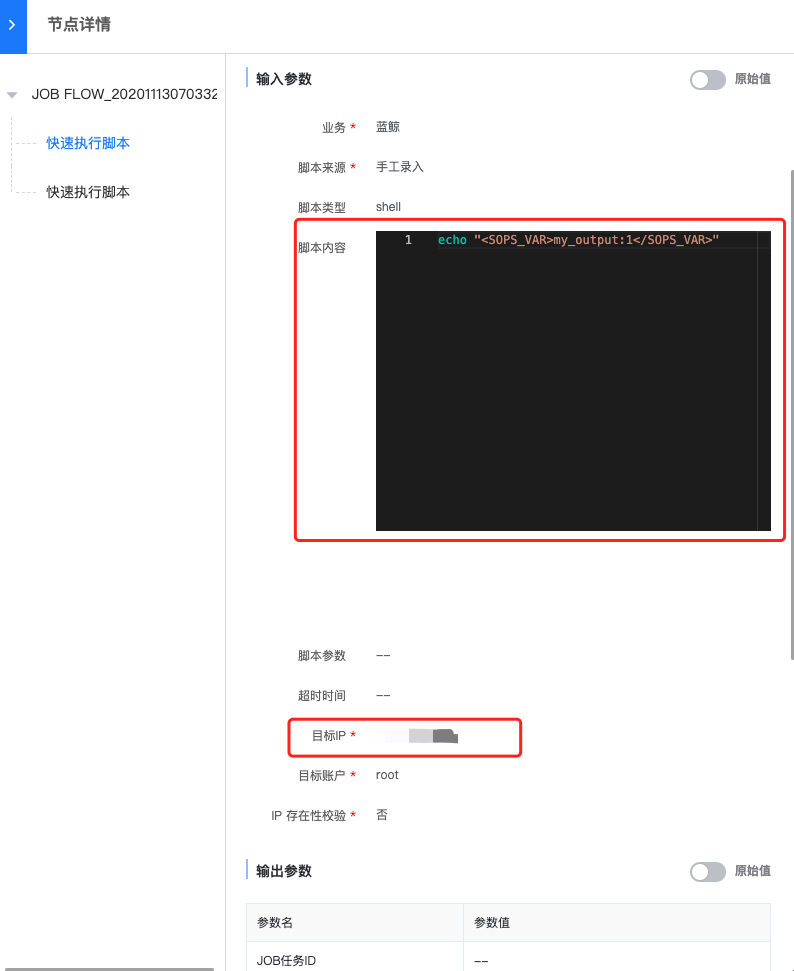

## JOB 任务流程

在这个章节中，你能够根据指引编排一个调度 JOB 作业的流程，这个流程会在第一个节点中到 JOB 中执行一段脚本，随后根据这段脚本的执行结果再去决定后续的工作。

### 新建流程

进入某个项目的项目流程页面下，点击“新建按钮”

### 编排流程

在这个流程中我们需要使用到一个分支网关，一个并行网关，和四个任务节点，先按照下图所示配置出整体的流程框架：

在编排流程的过程中我们可以通过单机节点弹出的快捷面板来快速在该节点后生成其他节点：

### 配置第一个节点

让我们先来配置流程中的第一个节点，双击节点打开配置面板，选择“作业平台(JOB)-快速执行脚本”插件：

进行如下配置

这里我们重点讲一下这几点：
- 在脚本内容中我们执行了一段 `echo "<SOPS_VAR>my_output:${flag}</SOPS_VAR>"` 脚本，这里使用了两个特殊语法：
  - `<SOPS_VAR>key:value</SOPS_VAR>`：在标准运维的任意步骤中，通过 JOB 插件（快速执行脚本、执行作业），输出`<SOPS_VAR>key:val</SOPS_VAR>`格式的字符串，即将变量 key 赋值 val，并添加到节点输出中
  - `${flag}`：这里是表示对标准运维流程全局变量中 `${flag}` 变量的引用，如果全局变量存在的话，标准运维会在执行任务时替换为变量实际的值
- 在脚本的目标 IP 中我们引用了 `${ip}` 变量，而不是将 IP 写死在配置中

看完输入参数配置，我们再来看看输出参数：

这里我们将“JOB 全局变量”这个输出参数勾选到了流程全局变量中，这样我们可以在后面的流程中使用

### 配置第二个节点

下面来配置第二个节点，打开节点配置，依旧选择“作业平台(JOB)-快速执行脚本”插件，并进行如下配置

### 配置分支网关

分支网关能够引用流程上下文中的变量，并根据用户配置的表达式来决定要执行哪个分支，点击第一个分支条件打开配置面板并进行如下配置：

我们通过表达式 `"${log_outputs['my_output']}" == "1"` 引用了第一个节点中输出的 my_output 变量的值，并通过表达式进行判断，如果其值为 `"1"`，流程就会执行这条分支。

下面我们按照同样的步骤配置另一条分支：

### 配置全局变量

最后一步我们要完成全局变量的配置，我们要配置两个全局变量：

- `${flag}`：第一个节点的脚本内容中引用的变量，控制第一个节点的输出内容
- `${ip}`：执行流程中两个节点所配置的脚本的机器 IP

打开全局变量面板：

参考下图先完成 `${flag}` 的配置：

再参考下图完成 `${ip}` 的配置：

完成配置后你的全局变量中应该有这些变量：

最后保存流程，并使用该流程新建一个任务

### 参数填写

使用流程新建任务时，在参数填写界面按照下图进行填写和配置

这里我们先将“JOB 输出”设置为`1`，“脚本执行 IP” 选择当前业务下的任意 IP 即可。

### 任务执行

完成参数填写和任务创建后，我们会进入到任务详情页面。点击“查看参数”按钮能够预览每个节点的执行参数：

如果配置正确的话，可以看到引用参数的地方都已经被替换掉了：

点击执行按钮开始任务执行：

可以看到，任务按照我们的配置执行了 “flag = 1” 分支：

点击任务节点能够看到节点执行详情：

### 修改 flag

创建一个新的任务，这次我们将 flag 的值填写为 `0` 并执行任务，可以看到，任务走向了另一条分支：

