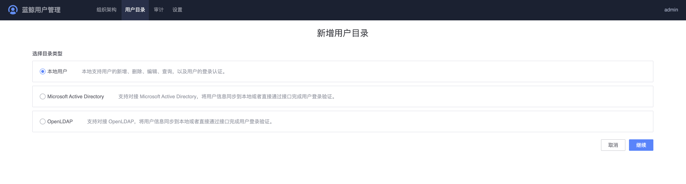

# 用户目录

用户目录代表一类用户来源，用户管理支持通用的用户目录：OpenLDAP、MAD，也支持本地用户目录类型。

- OpenLDAP目录：支持通用的OpenLDAP协议，该用户目录仅同步ldap的组织和用户信息，同步过来后组织和用户信息只读，对应的用户可以直接登录蓝鲸；
- MAD：MAD为Microsoft Active Directory的缩写，协议跟OpenLDAP目录协议类似，通用该用户目录仅同步MAD的组织和用户信息，同步过来后组织和用户信息只读，对应的用户可以直接登录蓝鲸。
- 本地用户目录：蓝鲸用户管理保留了本地编辑组织和用户的功能，本地用户目录下的组织和用户需要管理员去创建。 

