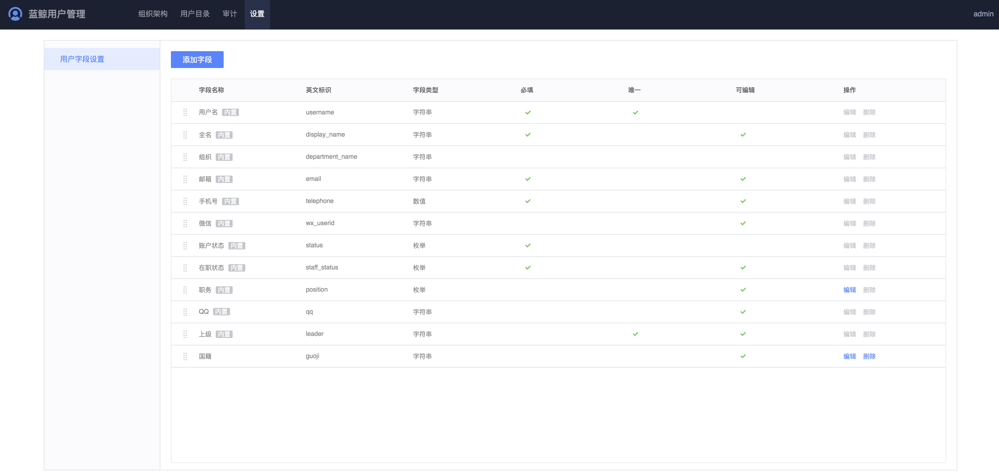

# 用户字段设置

用户管理提供基本的默认字段，如果企业需要有额外的字段，可以在`设置`菜单下，添加自定义字段。

在`设置`页面里，点击`添加字段`按钮进行字段添加。

- 字段名称：字段别名，可修改
- 英文标识：字段唯一 ID，保存后不可修改
- 字段类型：目前支持字符串、数值、枚举、日期
- 必填：表示该字段在用户信息里必须填写
- 唯一：表示该字段在不同的用户信息里不能重复
- 可编辑：表示该字段在用户信息里可编辑

