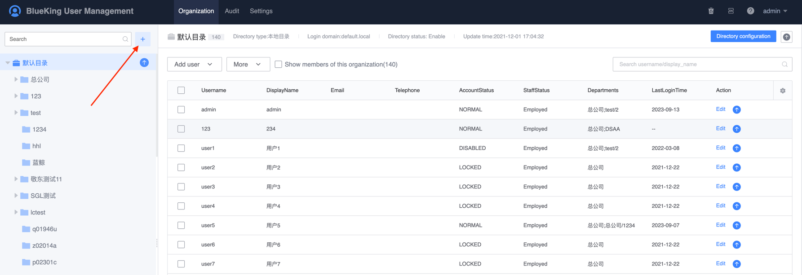
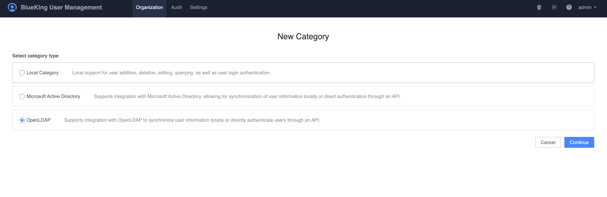

# User directory

The user directory represents a type of user source. UserManage supports common user directories: OpenLDAP, MAD, and also supports local user directory types.

- OpenLDAP directory: Supports the general OpenLDAP protocol. This user directory only synchronizes the organization and user information of ldap. After synchronization, the organization and user information are read-only, and the corresponding users can log in to BlueKing directly.
- MAD: MAD is the abbreviation of Microsoft Active Directory. The protocol is similar to the OpenLDAP directory protocol. Generally speaking, this user directory only synchronizes the organization and user information of MAD. After synchronization, the organization and user information are read-only, and the corresponding users can log in to BlueKing directly.
- Local user directory: BlueKing UserManage retains the function of locally editing organizations and users. Organizations and users in the local user directory need to be created by the administrator.

