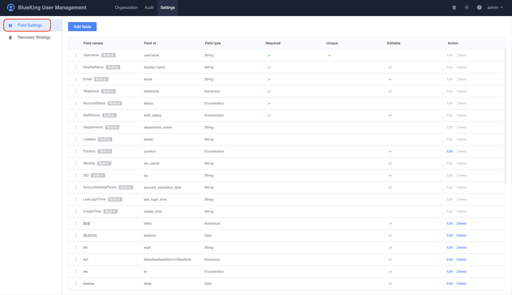
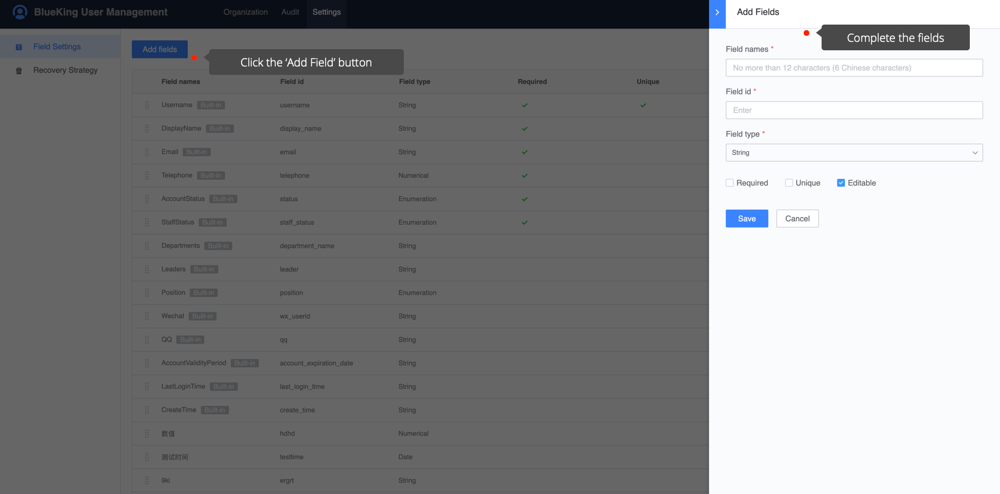

# User field settings

UserManage provides basic default fields. If the enterprise needs additional fields, you can add custom fields under the `Settings` menu.

On the `Settings` page, click the `Add Field` button to add fields.

- Field name: Field alias, can be modified
- English ID: The unique ID of the field, which cannot be modified after saving
- Field type: Currently supports string, value, enumeration, date
- Mandatory: Indicates that this field must be filled in the user information
- Unique: Indicates that this field cannot be repeated in different user information
- Editable: Indicates that the field is editable in user information

