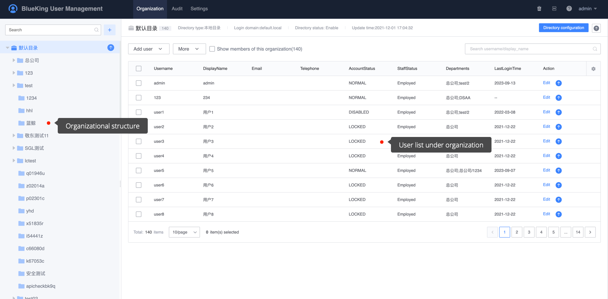
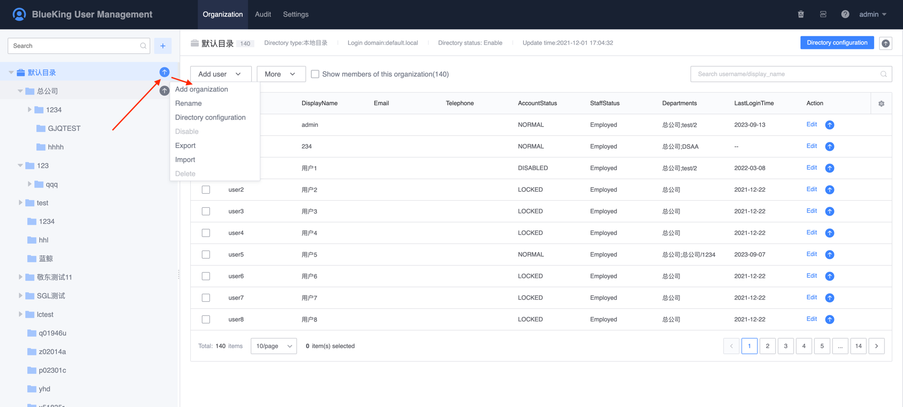
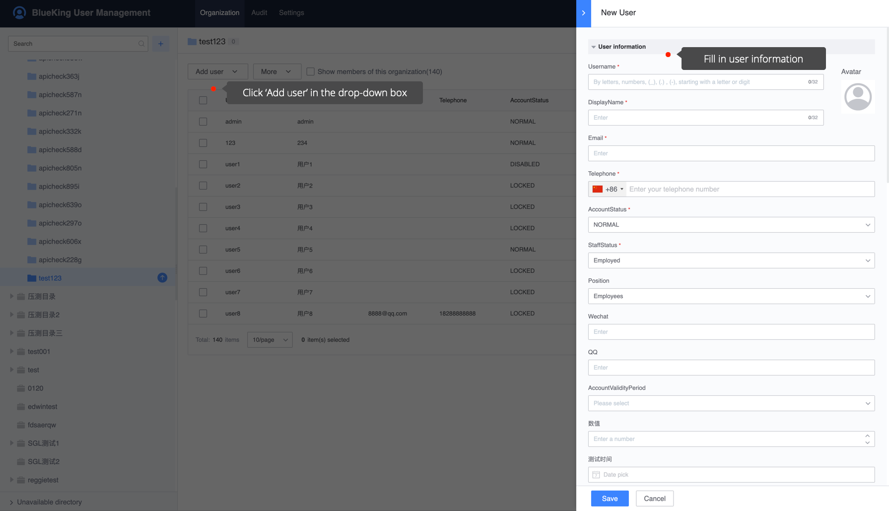
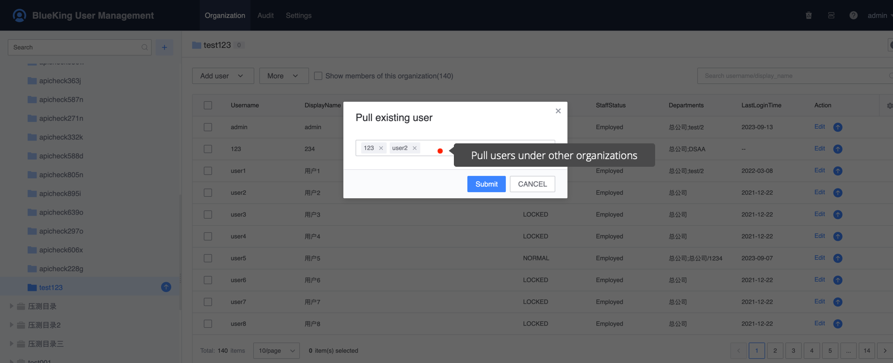
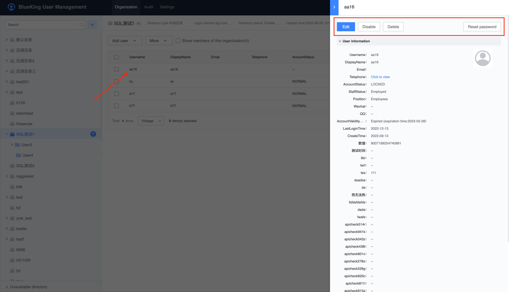

# Organization

The organizational structure is the organizational form of personnel management, which supports multi-level organizations, and the organizational structure varies according to the type of user directory to which it belongs.

- OpenLDAP, MAD user directory, the organizational structure is read-only by default, and administrators cannot edit it;
- Local user directory, organizational structure can be edited.

This article focuses on the organizational structure and user information management of the `local user directory` type.

## Add organization

The prerequisite for adding an organization is that there must be an editable user directory type (here refers to the local user directory).

Select the user directory that needs to add an organization, click the `More` icon, and a pop-up panel (as shown below) can be used to add organizations. One user directory supports the addition of multiple organizations.

## Organization adds user

Organizations can add users in several ways: `Add new users, import new users in batches, and pull from existing organizations`. The former two are new users, and the latter is to realize a user spans multiple organizations.

### New users

Click the organization that needs to add users, click `Add User -> Add User` on the right side, fill in the user details in the pop-up sliding window, click `Save` to successfully add a new user, the newly added user will be displayed at the top of the form by default OK.

### Pull existing users

Click the organization that needs to add users, click `Add User -> Pull Existing Users` on the right side, in the pop-up input box, enter the specific user name that needs to be added, and click Submit to add in batches.

### Import users in batches

On the **Organization Structure** page, find the local user directory, click More on the right, and click "Import" on the pop-up panel to download the corresponding import template. The red font in the template is required.

Fill in the user information and then import it to complete adding users in batches.

## Manage users

  Click on the user who needs to be managed, and in the pop-up sliding window, you can perform operations such as `Edit`, `Disable`, `Delete`, and `Reset Password` for the user.

- Edit: Edit basic user information
- Disabled: After the user is disabled, the login operation cannot be performed. You can continue the login by touching disable.
- Deletion: After deletion, users will enter the recycle bin. Subsequent versions support the recovery of deleted users from the recycle bin.
- Reset password: Administrators can help users reset their login passwords

