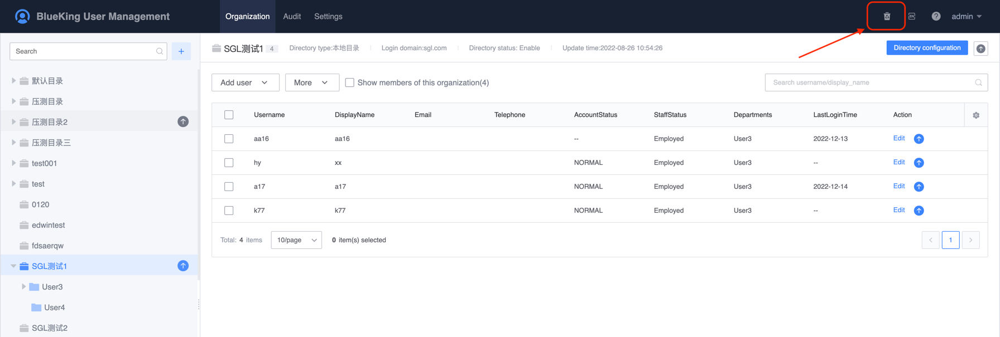
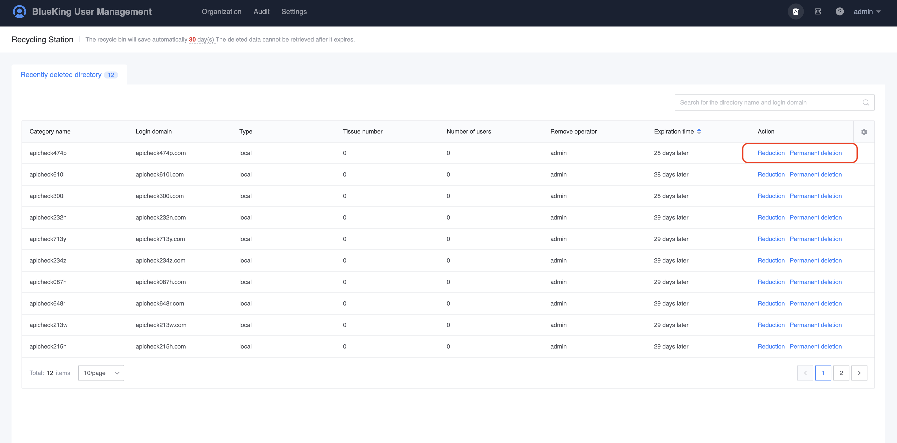
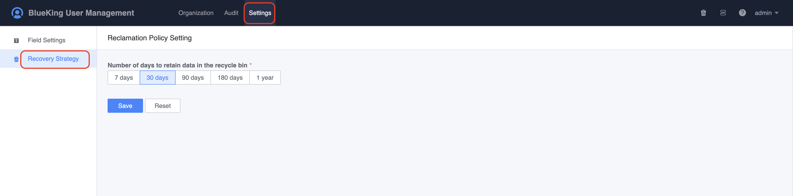

# Recycle bin

The new version of UserManage provides the recycle bin function. For users, organizations, and user directories deleted, they will go to the recycle bin by default. Administrators can perform further operations in the recycle bin: restore, completely delete.

The duration of data retention in the recycle bin can be set in `Recycle Policy`.

