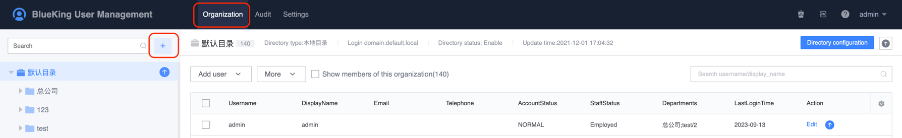
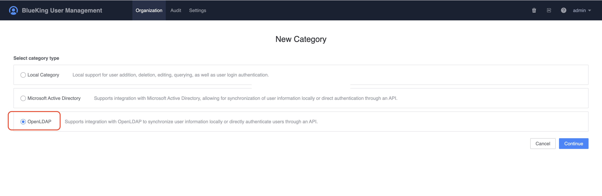
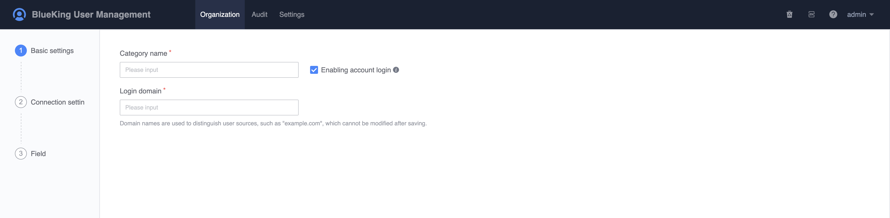
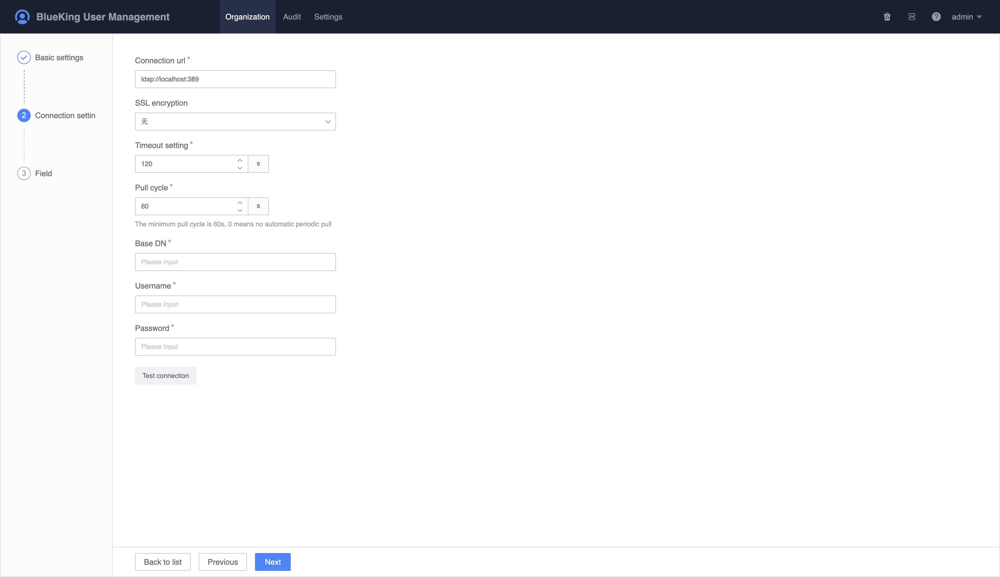
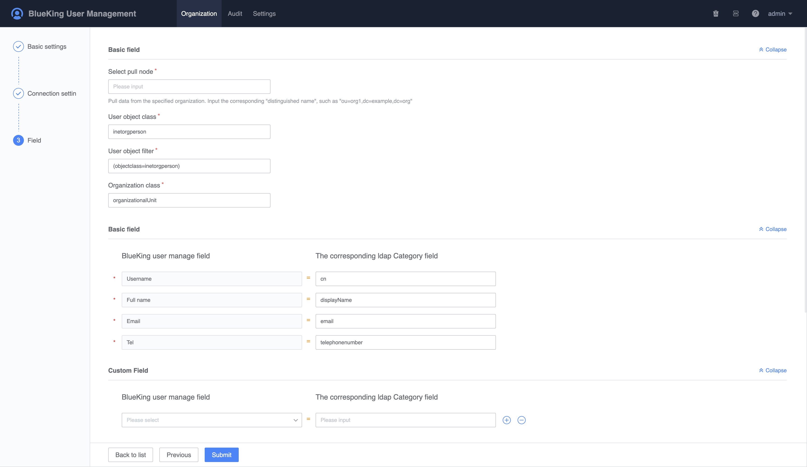
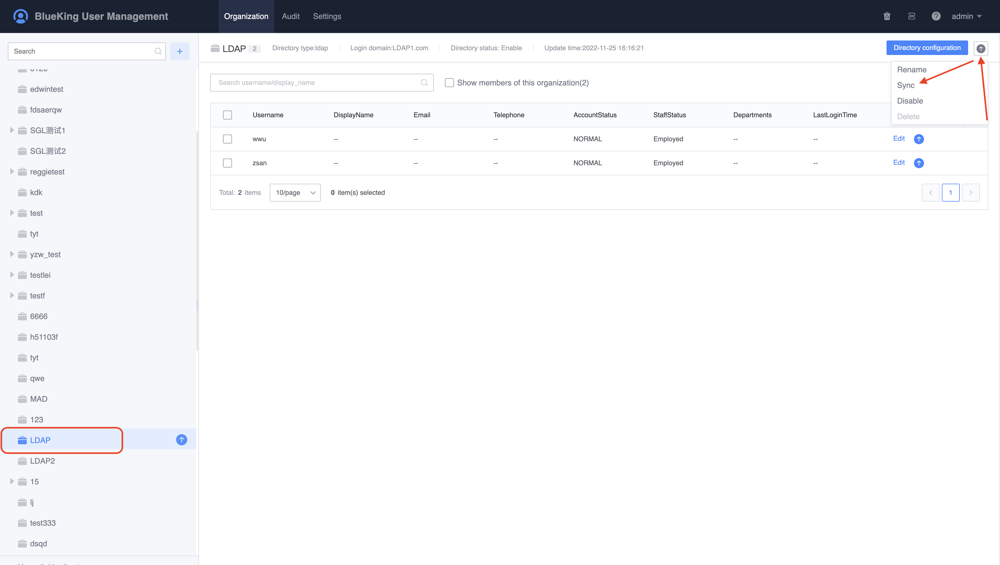
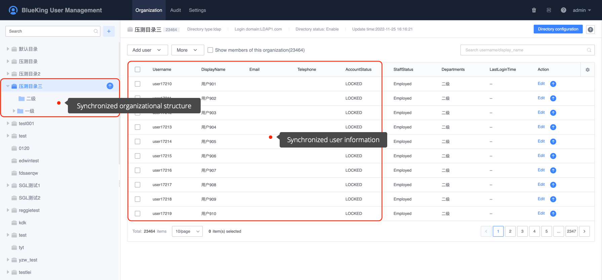

# How to connect to the existing LDAP user system

This chapter describes how to create an OpenLDAP directory and synchronize LDAP users to UserManage.

## Preconditions

> 1. Require an already established LDAP service
>
> 2. Require to apply for new permissions for the OpenLDAP directory

## Steps

1. Click `Organization Structure -> New Directory`, select `OpenLDAP` directory type to create a directory and go to the next step.

    

    

2. On the `Basic Settings` page, fill in the basic information.

    - Directory name: Directory name, which can be modified at any time after being saved;
    - Login domain: The login domain is used to distinguish the source of the user when logging in. In order to facilitate the distinction, it is generally the company `code`, which cannot be modified after being saved.

    

3. On the `Connection Settings` page, fill in the basic information for connecting to the LDAP server.

    - Connection address: LDAP server address, generally fill in the IP address of the LDAP server directly, or in the form of `IP:PORT`, if the port is the default, you can leave it blank;
    - SSL encryption method: Default is enough;
    - Timeout setting: The connection timeout setting for trying to connect to the LDAP server;
    - Pulling cycle: The cycle of synchronizing LDAP user data, fill in `0` means not automatically pull;
    - Root directory: LDAP root directory, the default is `cn`;
    - Username: The username to log in to the LDAP service;
    - Password: Username and password for logging in LDAP service;

    After filling in, click `Test Connection`. If it is normal, it will prompt a success message. If there is an error, please check the UserManage background log information.

    

   

4. On the `Field Configuration` page, the main configuration is to pull the field information. Only need to fill in the user's basic field information. Other field information can be kept as default. Please refer to the figure below for specific field values.

    

5. After filling in and confirming all the above information, click `Submit` to complete the creation of the OpenLDAP user directory. Once the creation is completed, user information can be synchronized immediately.

    

6. After synchronizing user information, you can view the synchronized organizational structure data on the organizational structure page.

    

7. Try to log in to BlueKing directly as an LDAP user.

    When filling in the username, in addition to the default directory, users in other directories need to log in using the form `username@login domain`.

    