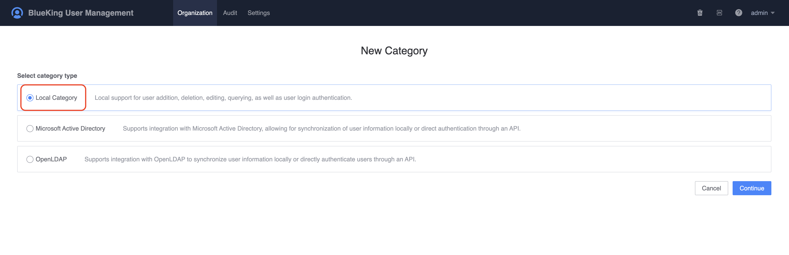
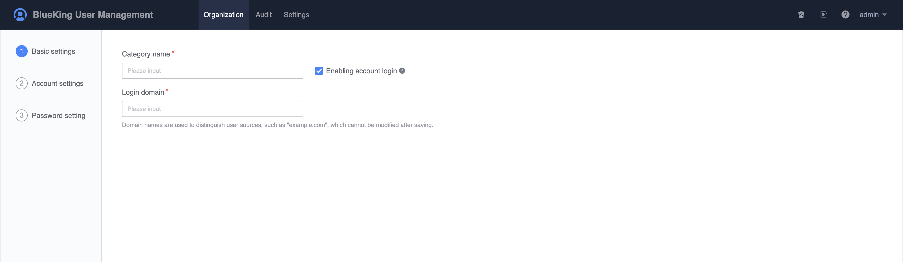
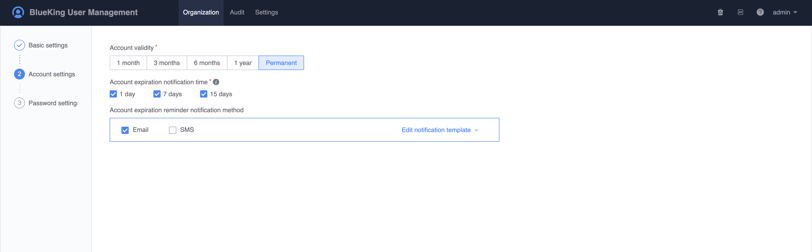
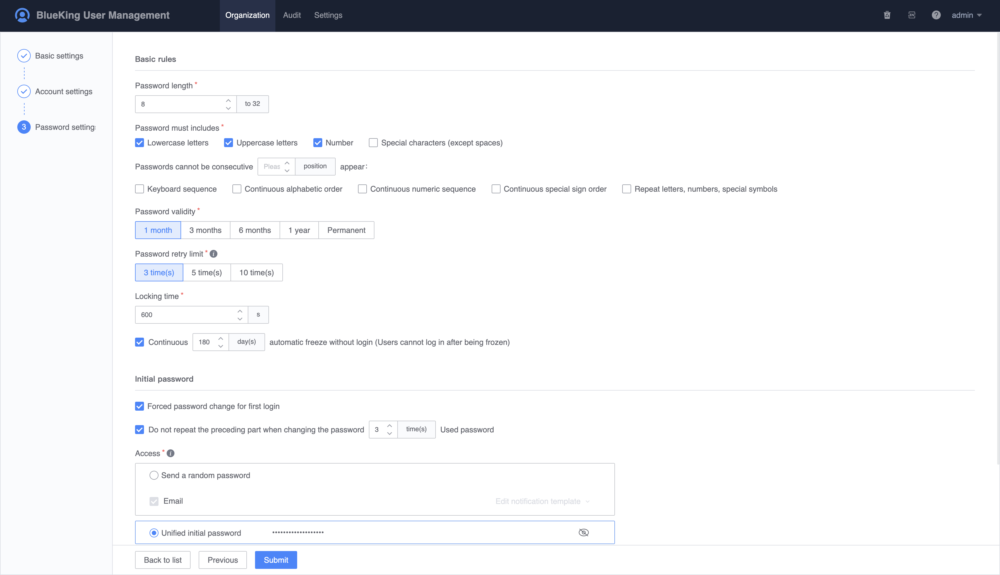
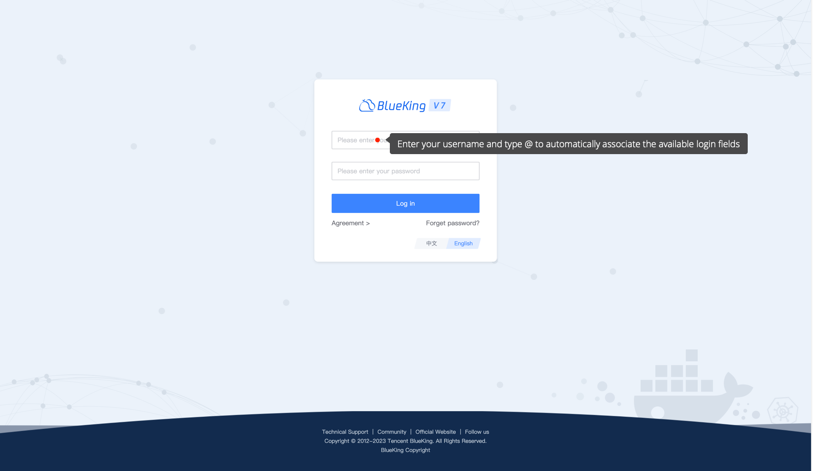

# How to create a local user directory

This chapter describes how to create a local user directory and how to add users and organizations to the local user directory.

## Preconditions

> You need to apply for the management permission of the organization and members, or the default directory management permission.

## Steps

1. Click `Organization Structure -> New Directory`, select `Local User` directory type to create a directory and go to the next step.

    

    

2. On the `Basic Settings` page, fill in the basic information of the directory.

    - Directory name: Directory name, which can be modified at any time after being saved;
    - Login Domain: It is used to distinguish the source of the user. For the convenience of distinguishing, it is generally the company `code`, which cannot be modified after being saved.

    

3. On the `Account Settings` page, fill in the account validity period settings

    

4. On the `Password Settings` page, mainly configure the settings related to the password security rules, which can be kept unchanged by default.

    - Password length: The default is 8 digits, and the maximum can be set to 32 digits;
    - The password must contain: It applies to all users in this directory, and the password must comply with this rule;
    - Password validity period: Set the password validity period uniformly, and when the password validity period is reached, the user needs to reset the password;
    -Number of password attempts: When a user logs in, the maximum number of login attempts is allowed. Failure to log in will automatically lock the user;
    - Automatic unlocking time: After the user logs in and is locked, the user needs to wait for the unlocking time before he can continue to try to log in;
    - Initial password acquisition method: The default is a unified initial password. The enterprise can change it to send a random password uniformly through the mailbox, provided that the configuration of the mailbox gateway needs to be completed;
    - Automatic freezing: When a user has not logged in for a long time, the BlueKing platform will automatically freeze the user. If the user needs to log in again, the administrator needs to lift the ban.

    

5. After the settings are completed, click `Submit` to create a local user directory. After the directory is created, you can continue to `Import` users and organizations.

    

6. Try to log in to BlueKing directly.

    When filling in the username, in addition to the default directory, users in other directories need to log in using the form `username@login domain`.

    