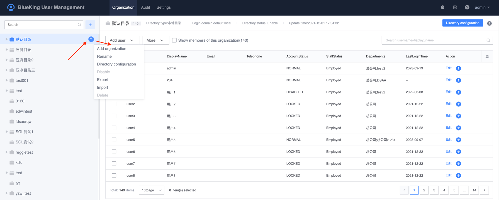
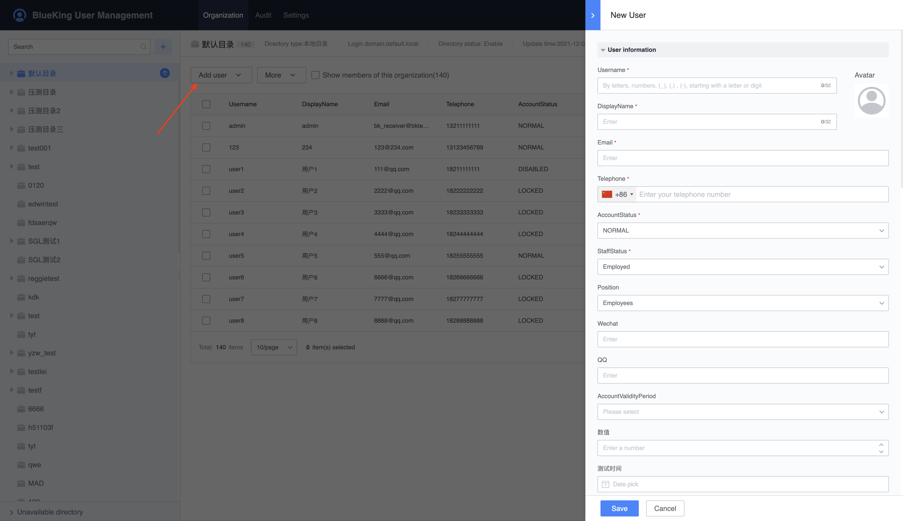
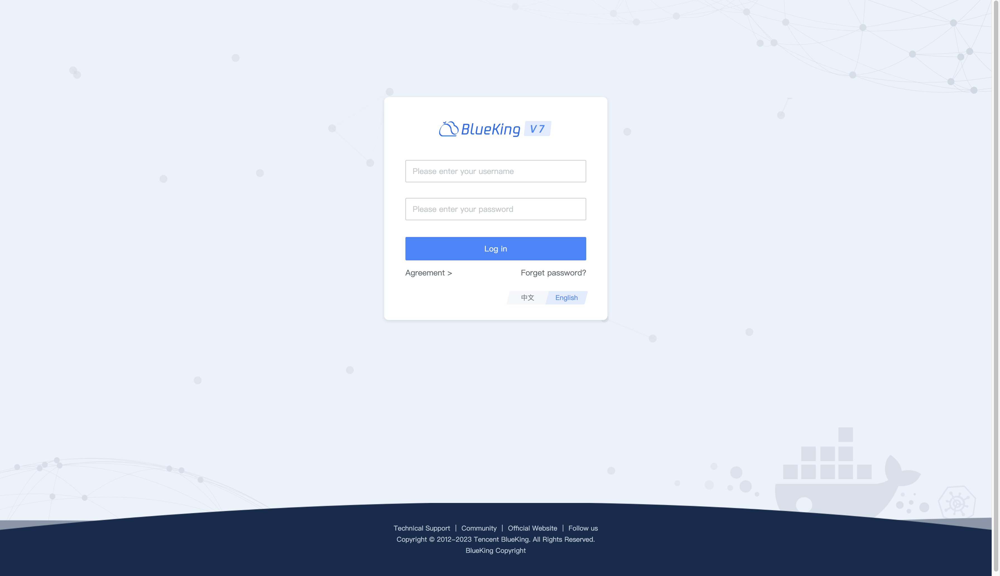
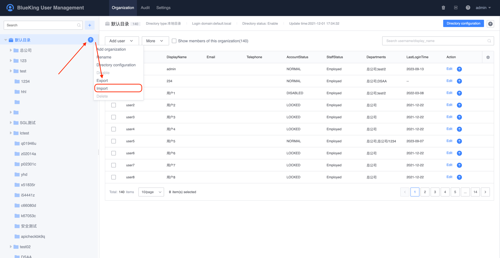
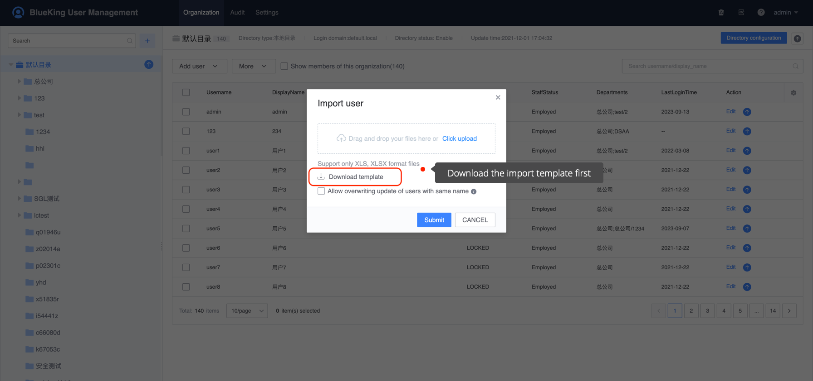
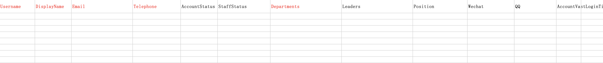
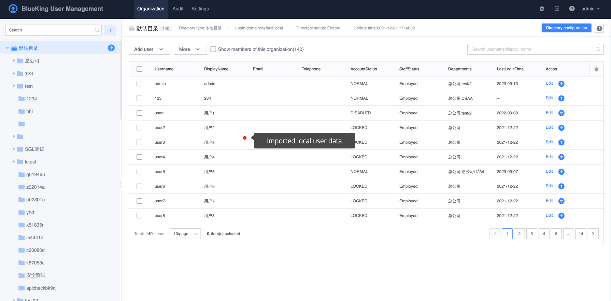

# How to add a local user

This chapter describes how to add local users in the `Default Directory`. New local users can be created manually or imported in batches through Excel tables.

## Preconditions

> Requires organization and member management permissions for the default directory, or administrative permissions for the default directory.

## Create manually

1. Click the `Organizational Structure Menu`, under the organizational structure page, select the default directory, click `Add Organization`, enter the organization name to manually add the root organization. To create a hierarchical organization, click `Add Organization' to the right of the required organization. `Create a sub-level organization.

    

2. Select the newly created organization, and in the right panel, click `Add User` to add users.

    - Username: The user’s unique identifier, required. It consists of 1-32 letters, numbers, underscore (_), dot (.), and minus sign (-) characters, starting with a letter or number.
    - Full name: User `alias`, required, `full name can be modified at any time, the length is 1-32 characters`
    - Email: User's work email, required. `If you need to use a random password sent by email or the user can retrieve the password by forgetting it, the email must be globally unique`
    - Mobile phone number: User's mobile phone number, required
    - WeChat: optional
    - QQ: optional
    - Direct superior: The user is directly subordinate to the leader, `This field can be used when configuring the approval process`
    - Organization: The organization the user belongs to, each user must belong to an organization
    - Account validity period: The default is permanent
    - Password validity period: The validity period of the user password, after the password validity period, the user will be prompted to change the password

    

4. User login: When a user in the default user directory logs in, just enter the user name directly.

    

## Batch Import

1. On the organizational structure page, select the `Local User Directory` that needs to import users, and click the `Import` button.

    

2. Download the import template form.

    

3. According to the sample template, fill in the user information, `Red fonts are required information`.

    - Username: The user's unique identifier, required, consisting of 1-32 letters, numbers, underscore (_), dot (.), minus sign (-) characters, starting with a letter or number.
    - Full name: user `alias`, required, `full name can be modified at any time, the length is 1-32 characters`.
    - Email: User's work email, required. If a random password needs to be sent via email or the user can retrieve the password by forgetting it, the email must be globally unique.
    - Mobile phone number: User's mobile phone number, required.
    - Account Status: Default `Normal`.
    - Employment status: Default `Employment`.
    - Organization: Please fill in from the root organization (note that you do not need to fill in the user directory).

    

4. Select the user information form edited in the previous step to upload, and click `Submit` to complete the import. After the import is successful, the user information can be viewed in the user directory corresponding to the `Organizational Structure Page`.

    

5. User login: When a user in the default user directory logs in, just enter the user name directly.

    