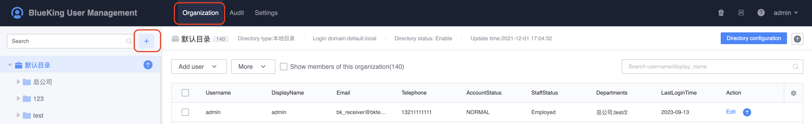
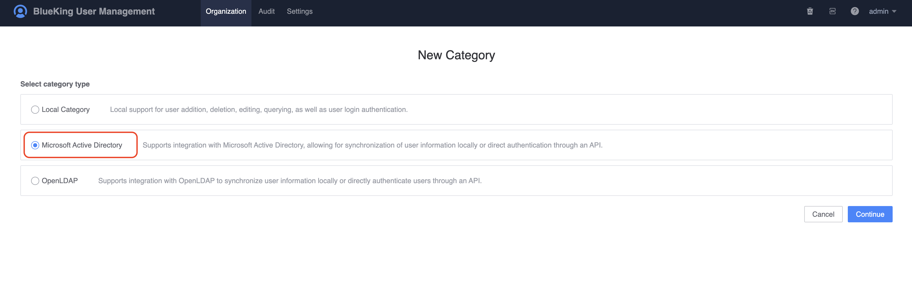
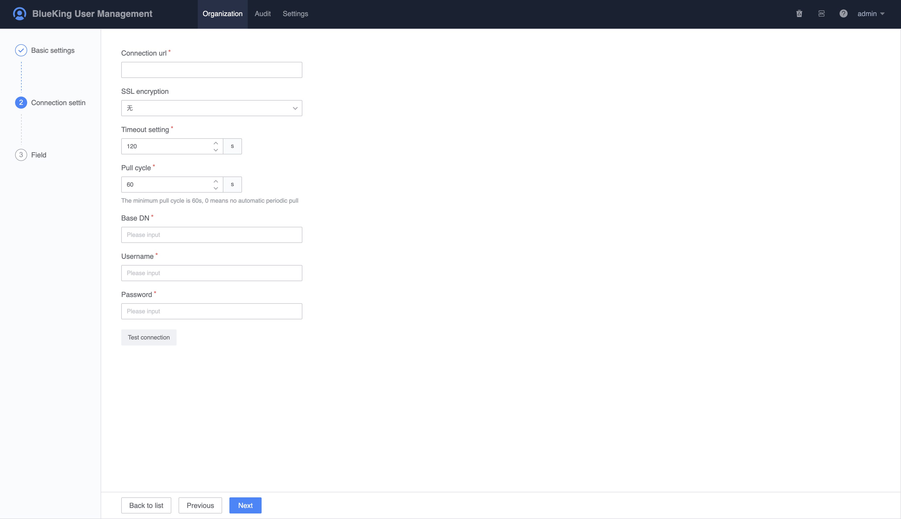
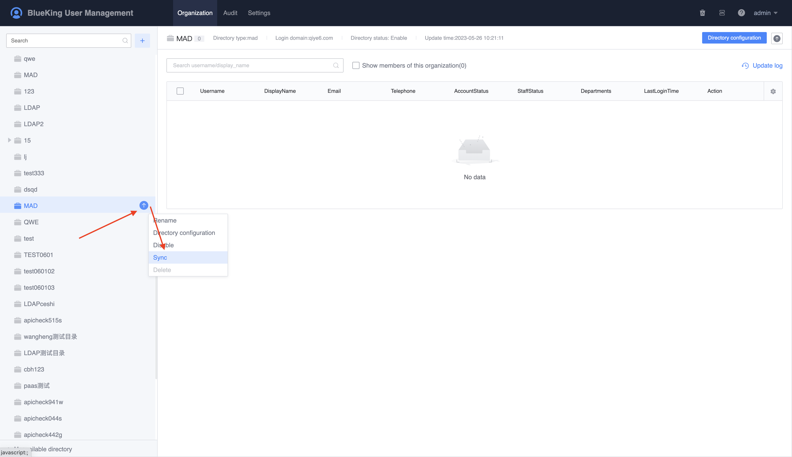
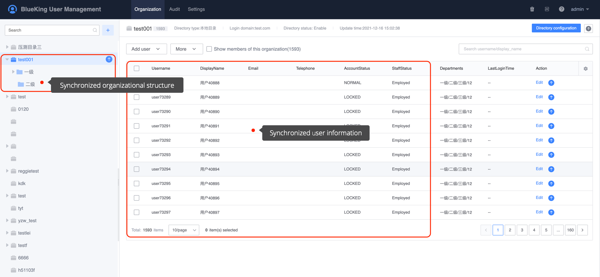

# How to connect to the existing MAD user system

This chapter introduces how to create a Microsoft Active Directory (MAD) directory and synchronize MAD users to UserManage.

##Preconditions

> 1. Need to have the established MAD service
>
> 2. Need to apply for the new permissions of the MAD directory

## Steps

1. Click `Organizational Structure -> New Directory`, select `Microsoft Active Directory` directory type to create a directory and go to the next step.

    

   

    

2. On the `Basic Settings` page, fill in the basic information.

    - Directory name: Directory name, which can be modified at any time after be saved;
    - Login domain: The login domain is used to distinguish the source of the user when logging in. In order to facilitate the distinction, it is generally the company `code`, which cannot be modified after saving.

    

3. On the `Connection Settings` page, fill in the basic information for connecting to the MAD server.

    - Connection address: MAD server address, generally fill in the IP address of the MAD server directly, or in the form of `IP:PORT`, if the port is the default, you can leave it blank;
    - SSL encryption method: Default is enough;
    - Timeout setting: Connection timeout setting for trying to connect to the MAD server;
    - Pulling cycle: The cycle of synchronizing MAD user data, fill in `0` means not automatically pull;
    - Root directory: MAD root directory, the default is `cn`;
    - Username: The username for logging in to the MAD service;
    - Password: Username and password for logging in to the service;

    After filling in, click `Test Connection`. If it is normal, it will prompt a success message. If there is an error, please check the UserManage background log information.

    

4. On the `Field Configuration` page, the main configuration is to pull the information. Only need to fill in the user's basic field information. Other field information can be kept as default. Please refer to the the figure below for specific field values.

    

5. After filling in and confirming all the above information, click `Submit` to complete the creation of the MAD user directory. Once the creation is completed, user information can be synchronized immediately.

    

6. After synchronizing user information, you can view the synchronized organizational structure data on the organizational structure page.

    

7. Try to log in directly to BlueKing as a MAD user.

    When filling in the username, in addition to the default directory, users in other directories need to log in using the form `username@login domain`.

    