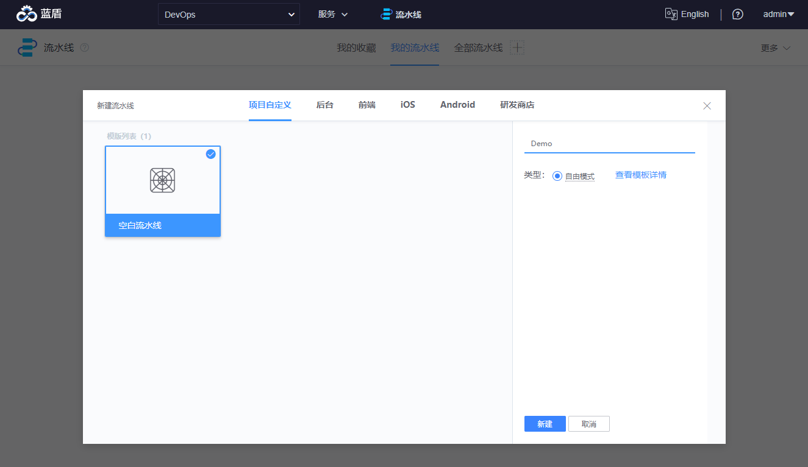
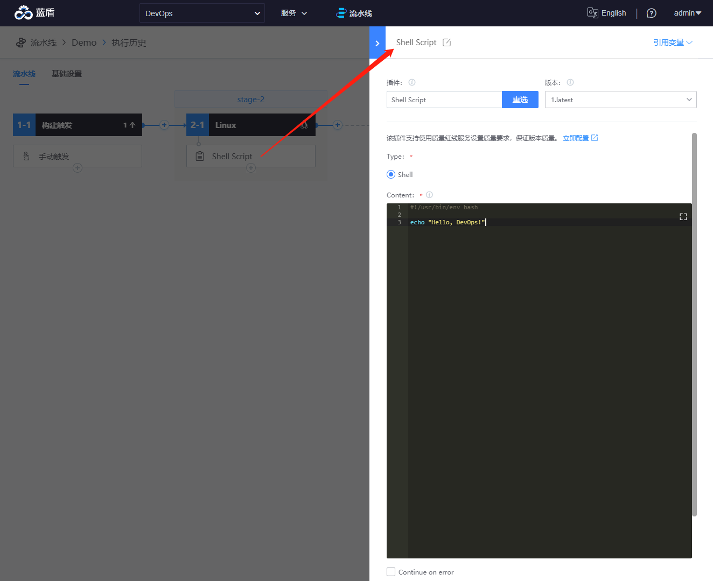
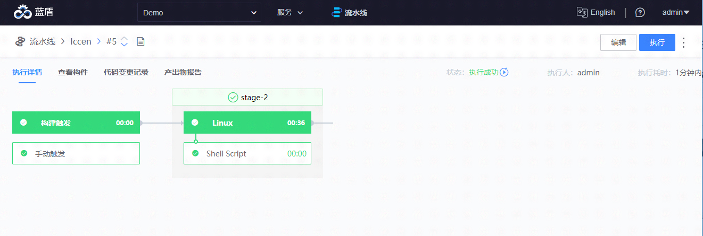

# 流水线的创建

持续集成平台可以快速实现一条持续交付流水线来编译、测试、部署应用，这里通过教程和文档指南告诉你，如何创建一条基础的流水线。

选择`流水线服务`，完成项目创建后，点击`创建流水线`

选择空白流水线模板，输入流水线名称并选择`自由模式`，创建流水线

点击`Job 1-1`右侧的+号，选择 Linux Job 类型添加`Job 2-1`

为`Job 2-1`添加一个`Shell Script`插件

为`Shell Script`插件配置脚本内容

执行流水线

查看插件执行日志

