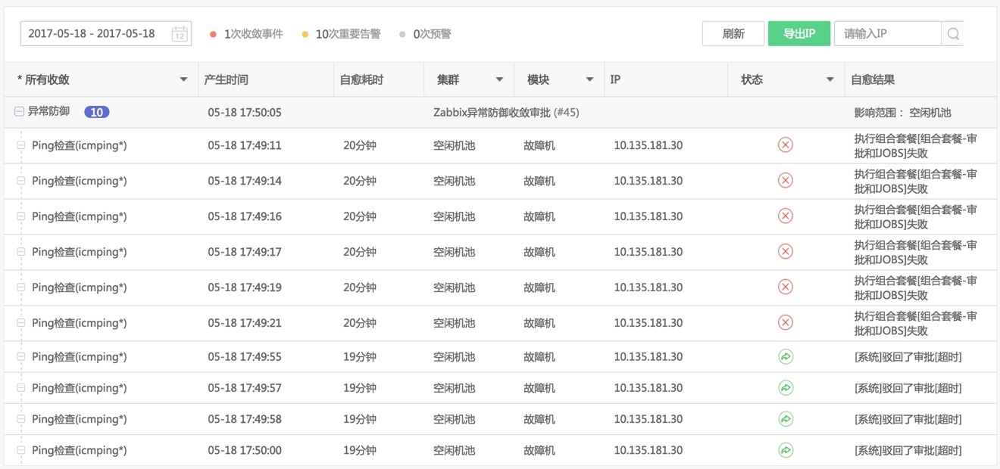
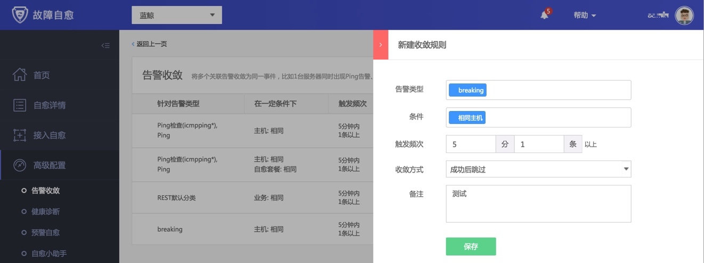
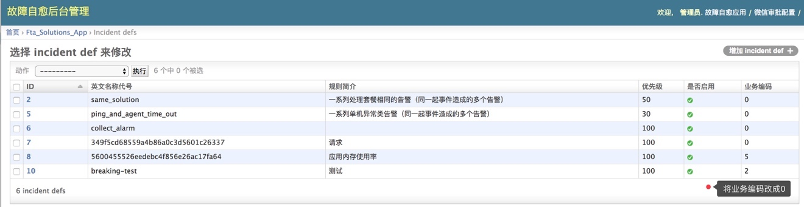
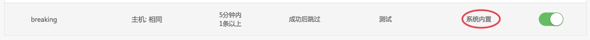
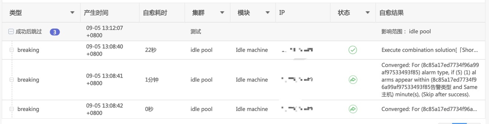

# 进阶场景

当你对基础场景非常熟悉后，可以挑战进阶场景来完成复杂场景的故障自愈。

## 告警收敛
### 设置告警收敛规则

我们很有可能收到重复的告警，所以故障自愈推出告警收敛功能。

满足一定规则后，执行对应的收敛方式。

点击右上角 新建收敛规则，按下图灰色框中内容添加一条规则。

图56. 告警收敛

下图中命中了上述最后一条规则(在同一台主机上，5分钟内出现3条以上告警，由于没有进行审批动作，于是20分钟后超时了)。

图57. 告警收敛结果

### 设置全局收敛规则

默认手动添加的收敛规则的生效范围是当前业务，如果希望在全业务下都生效，可以在 Django 后台设置。

#### (1) 任意找一个业务设置收敛规则

图58. 添加收敛规则

图59. 收敛规则添加成功

#### (2) 在Django后台修改生效范围

使用管理员角色访问以下地址

`http://${PaaS_URL}/o/bk_fta_solutions/admin/fta_solutions_app/incidentdef/`

图60. 在Django后台修改生效范围

找到刚添加的收敛规则，将其业务编码修改为0 (即对所有业务生效.)

访问告警收敛可以发现规则来源 从 当前业务 换成了 系统内置

图61. 收敛规则来源修改成功

#### (3) 在不同业务下测试，均生效

图62. 在A业务下测试收敛规则

图63. 在B业务下测试收敛规则

