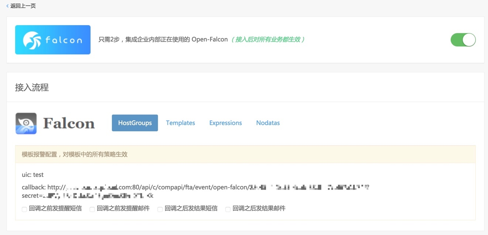
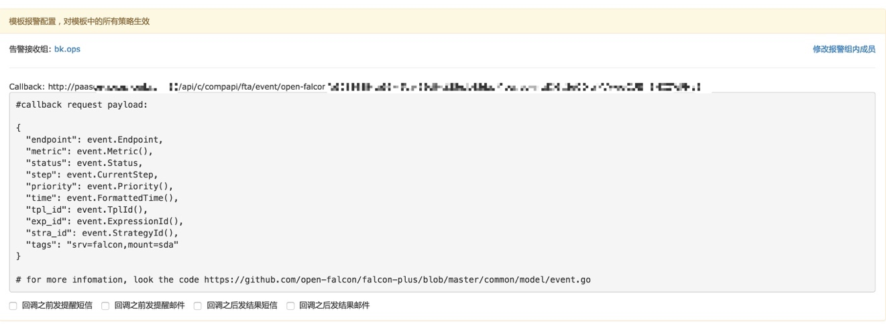
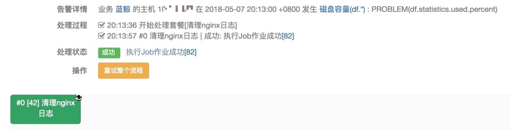

# 对接Open-falcon

对接 Open-falcon 的机制：Open-falcon 模板中包含 callback(回调) 功能，在回调地址中填写故障自愈分配给 Open-falcon 的告警接收地址. 

图34. 故障自愈集成Open-falcon

## Open-falcon模板中添加故障自愈的Callback地址

图35. Open-Falcon配置Callback地址

## Open-falcon告警自愈历史

下面是 Nginx 模块磁盘告警的自愈示例，匹配 Nginx 模块的磁盘清理套餐，清理 Nginx 模块的日志文件，整个过程不到 30 秒。 

图36. 磁盘告警的自愈示例

## Open-falcon告警处理的特别之处

Open-Falcon 的资源标识 endpoint 默认是主机名，于是故障自愈将蓝鲸 CMDB 自动上报的主机名转换为 IP，然后在做匹配、告警自动处理。
