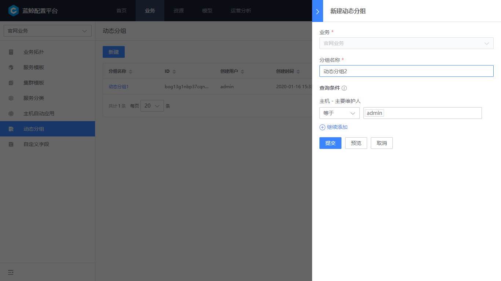

# 动态分组

动态分组是为了方便上层应用（作业平台、标准运维等）能够方便查询到用户定义的一类查询集合。 

## 动态分组管理

进入到“业务-动态分组”功能，可以看到当前已经存在的动态分组列表。可以预览、编辑删除已存在分组。

图1.动态分组

## 新建动态分组

点击“新增”增加一个动态分组，“分组名称”便于快速识别分组用途，“查询条件”是指需要对集群、模块还是主机的哪些属性进行查询。

灵活的查询条件，我们很容易配置出例如“所有 linux 主机”、“所有 admin 负责的主机”等场景的动态分组查询。

图2.新建动态分组

