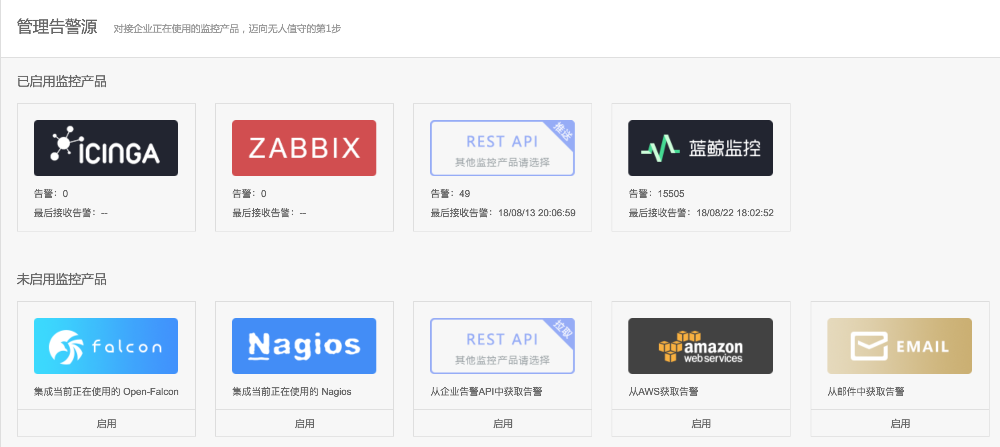
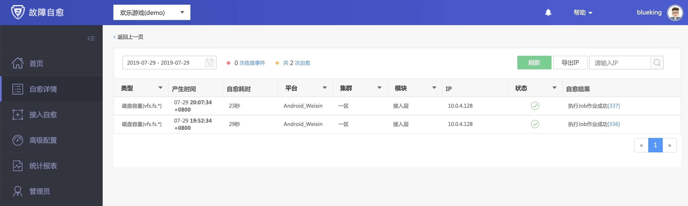
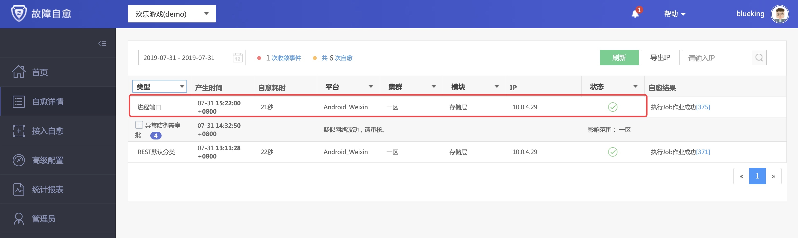
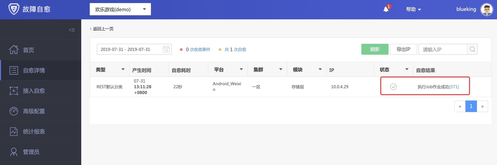
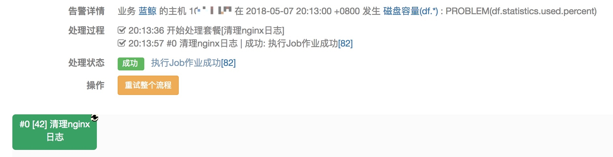

# 集成主流监控产品

告警源集成蓝鲸监控、4 款主流开源监控产品 Zabbix、Open-Falcon、Nagios、Icinga，及 AWS、邮件的告警接入，更能通过 REST API 拉取、推送告警。

以下为部分监控产品的故障自愈执行记录：

- Zabbix

- 蓝鲸监控

- REST API

- Open-Falcon

无论是主流的监控产品，还是自研监控产品，故障自愈总能与其对接。
