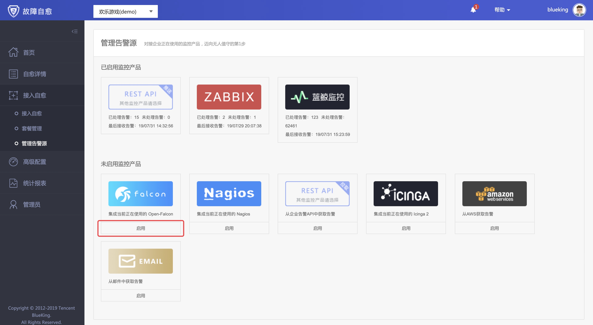
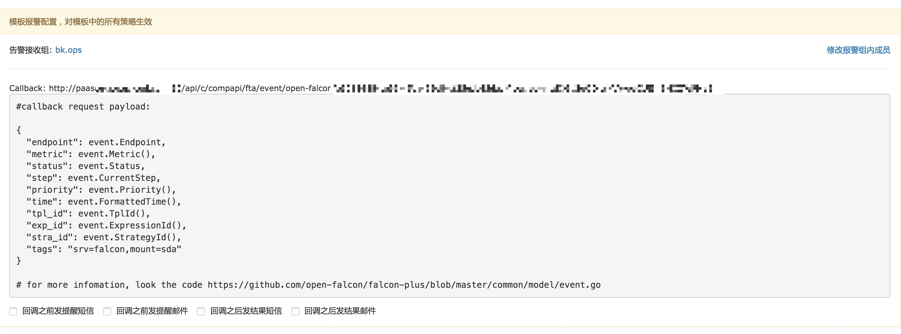
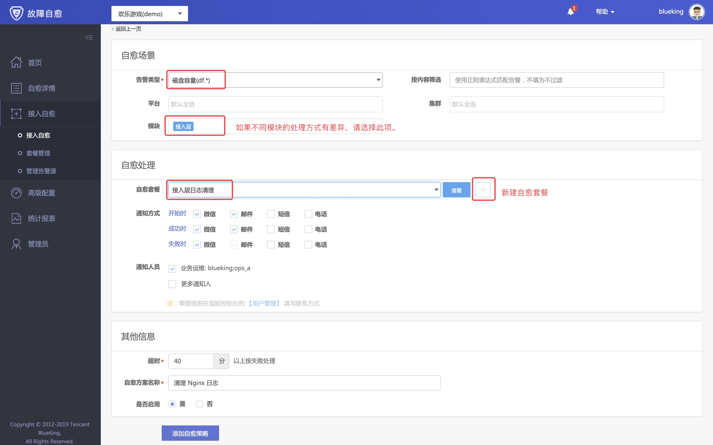
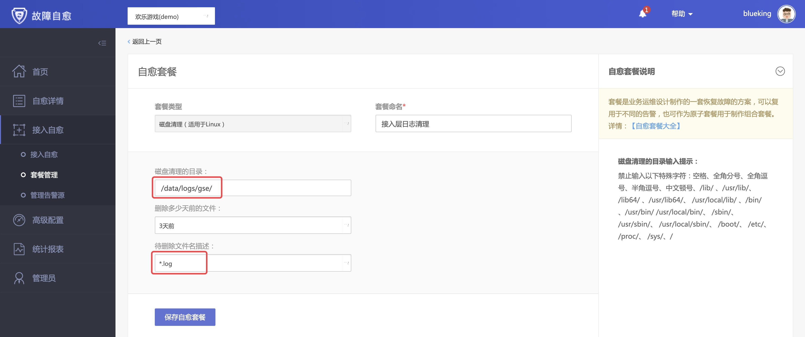
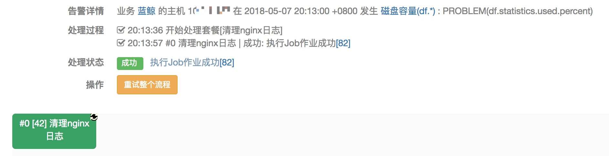

# 对接 Open-Falcon

对接 Open-Falcon 的机制：Open-Falcon 模板中包含 CallBack（回调）功能，在回调地址中填写故障自愈分配给 Open-Falcon 的告警接收地址。

## 对接 Open-Falcon 告警源

在【接入自愈】下找到【管理告警源】菜单，点击【启用】Open-Falcon 告警源。

可以找到故障自愈为 Open-Falcon 生成的全局回调地址，针对所有业务生效。

将该回调地址录入至 Open-Falcon 告警模板的回调地址中。

故障自愈对接完告警源后，接下来 **创建自愈方案** 和 **自愈套餐**。

## 创建自愈方案

选择【接入自愈】菜单，点击【接入自愈】，在接入自愈页面选择 Open-Falcon 的告警类型，比如 磁盘容量，在 【自愈套餐】一栏点击【**+**】，新建自愈套餐。

在 【新建自愈套餐】页面，选择清理的磁盘目录、时间以及文件名描述。

点击【保存自愈套餐】，回到接入自愈界面，点击【添加自愈策略】，至此 自愈方案 接入成功。

接下来，在 Open-Falcon 中模拟告警，以触发故障自愈。

## Open-falcon 告警自动处理

在 Open-Falcon 中触发告警后，在下图中可以看到接入层模块磁盘告警的自愈示例，匹配 接入层的磁盘清理套餐，清理其日志文件，整个过程不到 30 秒。

> Open-Falcon 的资源标识 `endpoint` 默认是主机名，于是故障自愈将蓝鲸 CMDB 自动上报的主机名转换为 IP，然后在做匹配、告警自动处理。
