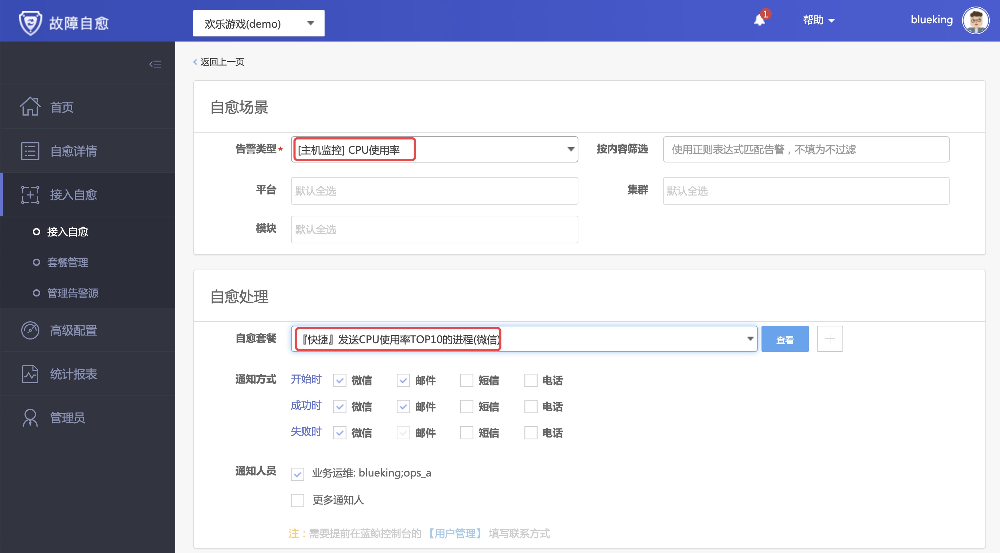
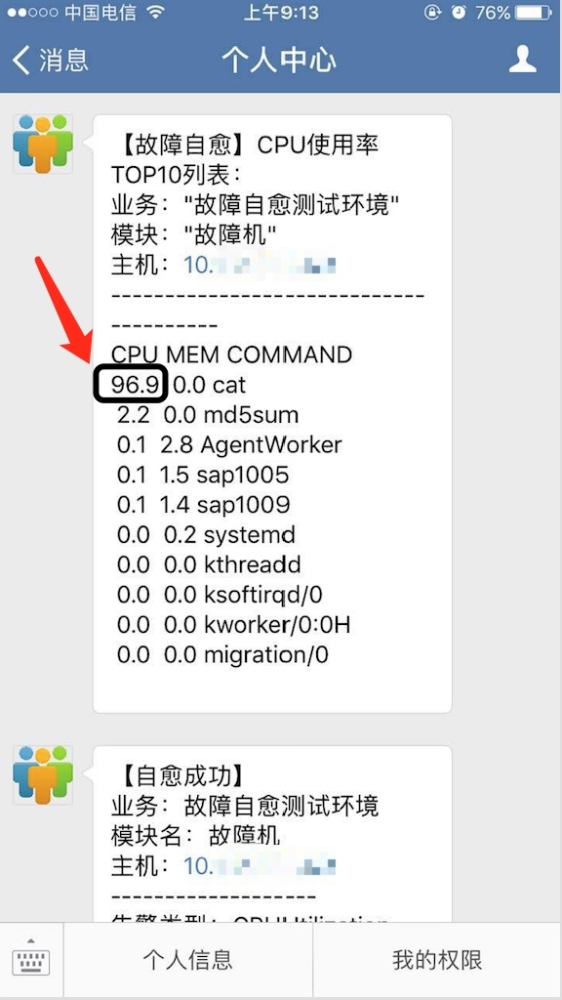

# CPU 使用率告警

一般出现 CPU 使用率告警后，我们很想知道是哪个进程造成的？

于是，故障自愈内置一个分析 CPU 使用率的快捷套餐 `『快捷』发送 CPU 使用率 TOP 10 进程列表(适用于Linux)`。

## 接入 CPU 使用率告警套餐

选择【接入自愈】菜单，点击【接入自愈】，告警类型选择 “CPU 使用率”，自愈套餐为 “『快捷』发送 CPU 使用率 TOP 10 进程(微信)”

## 自愈测试

在监控系统中产生 CPU 使用率，触发自愈。

下图是一条 CPU 使用率告警的自愈记录，微信消息显示占用 CPU 使用率最高的进程是我们测试的进程 `cat`。

关于 CPU 使用率套餐的技术细节，请参考 [上下文传参](Context_Parameters.md)。
