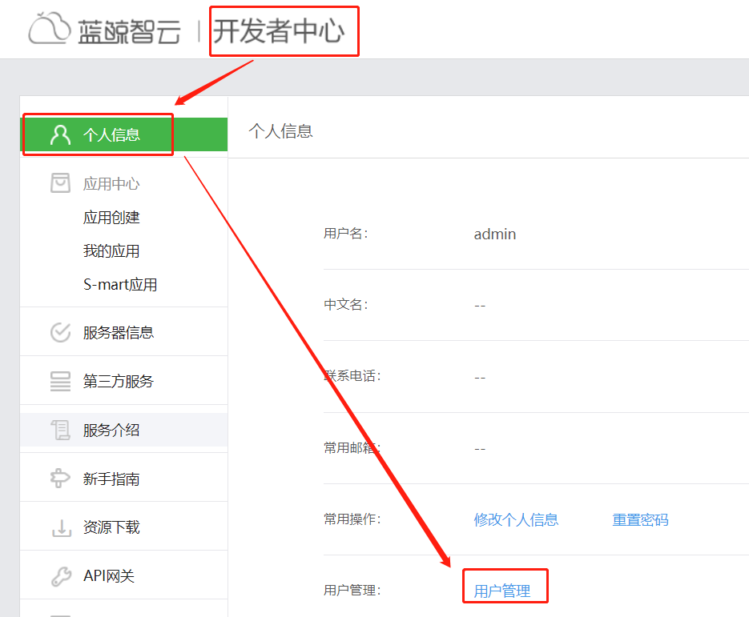
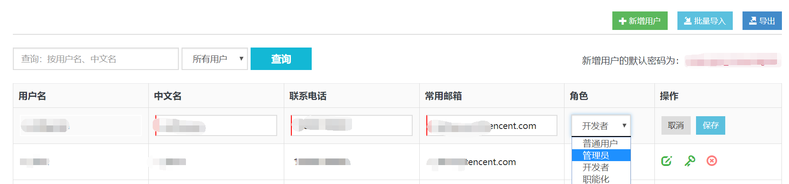
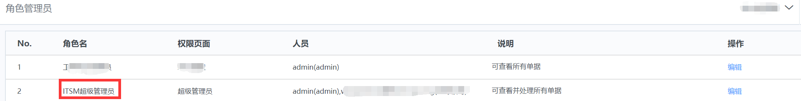
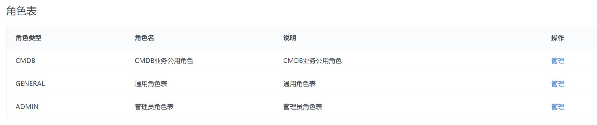
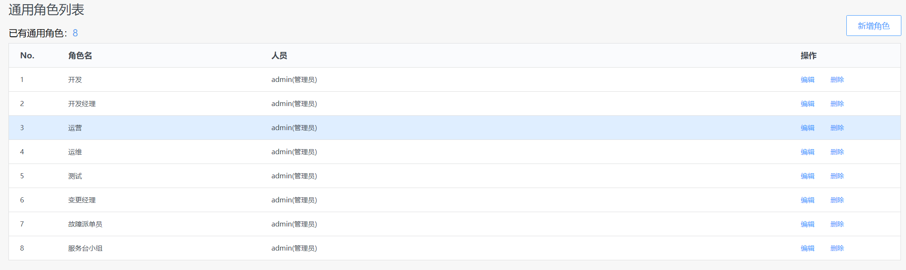
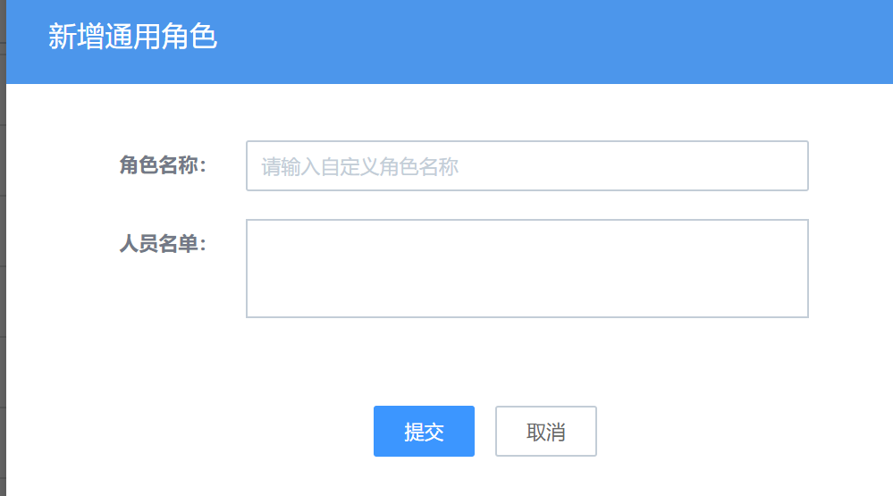
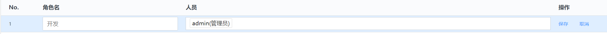
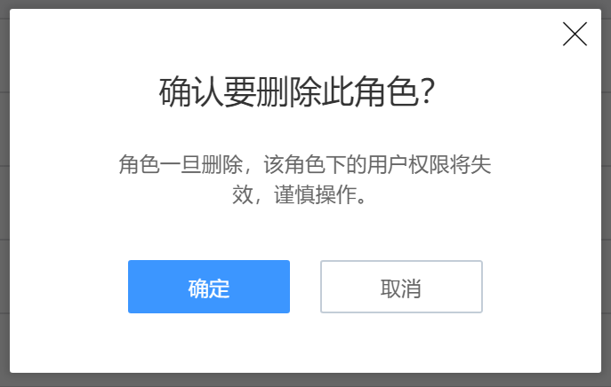
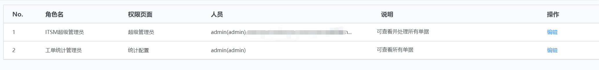
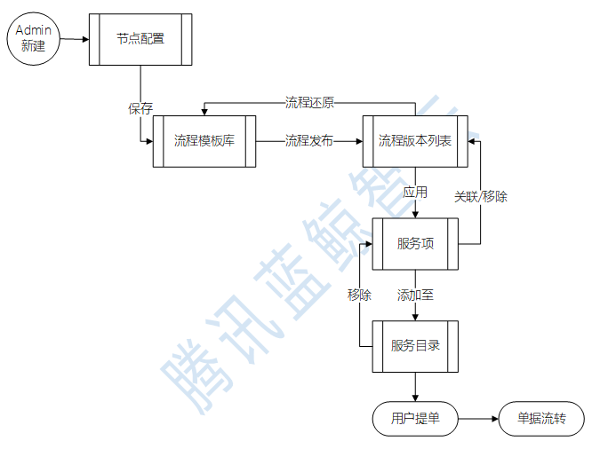

# 权限体系和角色管理

蓝鲸 ITSM 属于基于蓝鲸智云体系上开发的 SaaS 应用。PaaS 负责账号管理，针对上层所有 SaaS 生效。所以其账号登录沿用蓝鲸 PaaS 平台为整个蓝鲸体系提供的“统一登录”模块，作为整个蓝鲸智云软件的统一入口。

初始化账号为“admin”，内置于 ITSM 管理员列表中的“ITSM 超级管理员”，是 ITSM 中管理“角色体系”的最高级账号。

其他非“admin”的蓝鲸管理员账号，需要通过“admin”账号将其添加至 ITSM 超级管理员中，才会拥有 itsm 中的超级管理员权限。

ITSM 服务中涉及的角色需由 ITSM 超级管理员进行创建及维护。

图3. 蓝鲸体系统一登录界面

图4. 蓝鲸体系角色管理

图5. 蓝鲸体系用户角色权限管理

图6. ITSM 管理员角色列表

## ITSM的权限体系

权限体系主要表现在两方面：

-   访问控制：只有在蓝鲸体系内的账号/用户才能使用蓝鲸智云 ITSM 服务。

-   操作权限：通过 ITSM 中的角色管理对来访用户在 ITSM 中的操作权限进行管理。

>   ITSM中的角色及权限对应表如下：

<table>
  <tr>
      <th  align="center">角色 </td>
      <th  align="center">可见页面/菜单</td>
      <th  align="center">操作权限 </td>
  </tr>
  <tr>
      <td>前台普通用户(CMDB业务角色，通用角色，或一般来访用户) </td>
      <td>
      工作台 
      全局视图 
      变更管理：所有变更单，我的待办，我的申请单 
      事件管理：所有故障单，我的待办，我的申请单 
      请求申请：所有请求单，我的待办，我的申请单 
      问题管理：所有问题单，我的待办，我的申请单 
      知识库：知识录入，知识检索
      </td>
      <td>
      查看 
      处理 
      查询 
      提单 
      </td>
  </tr>
  <tr>
      <td>ITSM超级管理员</td>
      <td>所有页面</td>
      <td>所有后台管理权限，以及前台单据的特殊处理权限</td>
  </tr>
</table>

图7. 蓝鲸体系统一登录界面

## ITSM中的角色管理

>   ITSM 根据不同服务场景中的参与角色，将角色分为3种类型。

图8. 蓝鲸ITSM角色表

1\. 与业务或者应用服务强关联的“**CMDB 业务角色**”：例如变更某个应用服务或者业务系统下的配置信息，只能限定负责该业务下的服务团队来进行需求提单和处理跟进。如业务运维，业务产品接口人等。该类角色和名单 ITSM 直接从 CMDB 中同步，ITSM 本身不对此类角色进行管理或维护。

2\. **通用角色**：主要指承接通用性 IT 服务的角色。例如安全网络类的基础实施人员，审核账号开通的负责人，开通账号远程准入的实施人员等。此类角色及人员名单，均由系统管理员在 ITSM 的角色管理后台，根据实际场景来进行角色和人员的增删改日常管理。

图9. 蓝鲸ITSM通用角色表示例

-   新增/编辑/删除

图10.  ITSM通用角色管理1

图11.  ITSM通用角色管理2

图12.  ITSM通用角色管理3

删除会有二次确认提醒。

3\. **管理员**：可以进行 ITSM 后台管理模块的管理人员。此类角色和人员，由 ITSM 超级管理员在 ITSM 的角色管理后台进行配置维护。

图13. ITSM管理员角色

>   \*目前内置 ITSM 超级管理员和工单统计管理员两种角色。

图14.  ITSM后台管理逻辑图

