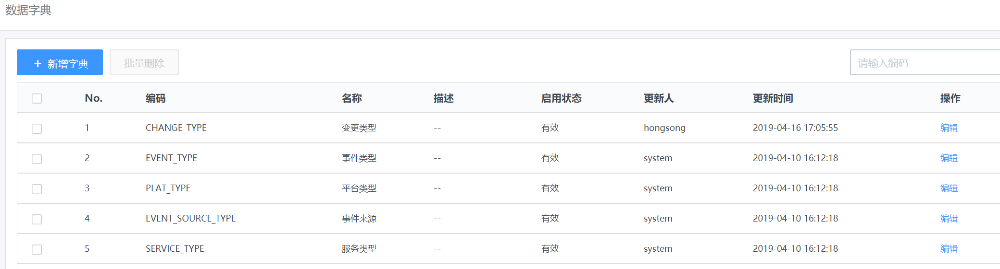
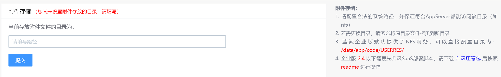
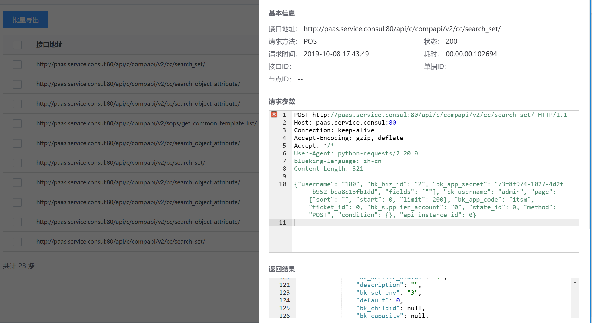

# 系统配置(后台)

## 数据字典

系统内置了部分数据字典，管理员在流程配置时，可以视流程场景需要，采用数据字典的信息，或自定义管理数据字典。

图44. 数据字典

图45. 新增/编辑数据字典

## 基础配置

-   附件存储

图46. 附件存储配置

>   如果表单中不需要使用“附件上传“类型的字段，可以不做配置，否则必须按照要求配置。

-   清除缓存

>   适用场景：如需即时更新来自 CMDB 的最新数据，可以通过手动清除缓存获取最新数据。

图47. 清除缓存

## 接口日志

>   流程中应用接口的调用日志。可协助进行问题定位或审计。

图48. 接口日志界面

