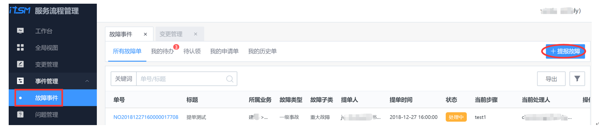

### 事件管理 

事件，是指非计划有服务中断、服务质量的降低或尚未对客户服务造成影响的事情。事件管理中的“事件”是一个广义的概念，不是狭义的故障，它可能是软件、硬件问题，也可能是服务需求事件。

故障，指已经直接造成客户服务影响的事件。

服务级别协议（SLA），服务提供者与客户之间签署的，明确服务内容与服务目标的文件化协议，用来保证服务质量做出的服务承诺。

事件管理的宗旨是尽快恢复故障或者排除告警，从而将对客户的服务损失降到最低，在此前提下尽可能满足服务的要求。

#### 应用逻辑 

- 定义不同的事件类型及类型下的子类。
- 配置不同事件的级别及对应SLA。
- 不同事件的流程设计。
- 用户前台提单。

#### 事件类型（后台）

对事件类型进行设置。事件类型主要分为故障和告警两大类。其中每个类别下可以设置子类，以更好管理事件分类，供后续的统计分析所用。

#### 事件级别及SLA（后台） 

不同事件类型的级别及相应SLA配置。SLA在当前版本中暂时没有应用到服务考核场景中，会作为后续的单据处理效率或者服务承诺参考之一。

#### 流程设计（后台） 

配置完成事件类型、级别后，则可以对事件流程进行设计配置。其配置方法和变更流程设计配置类似。具体配置可参考“变更管理流程设计”。

#### 提报故障（前台） 

提供给前台用户进行报障的服务。在获知故障后进行故障提报，单据根据后台设置的工作流进行流转及跟进。保证故障处理过程的可视，以及后续可回溯。

