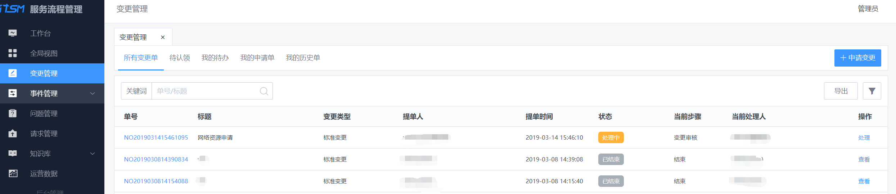
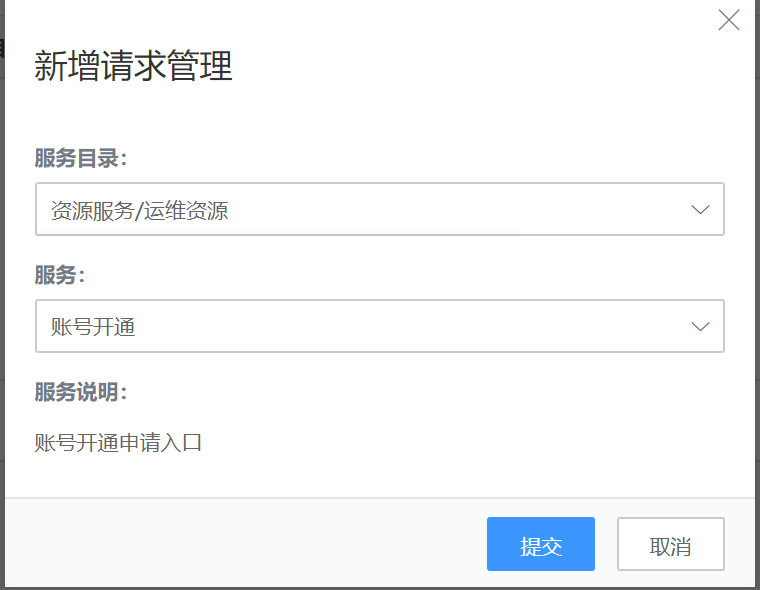
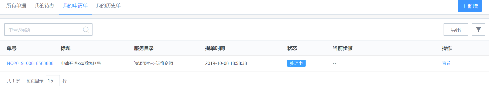
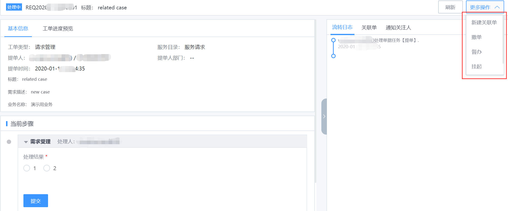
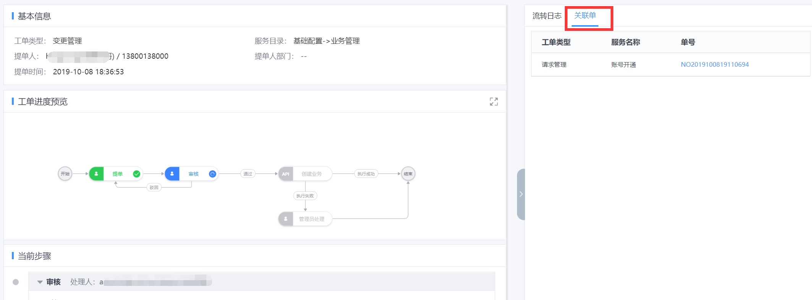
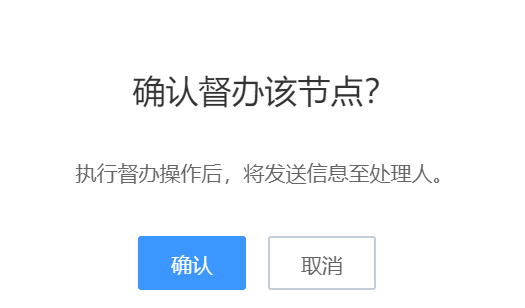
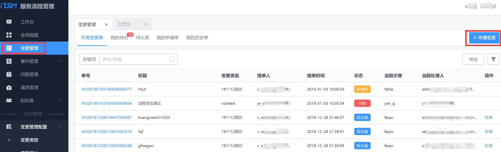
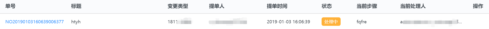
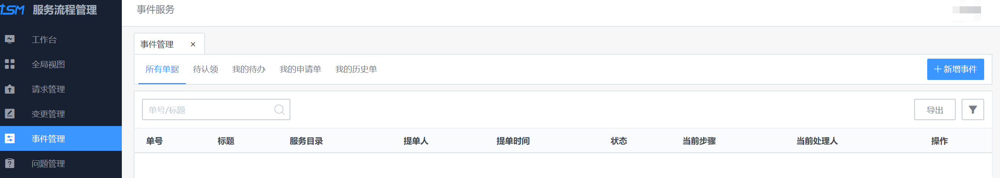
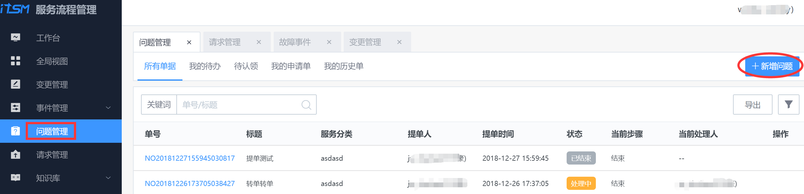

# 请求管理/变更管理/事件管理/问题管理(前台)

-   请求管理

请求管理是指用户对 IT 部门施加的或提出的各种不同类型要求的一般描述。其中很多实际上是小量的变更或者日常服务，具有低风险，高频需求，低成本等特征。例如开通权限，资源申请，数据支持，安装软件，咨询服务等…将此类与其他标准化的服务类型区分开，可以得到更高效的处理。

-   变更管理

变更是对 IT 生产环境中的软硬件及相关文档所作的增加、修改或移除。变更管理的目的在于管理和控制好变更(如变更的分类、审批、实施、回顾等)，最小化变更所带来的风险。

-   事件管理

事件，是指非计划有服务中断、服务质量的降低或尚未对客户服务造成影响的事情。事件管理中的“事件”是一个广义的概念，不是狭义的故障，它可能是软件、硬件问题，也可能是服务需求事件。

事件管理的宗旨是尽快恢复故障或者排除告警，从而将对客户的服务损失降到最低，在此前提下尽可能满足服务的要求

-   问题管理

问题管理是指确定引起事件发生的真正潜在原因以及提供的服务中可能存在的故障。并根据发现的原因来决定消除根因的解决方案，直至完成解决。问题管理的目标是消除引起事件的深层次根源以防止事件再次发生。

图57. 服务类型菜单

##  应用逻辑

1\. 管理员对服务项配置时，确定其所属“服务类型”。数据字典中，服务类型默认为请求，变更，事件，问题。服务项关联适合的流程版本。

2\. 服务项配置完成后，根据其所属服务类型，更新到前台各服务入口的提单选项中。

图58. 变更申请提交入口

图59. 提单入口的服务选择

## 请求管理(前台)

### 申请入口

图60. 新增请求入口

### 提交请求

图61. 选择服务

图62. 请求申请填单页面

### 处理请求

图63. 请求待办入口

图64. 处理界面

根据后台流程中设置的操作内容，以及当前用户的登录权限，单据处理页面会出现不同的操作按钮。

-   新建关联单：在处理单据过程中，如果衍生出其他的服务需求时，可以通过“新建关联单”来操作。将两个单据关联起来，关联后，两个单的处理流程依然独立进行不受影响，但可以在单据详情的“关联单“中查看单据信息。

图65. 关联单据查看

-   撤单：提单后，如果单据还未经后续环节处理，则提单人可以撤回该单据。撤回后，该单据将从列表中删除。

-   督办：拥有督办权限的用户，点击督办后，系统将发送通知提醒至当前处理人。

图66. 督办确认

-   挂起：单据处理过程中遇到特殊情况暂时无法处理完成时，可以选择“挂起”。需要备注挂起原因。

-   恢复：指将“挂起”的单据重新恢复到正常流程流转中。

-   打印：指打印工单当前信息。

## 变更管理(前台)

首页\>变更管理

图67. 首页变更提单入口

所有变更单：暂时对管理员可见。

我的待办：需要登入用户处理的单据列表页。

待认领：需要登入用户主动认领的单据列表。

我的申请单：登入用户提交的变更申请列表页。

我的历史单：我处理过的以及和我相关的单据。

### 申请变更

图68. 提交变更申请1

图69. 提交变更申请2

提交后，页面默认回到变更管理列表页。提交成功的单据会显示在列表中。

图70. 变更列表更新

在个人待办页中，会出现待办事项的更新提示。

### 处理变更

成功提交变更申请后，每个处理步骤的处理人会收到待办通知，其“我的待办”列表也会更新。处理人可以通过列表页的“处理”入口进入需求单的处理页面。[处理页面可参照“请求管理”部分的说明](./management.md#处理请求)。

### 查看变更

当变更单据处理完成，或者单据相关用户(如提单人)想查看变更单据详情以及，均可以通过变更列表的“查看”按钮进入详情页面。

## 事件管理(前台)

### 申请入口

图71. 事件提报入口

### 提报事件

图72. 提报事件页面1

图73. 提报事件页面2

通过“我的待办”进入处理页面。

### 事件处理

通过处理入口进入处理界面。处理完成提交，列表会更新单据状态。可以点击单号查看之前的处理信息。[处理页面的操作可参照“请求管理”页面的详细说明。](./management.md#处理请求)

## 问题提报

图74. 问题提交入口

图75. 问题提单

>   处理页面的操作，[同样可以参照“请求管理”中的详细说明](./management.md#处理请求)。
