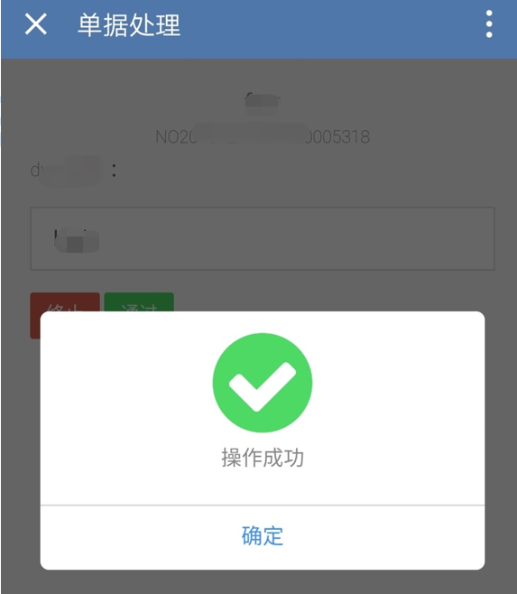

### 插件功能 

本产品通过插件的方式为用户提供增值服务，目前可以提供以下插件功能：

#### 评价邀请 

- 功能说明：
为了能收到用户真实有效地反馈，我们开发了满意度短信评价的功能，支持指定手机号发送评价邀请短信，短信中携带评价链接。用户可以在手机上做星级评价，方便管理者优化流程，提高服务质量。截图如下：

- 如何启用：
考虑到企业在使用蓝鲸平台时，基本都采用了私有化部署的方式，和公网隔离。所以我们提供了一个单独的评价服务应用，需要用户单独部署到一台主机，并对该服务开通有限的访问策略，在保证安全的情况下，对外提供服务评价功能。

目前该功能只做灰度开放，如有需要，请联系我们。

#### 移动端 

- 功能说明：
为了方便用户在手机端处理单据，我们开发了移动端界面，目前支持接入企业微信应用，方便用户在企业微信审批单据，简单改造后即可支持普通微信的单据审批，基本可以满足用户的移动端操作需求，截图如下：

- 如何启用：
考虑到企业在使用蓝鲸平台时，基本都采用了私有化部署的方式，和企业微信服务（公网）隔离，所以我们提供了一个一套代理方案，开放手机端服务，并实现了蓝鲸用户和企业微信用户的有效绑定，确保用户唯一有效。

目前该功能只做灰度开放，如有需要，请联系我们。
