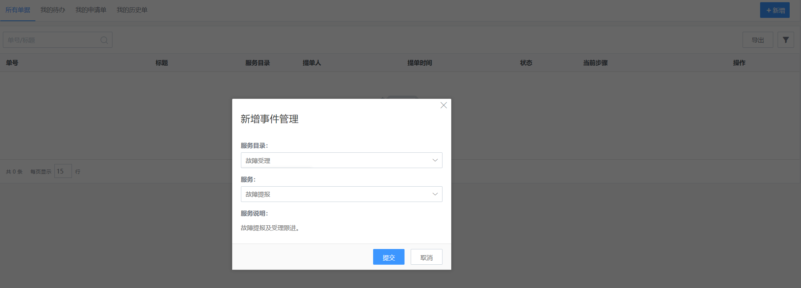
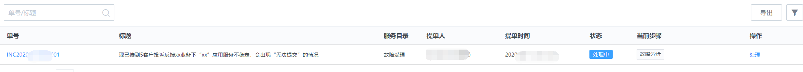
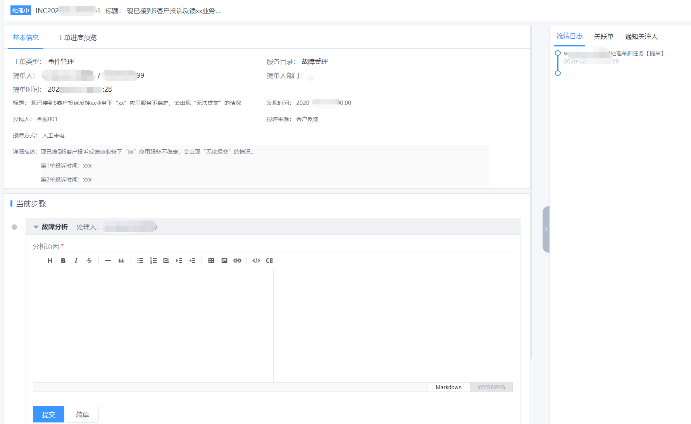
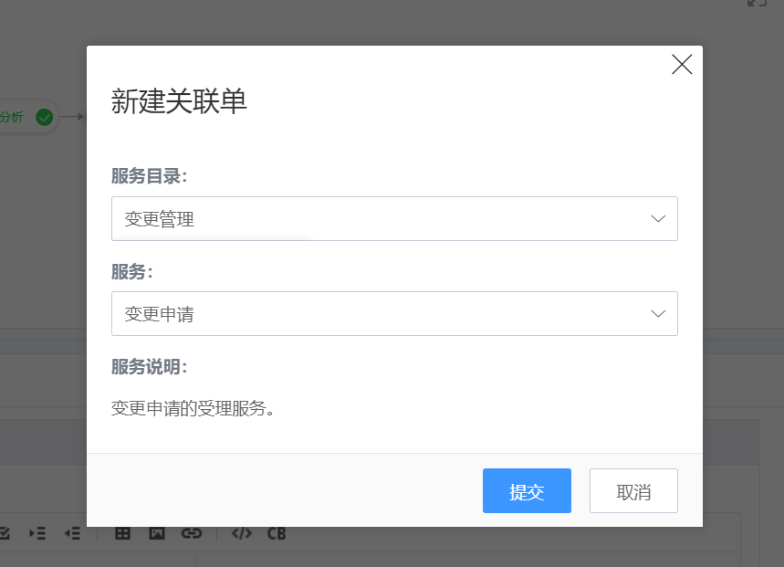
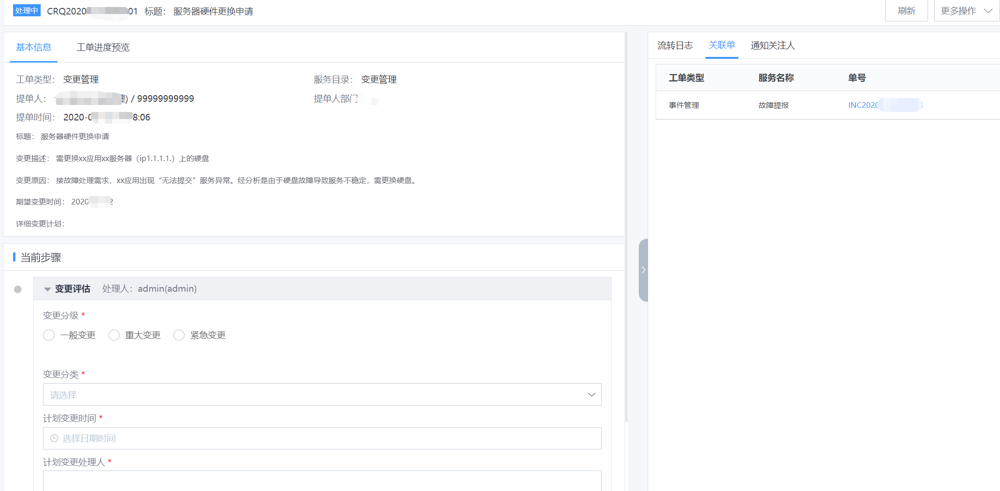
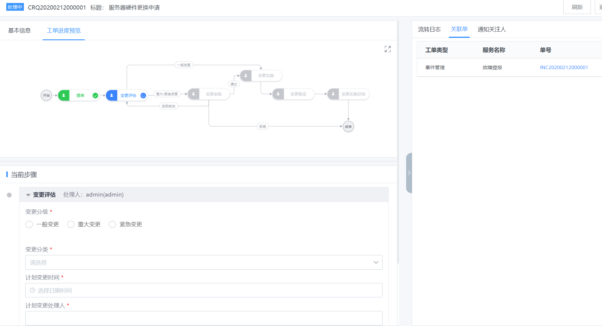

# 场景案例

## 情景：

**服务出现异常，需进行变更实施以恢复服务，如何将故障管理和变更申请有效关联？**

## 案例描述：

一线服务人员（服务台/客服坐席等，视不同企业管理方式会有所不同）收到用户/客户反馈“企业提供的xx应用出现服务不稳定的情况”，需要对异常进行记录及处理。

## 操作步骤：

### Step1 一线登入 ITSM，根据对应的服务入口，进行“故障提报”。

图1. 故障提报

图2. 填写故障信息

图3. 故障单

**Step2 提单之后，单据按照既定的受理流程进行流转处理。**

图4. 故障单跟进

>   运维人员在处理过程中，发现故障修复需要进行一个变更操作。例如：需要更换服务器硬件。

### Step3 故障处理人发起一个“变更申请”。变更单和事件单自动关联。

图5. 新建变更申请1

图6. 新建变更申请2

>   变更单创建完毕，两个单据互为关联单。均可在单据详情列表的“关联单”入口查看。

图7. 关联单

### Step4 变更单按照变更管理流程进行流转。直至变更实施完成并验收通过。

图8. 变更单进度视图

### Step5 故障处理人确认变更实施完成并验收通过，同时更新故障单的处理信息。确认服务恢复，故障单关闭。
