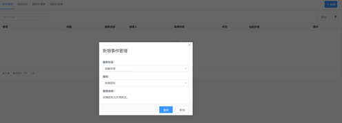
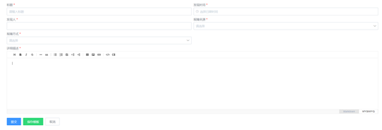
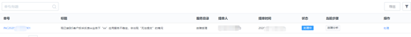
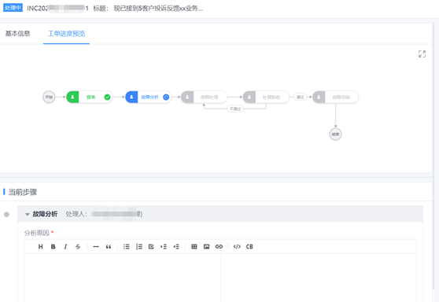
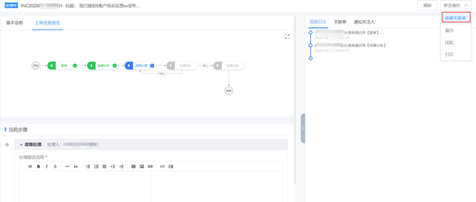
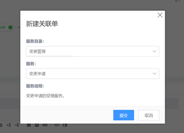
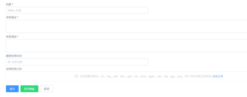
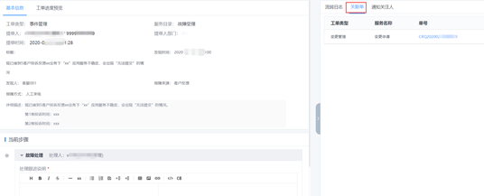
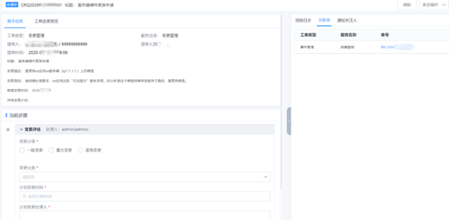
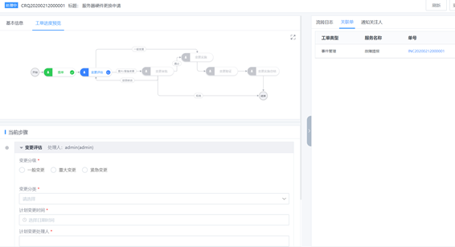

# 场景案例

案例描述：一线服务人员（服务台/客服坐席等，视不同企业管理方式会有所不同）收到用户/客户反馈：企业提供的xx应用出现服务不稳定的情况，需要对异常进行记录及处理。

Step1 一线登入 ITSM，根据对应的服务入口，进行“故障提报”。

图81. 故障提报

图82. 填写故障信息

图83. 故障单

Step2 提单之后，单据按照既定的受理流程进行流转处理。在处理过程中，发现故障修复需要进行一个变更操作。

图84. 故障单跟进

图85. 处理进度视图1

图86. 新建变更申请1

Step3 故障处理人发起一个“变更申请”。变更单和事件单自动关联。

图87. 新建变更申请2

图88. 新建变更申请3

图89. 关联单视图1

图90. 关联单视图2

Step4 变更单按照变更管理流程进行流转。直至变更实施完成并验收通过。

图91. 变更单进度视图

Step5 故障处理人确认变更实施完成并验收通过，同时更新故障单的处理信息。直至故障单关闭。
