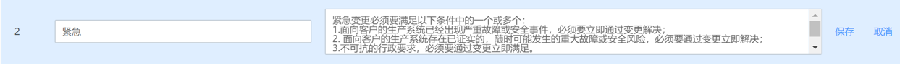
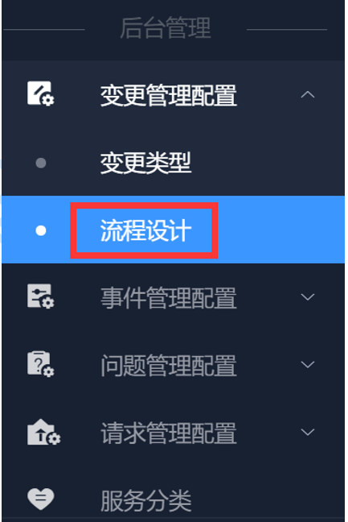
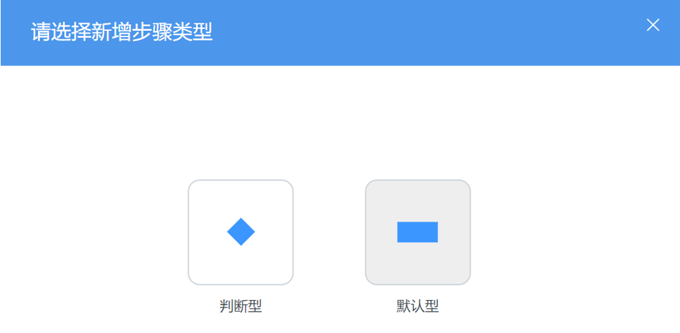
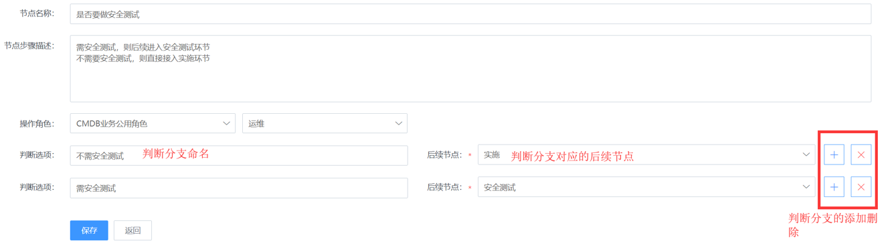

### 变更管理 

#### 配置变更类型 

- 新增变更类型

- 编辑变更类型

- 删除变更类型

#### 变更流程设计 

- 新增流程

成功增加一个流程，需要完成3个步骤的设置。

1.填写流程基本信息

字段信息：
- 请输入流程名称：输入该流程的名字。例如：防火墙策略申请
- 请输入流程说明：对该流程的说明描述
- 变更服务：此处从“服务分类”拉取分类内容，选择合适的服务场景。服务分类最多有3级。
- 变更类型：选择对应的类型。

**备注**：系统通过“变更服务”和“变更类型”的组合匹配生成唯一的流程标识。当后续再进行流程配置时，将不允许新建重复的流程项。
- 流程是否和业务关联：该字段的配置将影响到流程后续节点的处理角色选择。

  * 是：表明该流程和业务系统强关联。比如申请变更某个业务系统或者应用系统下的服务器配置信息时，只有负责该业务系统的对应人员才能提单或者处理。则对此类流程进行设计配置时，就需要通过业务权限来进行鉴权和操作限制。勾选后，在设置该流程的节点信息时，处理角色的下拉列表中将出现“CMDB业务角色”选项。
  * 否：表明当该条流程属于一般公共性服务，不与业务应用关联。例如，安全网络的策略开通，账号开通等。

2.定义与配置流程节点

当填写完成基本流程信息后，会进入到流程节点的定义和配置步骤。
该部分可以自行决定整体流程的长短，增删节点，节点类型，以及设置每个节点的字段信息。

**说明：每个流程的默认起点环节为“提单”。**

（1）增加节点

目前节点类型分为两种：判断型和默认型。
- 判断型：该节点为判断操作型，会出现判断分支设置。
- 默认型：普通操作节点。

a.新增普通节点

- 打回设置：指在该节点的处理阶段内，是否接受打回操作。如需要，则设置对应的打回环节。
- 是否需要派单：指该节点是否需要专人进行单据分派。勾选“是”，则可以设置派单角色或者派单个人。应用此项后，前台单据流转中，派单人将在操作角色的范围下进行单据派发。
- 是否需要认领：指该节点是否需要处理人主动认领。勾选“是”，在前台单据流转中，该单据会流入处理人的“待认领列表”中。处理人认领完成之后，会更新到自己的待办列表中。
- 是否可转单：指该节点是否可以转给其他人处理。勾选“是”，则在前台的处理页面，会出现“转单”按钮。
- 是否可终止：指该节点的处理人是否可以直接终止单据流程。勾选“是”，在前台操作页面会出现“终止”按钮。

b.新增判断节点

由于判断节点涉及判断分支和对应后续节点的设置，因此判断节点必须在有后续节点后，才能对判断节点本身进行设置。

（2）设置节点字段信息

a.普通节点的设置

节点名称：自定义该节点的名字，建议简单明了。“提单”为系统默认起始节点，名称不允许被更改。

操作角色：选择指定角色后，该角色下的所有人员均拥有该节点的处理权限。

- CMDB业务公用角色：存放在CMDB业务列表中的业务公用角色。比如业务运维人员，产品人员，测试人员，开发人员。

**备注：只有该流程的基本信息中，流程与业务关联时，各节点的操作角色下拉框中才会出现“CMDB公用角色”选项。**

- 通用角色表：“角色配置”后台中“通用角色”中的角色。
- 个人：指定具体的人员，可同时指定多人。
- 提单人：指提交单据的人。
- 派单人指定：不预设环节处理人，由特殊的派单人来进行指定。选择此项后，“是否需要派单”将默认为“是”。

- 不限：指该节点任何用户都可以进行操作。目前仅“提单”环节的操作角色有“不限”选择。

字段设置：自定义该节点中需要用户提交的信息。

“提单”环节中，系统内置了部分默认字段。用户可以根据实际情况对默认字段进行编辑，但无法删除。用户需要增加其他字段时，可点击“新增字段”按钮进行自定义配置。

目前支持的字段类型有：

单行文本，多行文本，数字，日期，时间，时间间隔，表格，单选下拉框，多选下拉框，复选框，单选框，单选人员选择，多选人员选择，富文本，附件上传。其中，附件上传类型，可以在后台上传附件模板，供用户在前台提单时下载参考查看。

字段排序及字段预览：

可通过“上移”“下移”来管理字段顺序。并通过“字段预览”来查看应用到前台页面时的显示。

b.判断节点的字段设置
- 节点名称，操作角色：与普通节点一样。
- 判断分支设置：

判断选项是指该节点的判断走向条件，每个判断选项对应一个后续流转节点。

- 流程预览

3.流程启用设置

在未进行流程启用设置之前，流程会以“草稿”状态保存在流程列表中。流程启用按钮打开以后，该流程才会正式生效供前台应用。

是否督办：是指该流程是否需要指定人在任务过程中进行督办提醒操作。“提单人”为默认督办人。在流程未结束之前，可以随时对处理人进行督办提醒。当设置后，在前台单据流转过程中，会出现“督办”按钮。

**说明：ITSM中的通知方式是直接调用ESB的通知组件服务，在使用该服务之前，请确保在蓝鲸的开发者中心里面完成各渠道的配置工作。**

配置路径：蓝鲸>开发者中心>API网关>通道管理>[CMSI]蓝鲸消息管理

4.流程日常维护操作
- 查看流程

鼠标拖动流程图可以查看完整流程。

- 编辑流程

流程更新后，对已经在流程中的单据无影响，仅对更新后的新提单生效。

- 删除流程

删除流程后，对已经在流程中的单据，不受影响。删除会有操作确认提醒。

#### 变更申请（前台） 

变更后台流程设计完成并应用后，用户可到前台入口进行单据提交。

1.申请入口

首页>变更管理

- 所有变更单：暂时对管理员可见。
- 我的待办：需要登入用户处理的单据列表页。
- 待认领：需要登入用户主动认领的单据列表。
- 我的申请单：登入用户提交的变更申请列表页。
- 我的历史单：我处理过的以及和我相关的单据。

2.申请变更

提交后，页面默认回到变更管理列表页。提交成功的单据会显示在列表中。

在个人待办页中，会出现待办事项的更新提示。

3.处理变更

成功提交变更申请后，每个处理步骤的处理人会收到待办通知，其“我的待办”列表也会更新。处理人可以通过列表页的“处理”入口进入需求单的处理页面。

处理页面分为3块信息区域。基本信息查看区域，工作流查看及处理区域，流转日志等其他入口查看区域。
根据后台流程中设置的操作内容，以及当前用户的登录权限，单据处理页面会出现不同的操作按钮。

- 挂起：单据处理过程中遇到特殊情况暂时无法处理完成时，可以选择“挂起”。需要备注挂起原因。
- 恢复：指将“挂起”的单据重新恢复到正常流程流转中。
- 打印：指打印工单当前信息。

4.查看变更

当变更单据处理完成，或者单据相关用户（如提单人）想查看变更单据详情以及，均可以通过变更
