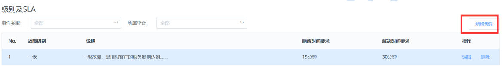
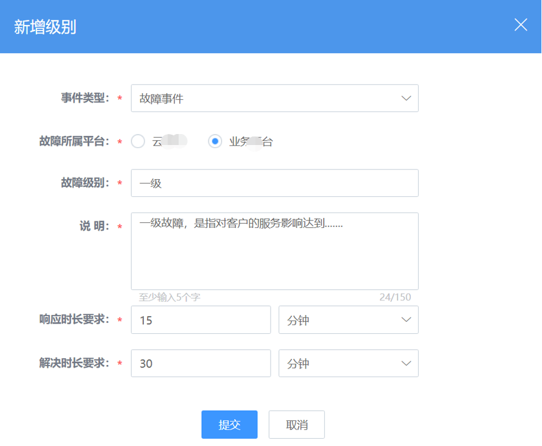

# 事件管理

## 配置事件类型

新增事件类型

## 配置事件级别及SLA

新增事件级别及SLA

## 事件流程设计

其配置方法和变更流程设计配置步骤类似。可参考“变更流程设计”此处不再详细描述。

## 提报故障（前台） 

1.申请入口

2.提报故障

通过“我的待办”进入故障处理页面。

3.处理故障

处理完成提交，故障列表会更新单据状态。可以点击单号查看之前的处理信息。
