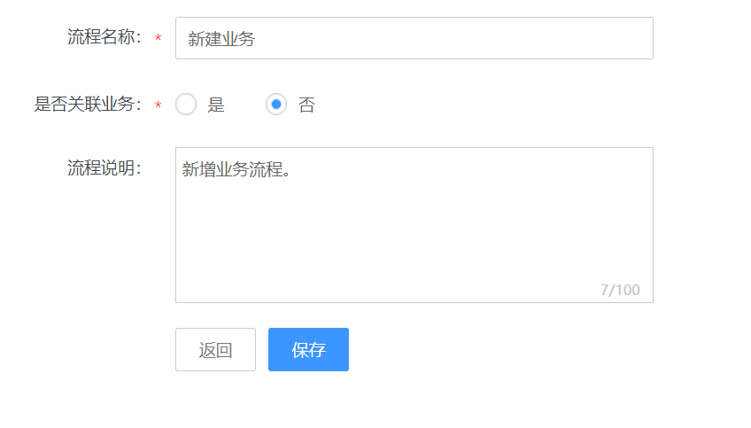

# 流程管理

## 新增流程

入口：后台管理\>流程管理\>流程设计

图80. 新建流程模板

详细步骤请参考“[流程设计](../产品功能/process.md#填写流程基本信息)”。

## 部署流程

在流程模板列表中，选择“部署”。

图81. 流程部署按钮

## 确认流程版本

部署完成后，在“后台管理\>流程管理\>流程版本”页面中，确认版本。

图82. 流程版本确认

