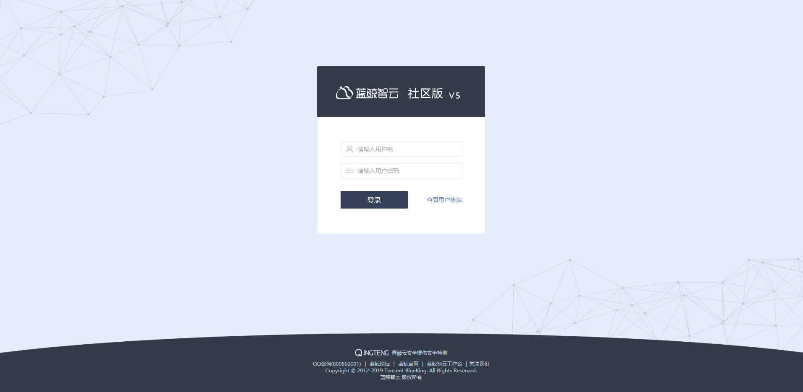
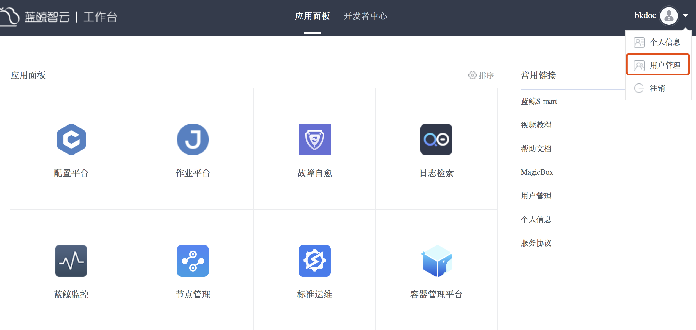

# 用户管理

为了保证使用蓝鲸产品的用户都是可信的，PaaS 平台为整个蓝鲸体系提供了 “统一登录” 模块，该模块包含了基本账号体系。当搭建部署好蓝鲸体系的产品后，会提供一个 URL 给用户访问。

社区版提供了5种角色：

(1) 管理员：管理员可以管理所有用户的信息，具有所有权限

(2) 普通用户：可以管理自己的用户信息和访问 “工作台”

(3) 开发者：可以管理自己的用户信息、访问 “工作台” 和访问 “开发者中心”

(4) 职能化用户：在普通用户权限上还拥有SaaS应用 “标准运维” 的职能化权限

(5) 审计员：在普通用户权限上还拥有SaaS应用 “标准运维”和作业平台的审计权限

> 注：社区版的管理员初始化密码在蓝鲸部署前的/data/install/globals.env文件中定义，且该 admin 是整个体系内置的管理员账号，该账号不可删除，请妥善保存。

管理员可以管理用户信息，包括分配用户角色和权限。

支持以下操作：

(1) 新增用户：录入信息，添加一个用户；

(2) 批量导入：下载 excel，并按照格式完善信息，即可批量导入用户信息；

(3) 用户查询：可选择角色类型（所有用户，管理员，用户）进行查询；

(4) 操作：编辑用户信息，重置密码，删除用户。
