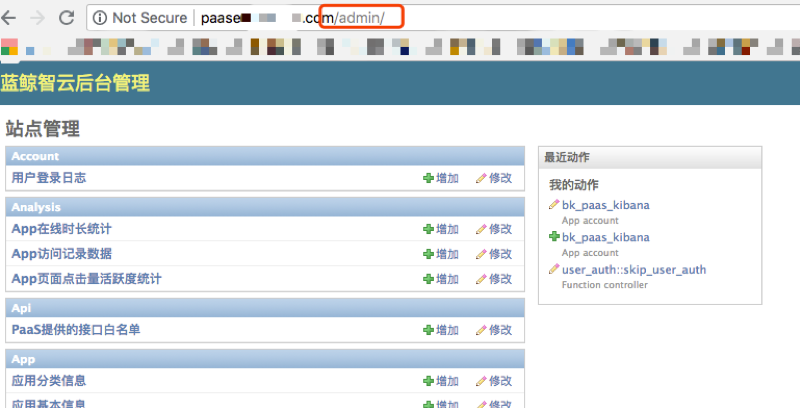

# 部署应用过程中，状态一直在 “正在提测” 中，如何处理？

1) 以“admin”身份进入蓝鲸软件；

2) 在浏览器输入“{domain}/admin”即可进入 PaaS 平台的后台

图一. PaaS 平台后台图

3) 进入如下图的目录，找到对应的 SaaS，更改其当前的状态，即可进行重新部署

图二. “日志检索”的状态修改入口图

4) 将 SaaS 状态调整为“测试中”即可对该产品重新部署。
