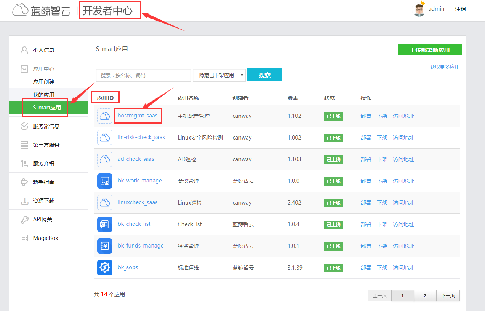
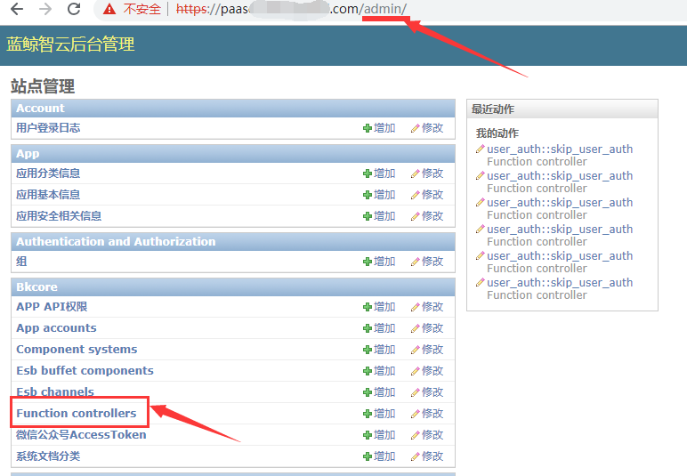

# 如何给某一个 SaaS 开组件“免用户认证”的白名单？

> **S-mart 市场和自己开发的 SaaS 需要开通白名单免登录验证才能正常使用**

- 获取 `应用 ID`,登陆 `PaaS 平台`—>`开发者中心`— `S-mart应用`(自己开发的应用在`我的应用`)

- 以管理员身份进入 PaaS 平台的后台 `{paas_domain}/admin`，进`Function controllers`目录

- 点击 `user_auth::skip_user_auth` 进入白名单组件目录

- 根据格式要求填写`应用 ID`（`支持两种格式数据，以逗号、分号分隔的字符串，及 JSON 格式字符串`）

