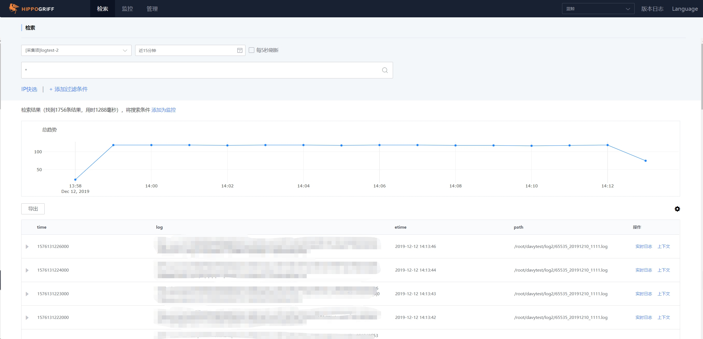
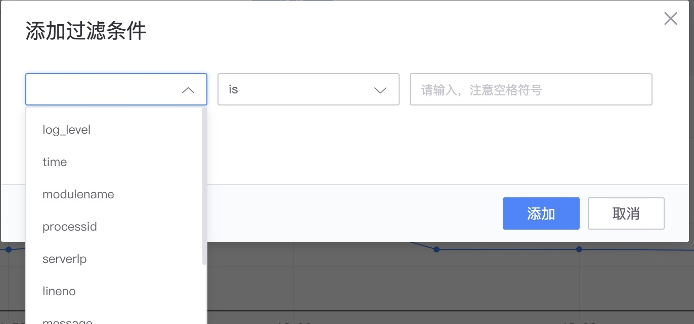
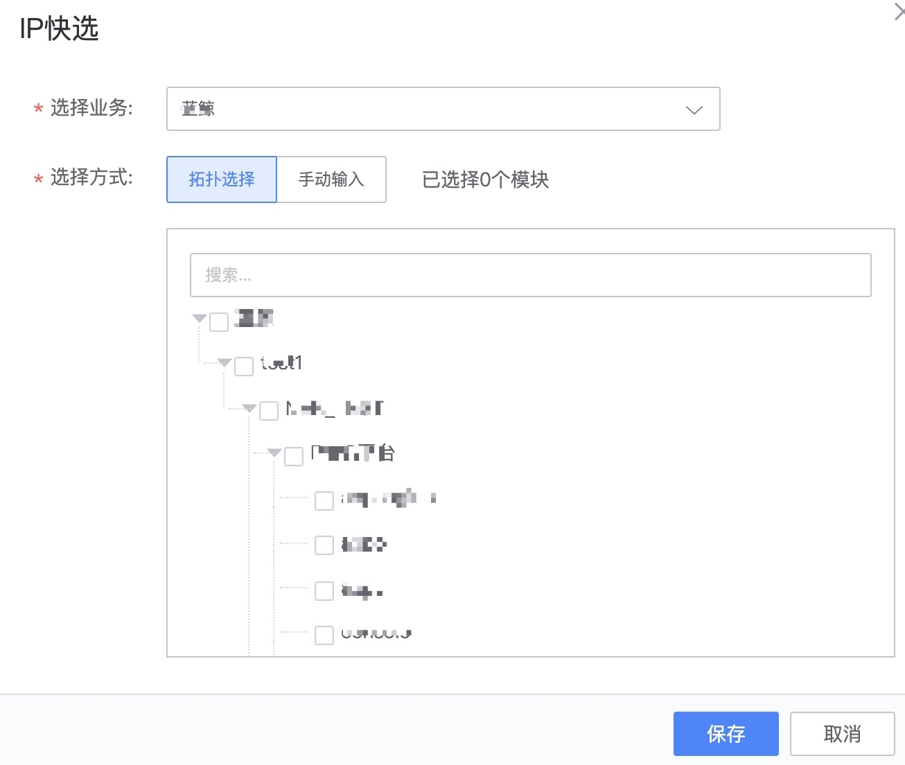
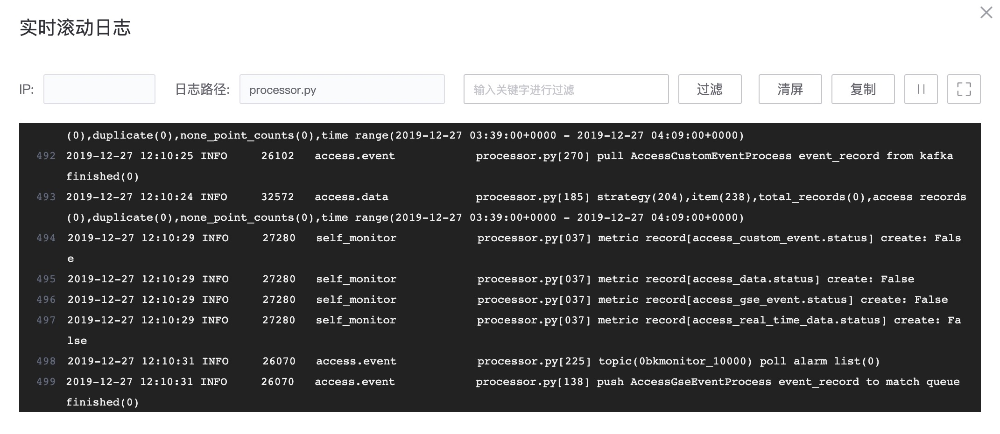
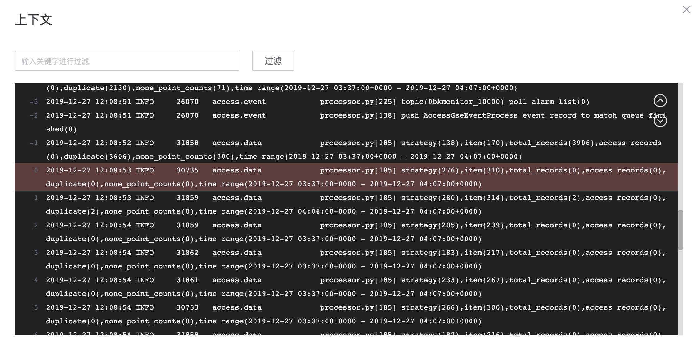
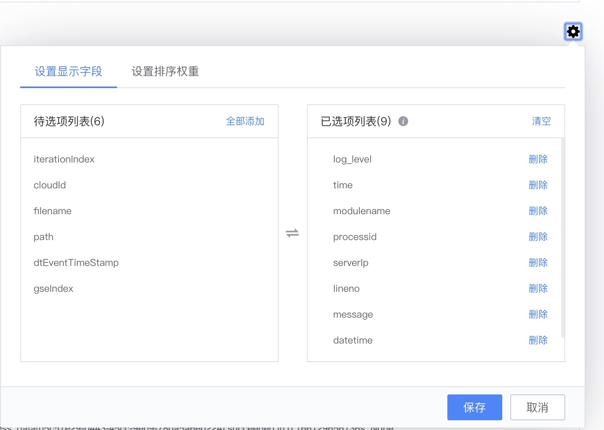

# 日志检索

日志检索主要是用来快速定位问题,避免在服务器端进行日志的查询,优点是性能高效和工具便捷. 

## 前置步骤

能够进行日志的检索,需要已经有数据源的接入并且形成`索引集`,才可以用来检索和监控. 

## 功能列表

### 主功能一览

* 日志检索和展示
* 过滤条件和IP快选
* 实时日志滚动
* 上下文
* 字段显示和排序

### 功能介绍 

**检索语句** 支持QueryString语法和正则匹配。 具体的查询语法查看[query string详解](addenda/query_string.md)

**添加过滤条件** 可以更精确的定位到日志内容

**IP快选**通过关联CMDB的业务拓扑，控制日志检索范围。

**实时日志滚动**

**上下文查看**

**字段显示和顺序,还有多列排序功能**. 

