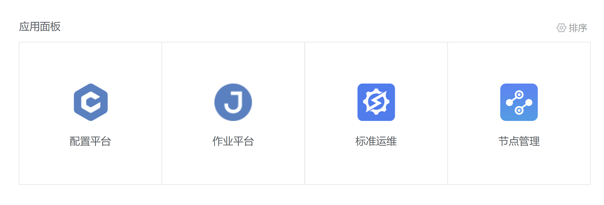

# 环境验证

- 登录机器，通过脚本自带命令查询蓝鲸后台模块的运行状态。
```shell
./bk_container_ctl status
```


- 在浏览器上访问 [http://paas.bk.com](http://paas.bk.com)，帐户密码可通过以下方式查看：
```shell
docker exec -it bk5.1-relese-latest /bin/bash
vim /data/install/globals.env
# 找到下列两行信息
export PAAS_ADMIN_USER=admin
export PAAS_ADMIN_PASS='xxxxx'
```

