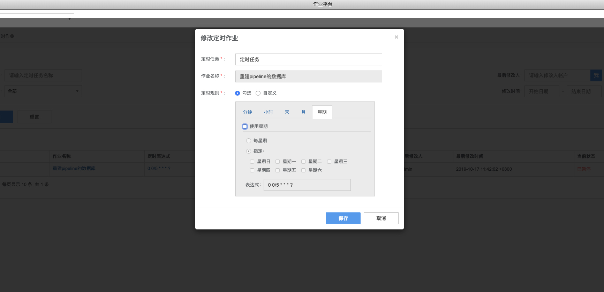

# 定时作业

“秒级” 定时，任务执行 Timing 更精准。突破了传统 Linux 系统自带的分钟级定时任务，作业平台能够支持到以秒为最小时间粒度的定时任务计划。且每个定时任务执行过程都会被记录日志，让一切操作都可追溯。对已创建的作业任务进行定时启停，可修改和删除。

定时任务类似于 Linux 下 crontab 语法，分别为`秒 分钟 小时 天 月 星期 年`，其中

- 用`*`表示每个周期
- 用`0/5` 从 0 开始，每隔 5 的周期
- 用`0,1,2,3`表示指定周期 0,1,2,3
- 定时规则，选`勾选`时从 0 秒开始执行，如需从指定的秒执行，选择自定义
- 定时规则，选`勾选`时默认无指定年的功能，如需指定年，选择自定义

