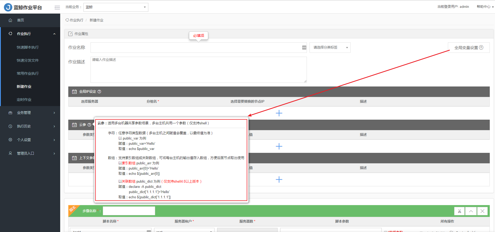
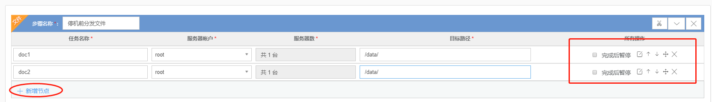
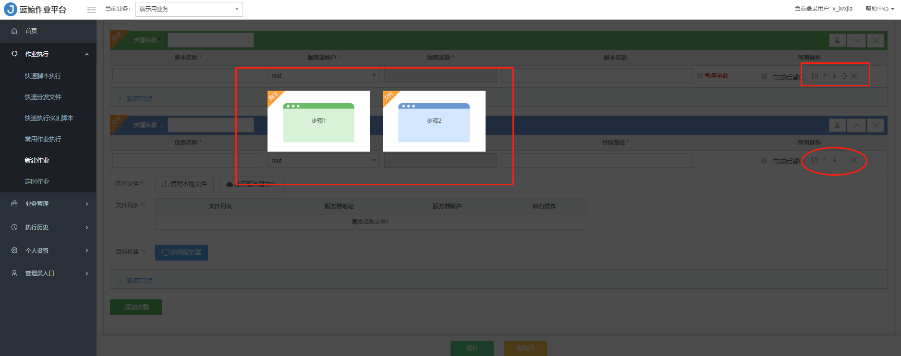

# 如何创建一个作业任务

1、填写作业名称、选择分类标签、输入作业描述。

2、全局变量设置。

支持全局变量的配置，支持全局 IP 设定、云参、上下文传参等三种全局变量设置方式。

- 全局 IP 设定

  是指多个步骤节点之间执行主机相同的场景。

- 云参

  是指多台主机共享参数，多台主机下的多个脚本都可以调用同一参数。

- 上下文传参

  是指两个节点同一个目标机器的参数传递。

3、设置步骤：

- 因为系统默认步骤 1 是 【添加脚本】 ，如需指定步骤 1 为 【添加传输文件】或 【添加 SQL 脚本】，应先新建步骤 【添加传输文件】 或 【添加 SQL 脚本】，然后拖动移动至步骤 1。

- 点击 【+新增节点】 ，每个步骤支持多个节点并发。每个节点支持一对多、多对一、多对多的文件(本地文件或服务器文件)分发。

- 支持对当前步骤的所有节点的 【完成后暂停】、【任务编辑】、【节点上移】、【节点下移】、【拖放】、【删除】 操作。

  

- 【拖放】 功能可以跨同类型的步骤实现节点移动。

  

4、设置完成，点击`保存` 或者`去执行` ，成功则会反馈执行结果`执行成功` ，如有任一步骤 `执行失败` 执行结果会反馈 `执行失败` ，每个步骤可以查看执行详情。

