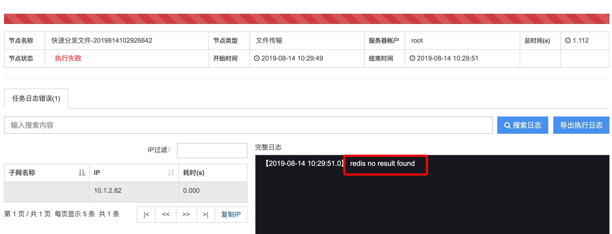

# 作业平台常见问题

## JOB 启动失败

job 启动失败常见原因：

- 若有日志，根据日志定位
	- 证书是否匹配
	- RabbitMQ 连接是否失败
	- Redis 连接是否失败
	- Mysql 连接是否失败
	- 确定 IP/密码/用户名是否存在及正确
- consul 是否路由正确
- 端口问题`/data/bkce/etc/job.conf`配置项内的端口是否有冲突
- 环境问题导致没有日志，打开`/data/bkce/job/job/bin/jo.sh`的`NOHUPLOG=job_jvm_console.log`配置，再重启确认 job 的日志目录下的日志文件 job_jvm_console.log 进行确认
- 确认 License 合法及可以连接

## JOB 作业一直等待执行

在执行作业时，步骤状态一直为等待执行，解决方法如下：

- RabbitMQ 连接异常，作业启动信息收不到，请检查 RabbitMQ，并重启 Job 进程尝试恢复
- 检查项：ijobs.amqp.addresses，ijobs.amqp.username，ijobs.amqp.password。其中 ijobs.amqp.username，ijobs.amqp.password 与 app.code 和 app.secret 配置项相同，并且 RabbitMQ 会在创建帐号后并授权 vhost 名为 bk_job 的使用权限

## JOB 一直跳转登陆页面

此问题一般为 PaaS 登陆接口通信失败，解决方法如下：

- 检查`/data/bkce/etc/job.conf`中 bk.paas.host 配置项，确认地址是否可以连通，并确认 PaaS 是否正常
- 检查`/data/bkce/etc/job.conf`中 bk.paas.host 配置项 app.code 和 app.secret 配置是否正确，否则访问 PaaS 接口会鉴权试下而无法登录

## JOB 无执行日志

在排除用户的脚本本身就不输出日志的正常情况，JOB 出现无日志的情况有很多种，第一种是 Job 本身问题，与 GSE 无关，当 error.log 出现 Table has no partition for value xxxx  这种错，就是 Job 本身的问题，原因：

JOB 对日志数据库表进行表分区， 并且要求 MYSQL 中启动事件调度功能，JOB 默认会在版本升级时自动启用这个功能，在 JOB 的版本 1.2.49 之前，蓝鲸出厂默认的 MySQL 配置中没有开启这个功能，所以在 MySQL 被重启后，这个事件功能被关闭，随着时间流转，分区不够用了，会出现这个错误 。

解决办法可根据情况选择：

1.不想升级蓝鲸版本

•在 Mysql 配置文件 my.cnf 中的[mysqld]部分添加以下内容 event_scheduler=ON   并重启 MySQL

•请联系蓝鲸人员提供一个 Job 的临时启用 event 的 SQL

2.升级蓝鲸到最新版本。

## JOB 耗时时间长并无执行日志：Execution result log always

此问题出现在 job.log 文件内，并一直打印`redis reply is not string`这种情况，原因如下：

- 此情况属于 GSE 的任务管道或者 Agent 的原因导致的无日志，这种情况需要排查 GSE 服务是否正常，以及执行机器 Agent 进程是否正常，有可能在执行中被杀掉，导致长时间无上报执行日志给服务器
- 最终结果为 JOB 的作业执行日志出现`Execution result log always`，这个是在脚本作业的超时时间范围内如果连接 10 分钟内一直没有收到任何日志信息，JOB 会触发保护，强制终止作业并返回上述信息给用户

## JOB 脚本耗时长并失败：Script log timed out

出现此问题可能两种原因：

- 用户业务脚本问题：执行过于耗时的脚本，并且超过了设置的脚本超时时间，一般默认是 1000 秒，在此时间基础上多 1-10%以内是正常的。若因为此原因，解决方法：修改耗时脚本或者修改脚本超时时间
- GSE Agent 的问题：作业最终超时时间是在用户设置的超时时间再+20%，若用户设置了 1000 秒超时，但脚本最终在 1200 秒以上出现超时，则表示这个任务是因为 Agent 原因导致长时间无响应，最终 JOB 容错了 20%的时间（1000+200 秒）而强行触发终止。解决方法：重启 GSE Agent 再重试

## JOB 连接 GSE 失败

这种报错，说明 job 连接 gse_task 异常 可能的原因如下：

- gse_task 进程异常，48669 端口（task 提供给 job 通信的端口）未监听
- job 配置文件`etc/job.conf`里配置的 gse.taskserver.ip 的值无法连通
- 证书问题，会爆出 ssl 字样的错误信息

## JOB 无法发现 Agent

这类报错说明 job 连接 task 是正常，但是 agent 状态异常

- agent 安装问题，失败，进程未正常启动
- agent 到 gse_task 的 48533 端口未建立 tcp 连接
- agent 证书和 gse_task 的不匹配，会爆 ssl 字样错误信息
- 云区域 ID 不匹配

## 分发文件，执行历史报 "redis no result found"
- 问题现象

  
  
- 解决方案

    1.gse 或者 redis 进程状态异常。
    
     gse redis 异常查看相应日志文件。/data/bkce/logs/gse/、/data/bkce/logs/redis。
       
    2.登陆至 gse server 模块所在机器上，`ps -ef |grep gse_agent` 确认该机器上成对出现 gse_agent 进程。如无，执行 `/usr/local/gse/agent/bin/gsectl start` 手动拉起 gse_agent。

    3.gse 和 redis 需要同在一台机器上部署。

## JOB 平台错误代码

| 错误码  | 源   | 目标  | 描述                                                         |
| ------- | ---- | ----- | ------------------------------------------------------------ |
| 1210001 | JOB  | GSE   | GSE TaskServer 不可用                                        |
| 1210101 | JOB  | GSE   | 当前证书服务不可用，请检查 license_server！                   |
| 1250001 | JOB  | Redis | Redis 服务不可：IP 不对或者配置错误                            |
| 1250002 | JOB  | Redis | Redis 服务内存满或者其他问题：内存不足                        |
| 1259001 | JOB  | NFS   | NFS 存储不可用                                                |
| 1252001 | JOB  | MYSQL | 数据库异常                                                   |
| 1255001 | JOB  | MQ    | Rabbit MQ 不可用或者连接不上                                  |
| 1211001 | JOB  | CMDB  | CMDB 服务状态不可达：地址配置错误                             |
| 1211002 | JOB  | CMDB  | CMDB 接口返回数据结构异常。一般是被网关防火墙重定向返回非 JSON 协议内容 |
| 1211121 | JOB  | CMDB  | 蓝鲸业务下的 Git 模块没有 IP（包管理）                          |
| 1213001 | JOB  | PAAS  | PAAS 服务不可达 - 地址配置错误或者地址无法正确解析            |
| 1213002 | JOB  | PAAS  | PaaS 接口返回数据结构异常。一般是被网关防火墙重定向返回非 JSON 协议内容 |

