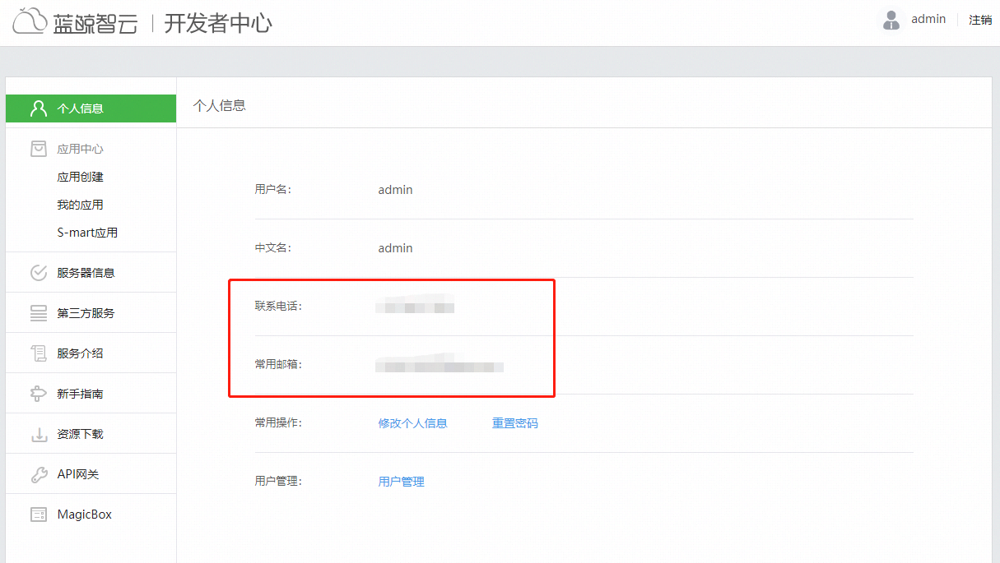
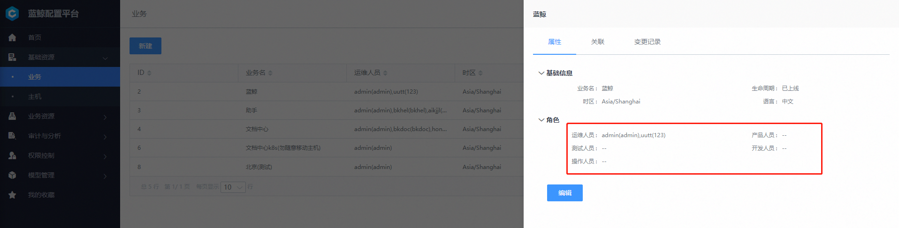
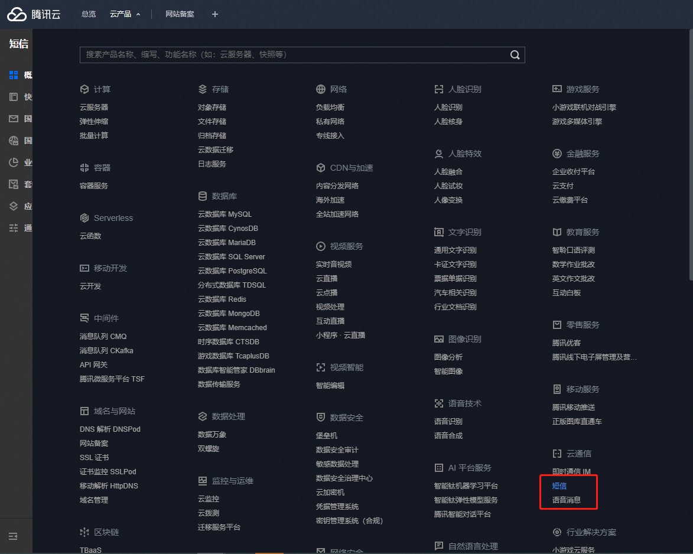
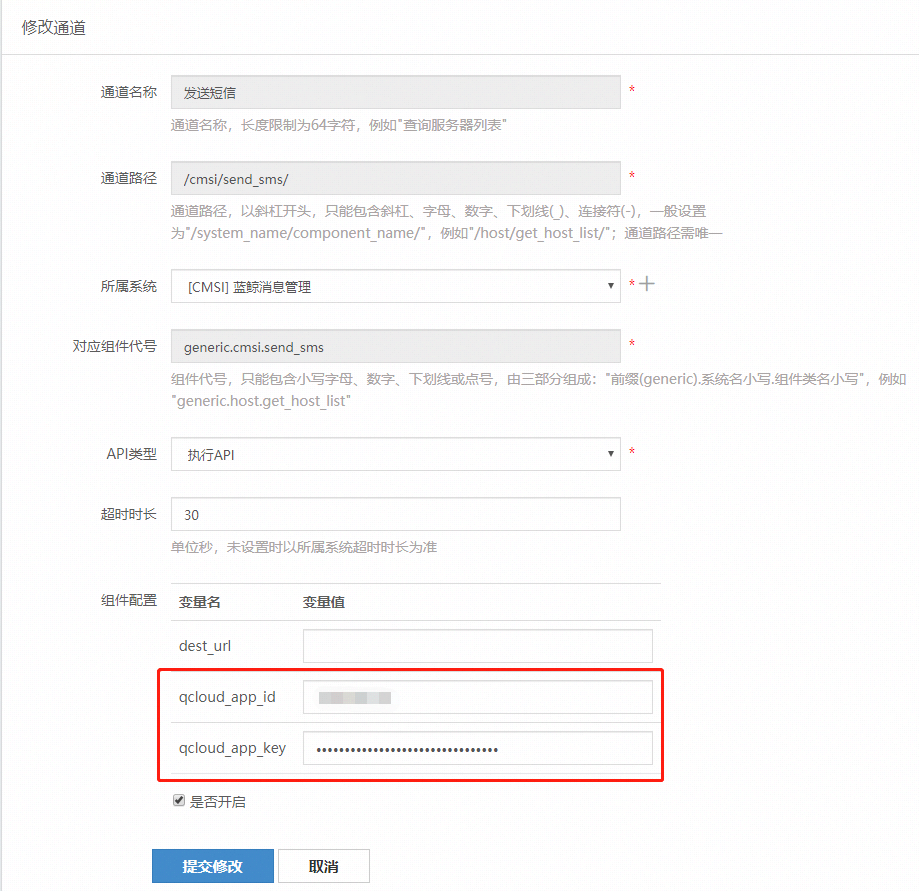
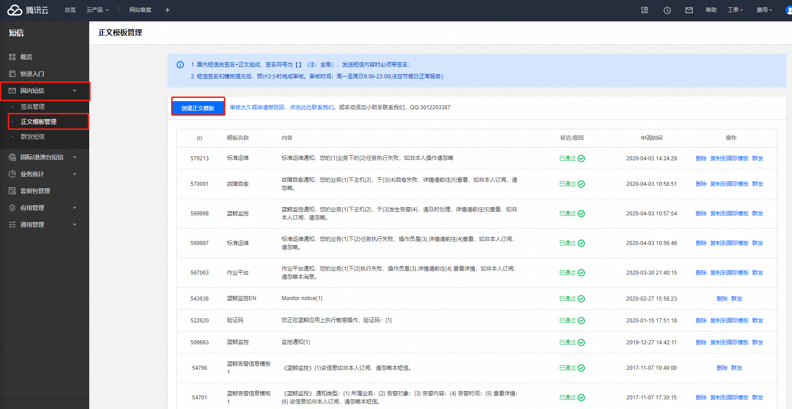
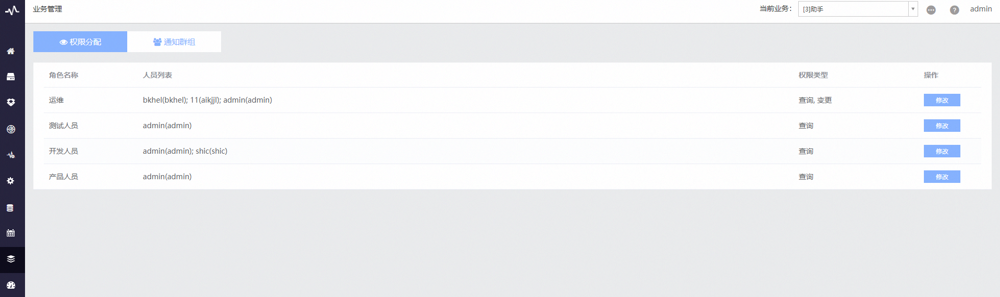
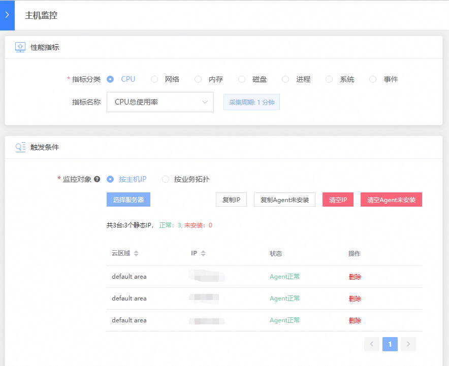
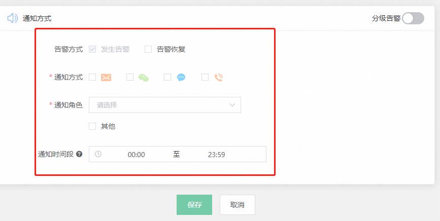
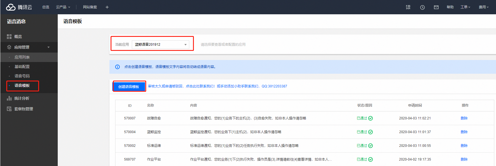

# 配置通知渠道(详细步骤)

蓝鲸内置了邮件、微信的通知渠道，以“admin”的角色进入“开发者中心”->“API 网关”->“使用指南”，可以参考详细的教程进行配置。

该配置属于整个蓝鲸体系的通用配置。


部分平台通知需要在用户管理中填好相应的信息。



相关信息需要配置 通道管理 -> 组件配置


部分平台通知需要在 配置平台 CMDB 中配置 -> 基础资源 -> 业务 -> 选择相应业务 -> 编辑



## 短信(为主)

以腾讯云为例

先进入 腾讯云云产品 -> 短信



应用管理 -> 应用列表 -> 创建应用


点击应用名 -> 获取 SDK AppID、App Key


进入PaaS页面 -> 开发者中心 -> API网关 -> 通信管理 -> 选择[CMSI]蓝鲸消息管理、搜索 -> 选择[CMSI]发送短信

将 SDK AppID 填入 qcloud_app_id

将 App Key 填入 qcloud_app_key

是否开启：是

提交修改



## 模板规范

先进入 腾讯云云产品 -> 短信 -> 国内短信 -> 正文模板管理 -> 创建正文模板




1.短信长度（签名+正文）不超过70字时，按照1条短信计费；超过70字即为长短信时，按67字/条分隔成多条计费。例如，短信长度为150字，则按照67字/67字/16字分隔成3条计费

2.短信模板内容不能含有【】符号

3.不能发送房产、移民、贷款、政治、色情暴力等违法短信[详情](https://cloud.tencent.com/document/product/382/39023)

> 模板示例：{1}为您的登录验证码，请于{2}分钟内填写。如非本人操作，请忽略本短信。（其中{1}、{2}为可自定义的内容，须从1开始连续编号，如{1}、{2}等）

### 作业平台短信通知

- 模板一

作业平台通知，您的业务{1}下{2}执行失败，操作员是{3},详情请前往{4} 查看详情，如非本人订阅，请忽略本消息。

- 模板二

《蓝鲸作业平台》通知{1}该信息如非本人订阅，请忽略本短信。

示例：
```
【腾讯蓝鲸】《蓝鲸作业平台》通知
您在蓝鲸作业平台《助手》业务中的任务《the_new_role》执行成功！，请登录蓝鲸作业平台(http://xxxxxx)查看详细信息！
该信息如非本人订阅，请忽略本短信。
```

#### 作业平台配置

- 用户管理：填写相关信息

- 通道管理：填写相关信息

- 作业平台 -> 个人设置 -> 通知管理 -> 勾选需要的消息通知服务


> 若需要电话语音消息通知，需要自己调用相应的 API 接口

### 标准运维短信通知

- 模板一

标准运维通知，您的业务{1}下{2}任务执行失败，操作员是{3},详情请前往{4}查看，如非本人订阅，请忽略。

- 模板二

<标准运维通知>执行完成

您在{1}业务中的任务{2}执行成功，操作员是{3}，请前往标准运维APP{4}查看详情！

#### 标准运维配置

- 配置平台：配置好相应角色组别

- 通道管理：填写相关信息

- 标准运维 -> 选择业务 -> 流程模板 -> 业务流程 -> 新建 -> ··· -> 添加标准插件节点 -> 选择插件：蓝鲸服务(BK)-发送通知 -> 选择相应通知方式、通知分组、通知主题、通知内容 -> 保存


### 蓝鲸监控短信通知

- 模板一

蓝鲸监控通知，您的业务{1}下主机{2}，于{3}发生告警{4}，请及时处理，详情请前往{5}查看，如非本人订阅，请忽略。

- 模板二

《蓝鲸监控》{1}该信息如非本人订阅，请忽略本短信。

示例：
```
【腾讯蓝鲸】《蓝鲸监控》蓝鲸监控系统
[提醒]CPU总使用率发生告警
所属业务: 3(助手)
告警时间: 2020-04-03 15:13:00+0800
主机: 10.0.x.x
告警维度: ip[ 10.0.x.x ],plat_id[ 0 ],集群[ 助手区 ],company_id[ 0 ],模块[ 咨询区 ]
告警内容: 当前指标值(67.4%) >= (50.0%)
详情请登陆蓝鲸监控系统
该信息如非本人订阅，请忽略本短信。
```

#### 蓝鲸监控配置

以主机监控为例

- 配置平台：配置好相应角色组别

或者

- 蓝鲸监控：业务管理

- 通道管理：填写相关信息

- 标准运维 -> 选择业务 -> 主机监控 -> 新增告警策略 -> 根据自己需求选择相关性能指标 -> 选择服务器 -> 设置检测规则 -> 通知方式









### 故障自愈短信通知

- 模板一

故障自愈通知，您的业务{1}下主机{2}，于{3}{4}自愈失败，详情请前往{5}查看，如非本人订阅，请忽略。

- 模板二

《故障自愈》{1}该信息如非本人订阅，请忽略本短信。

示例：
```
【腾讯蓝鲸】《故障自愈》
 自愈开始  [助手]业务[CPU总使用率]告警,IP[10.0.5.103]: CPU总使用率: 当前指标值(42.18%) >= (40.0%)
该信息如非本人订阅，请忽略本短信。
```

#### 故障自愈配置

- 用户管理：填写相关信息

- 通道管理：填写相关信息

- 故障自愈 -> 选择业务 -> 接入自愈 -> 添加接入自愈 -> 选择告警类型、自愈套餐、通知方式、通知人员、其他信息 -> 保存


## 语音消息

以腾讯云为例，跟短信配置相似

先进入 腾讯云云产品 -> 语音消息


应用管理 -> 应用列表 -> 创建应用


点击应用名 -> 获取 SDK AppID、App Key


进入PaaS页面 -> 开发者中心 -> API网关 -> 通信管理 -> 选择[CMSI]蓝鲸消息管理、搜索 -> 选择[CMSI]公共语音通知

将 SDK AppID 填入 qcloud_app_id

将 App Key 填入 qcloud_app_key

是否开启：是

提交修改


由于需要拨打语音电话，需要购买号码

应用管理 -> 语音号码 -> 选择应用 -> 购买号码


温馨提示：
1.企业资质通过审核后才可购买号码，单个企业资质最多购买 5 个号码。
2.语音消息采用预付费的方式，需要购买套餐包，可进入 [套餐包管理] 页面购买。
谨慎注销号码，注销后无法恢复。
3.上海、深圳、东莞语音号码盲区（外呼被叫归属地不通）：新疆、西藏；内蒙语音号码盲区（外呼被叫归属地不通）：新疆、内蒙。
4.同一被叫号码默认1天内最多发送3条（语音通知限制为5条），最大频率限制为1天50条，如需修改语音频率限制请 [联系我们](https://cloud.tencent.com/act/event/connect-service) 。
5.默认并发量：一分钟发送300通电话，如需修改默认并发量，请 [联系我们](https://cloud.tencent.com/act/event/connect-service) 。

应用管理 -> 语音模板 -> 选择应用 -> 购买号码



### 作业平台语音消息

- 模板一

作业平台通知，您的业务{1}下{2}执行失败，操作员是{3}

- 配置

由于社区版作业平台 通知管理 没有加入语音消息

所以只能进行API调用，来完成 语音消息通知

公共语音通知,[send_voice_msg](https://bk.tencent.com/docs/document/5.1/14/465)

### 标准运维语音消息

- 模板一

标准运维通知，您的{1}业务下的{2}任务执行失败，如非本人操作请忽略

- 配置

    - 配置平台：配置好相应角色组别

    - 通道管理：填写相关信息

    - 标准运维 -> 选择业务 -> 流程模板 -> 业务流程 -> 新建 -> ··· -> 选择相应通知方式、通知分组、通知主题、通知内容 -> 保存

### 蓝鲸监控语音消息

- 模板一

蓝鲸监控通知，您的业务{1}下主机{2}，于{3}发生告警{4}，请及时处理，详情请前往{5}查看，如非本人订阅，请忽略。

- 配置

    以主机监控为例

    - 配置平台：配置好相应角色组别

    或者

    - 蓝鲸监控：业务管理

    - 通道管理：填写相关信息

    - 标准运维 -> 选择业务 -> 主机监控 -> 新增告警策略 -> 根据自己需求选择相关性能指标 -> 选择服务器 -> 设置检测规则 -> 通知方式


### 故障自愈语音消息

- 模板一

故障自愈通知，您的业务{1}下主机{2}，于{3}{4}自愈失败，详情请前往{5}查看，如非本人订阅，请忽略。

- 配置

    - 用户管理：填写相关信息

    - 通道管理：填写相关信息

    - 故障自愈 -> 选择业务 -> 接入自愈 -> 添加接入自愈 -> 选择告警类型、自愈套餐、通知方式、通知人员、其他信息 -> 保存


