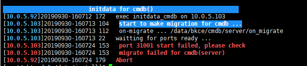
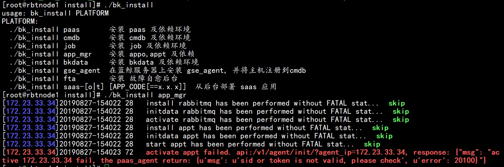
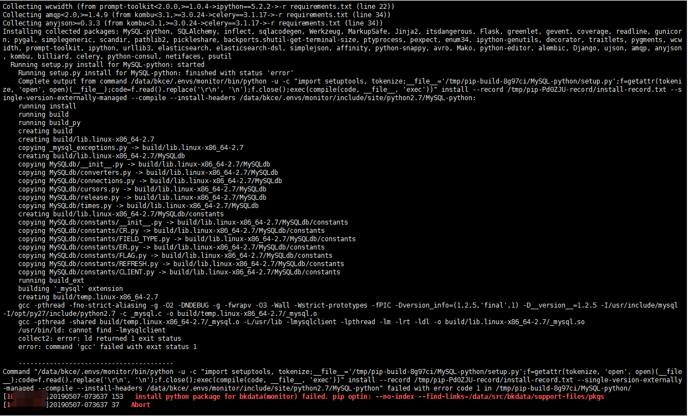
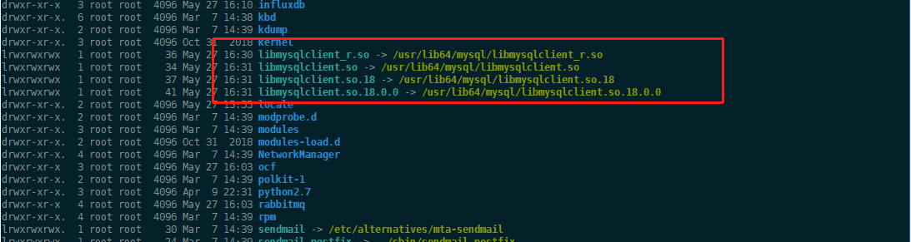
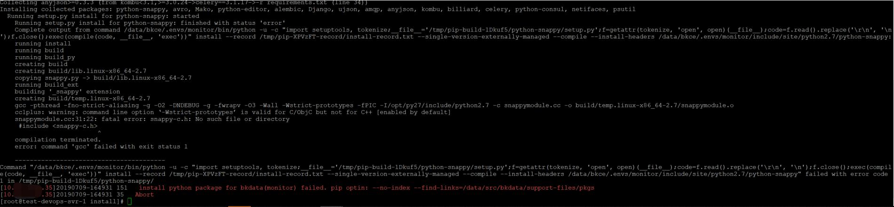
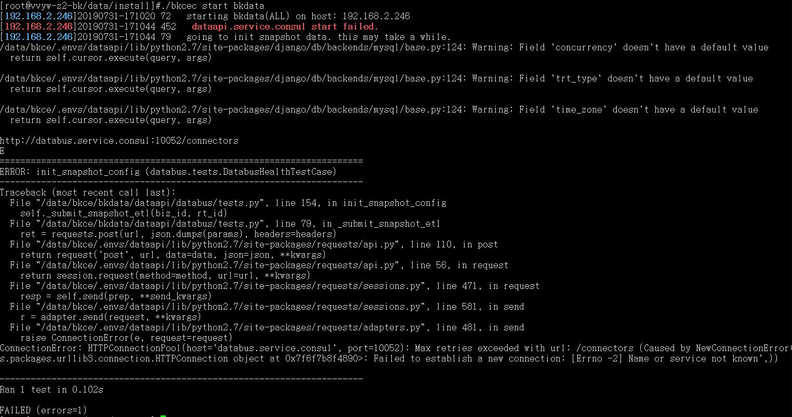
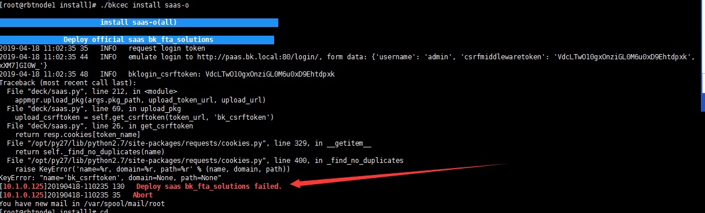
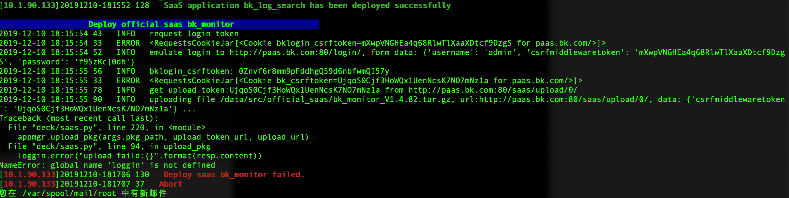

# 部署常见问题

## 部署 CMDB 常见问题

### prot 31001 start failed，please check 



- 检查防火墙端口是否有开（8300，8301，8302）
 
- 查看日志，登录所在机器的路径：`/data/bkce/logs`

`cmdb-adminserver` 服务状态 failed 

 检查依赖服务是否正常 `redis mongodb nginx gse zk` 
 
 3.2.查看`cmdb_adminserver` 日志（/data/bkce/logs/cmdb/）
 
 
### 检查 cmdb 服务状态，参照下图

```bash
./bkcec status cmdb

```


# 若服务装状态都是 RUNNING 则查看能否解析

```bash
dig zk.service.consul 
DiG 9.11.4-P2-RedHat-9.11.4-9.P2.el7 <<>> zk.service.consul
global options: +cmd
Got answer:
->>HEADER<<- opcode: QUERY, status: NOERROR, id: 15784
flags: qr aa rd ra; QUERY: 1, ANSWER: 3, AUTHORITY: 0, ADDITIONAL: 0
QUESTION SECTION:
zk.service.consul.                IN        A
ANSWER SECTION:
zk.service.consul.        0        IN        A        10.0.0.1
zk.service.consul.        0        IN        A        10.0.0.2
zk.service.consul.        0        IN        A        10.0.0.3
Query time: 0 msec
SERVER: 127.0.0.1#53(127.0.0.1)   
WHEN: Thu Nov 14 11:27:12 CST 2019
MSG SIZE  rcvd: 83
```
解析异常处理方法：

- 检查三台服务器 `/etc/resolv.conf`配置  首行是否有配置 `nameserver 127.0.0.1`，如无，请添加
- 检查consul配置中是否有`ls /data/bkce/etc/consul.d/zk-config.json`,如无，则重装consul服务
```bash
./bkcec stop consul  #(或在consul服务所在的三台主机，ps -ef |grep consul | awk '{print $2}'  |xargs kill -9)
./bkcec install consul 1
./bkcec start consul
```

### 若安装 consul 报错
 
检查 `/data/src/service/consul/` 是否有这两个文件夹 `bin ，conf`；`bin` 文件夹下是否有文件

- 备份一下 src 下的`.pip/pip.conf` 文件，然后重新解压一下`bkce_src` 安装包，继续检查是否有文件，如果还没有
 
- 解压时直接用 tar xf 包名，不要加 -C，若还是没有文件则去官网下载新包重新解压
 
- 对比包的 md5 是否和官网一致
 

### cmdb-nginx 服务状态 failed 

检查cmdb模块所在机器上是否能 YUM 安装 Nginx `yum info nginx` 
 
 安装 epel YUM 源, 重装 CMDB

```bash
./bkcec stop cmdb 
./bkcec install cmdb 1 
./bkcec start cmdb 
./bkcec initdata cmdb

```

三台机器的 YUM 源都更新一致，确保 YUM 源能安装 Nginx

其他进程状态 EXIT，请前往 CMDB 所在服务器

`/data/bkce/logs/cmdb/` 目录下查看相应的日志


## 部署 App_mgr 常见问题




该报错是激活 paas_agent 失败，需要查看的是 appo 服务还是 appt 服务

```bash
./bkcec status appo
./bkcec status appt 
```

若是异常重启进程，启动失败需要查看日志详情 `/data/bkce/logs/paas_agent/`

进程正常启动后再激活

```bash
./bkcec activate appo
./bkcec activate appt
```

## 部署 BKDATA 常见问题

`./bk_install bkdata` 报错

```bash
failed with error code 1 in /tmp/pip-build-8g97ci/MySQL-python/
install python package for bdata(monitor) failed pip optin: --no-index --find-links=/data/src/bkdata/support-fileds/pkgs
```

### MySQL-python 安装失败



- 解决方案：

1. 确保 mysql-devel 已经安装

可用 which mysql-devel 来确认

2. 建立软连接



```bash
ln -s /usr/lib64/mysql/libmysqlclient_r.so /usr/lib/libmysqlclient_r
ln -s /usr/lib64/mysql/libmysqlclient.so /usr/lib/libmysqlclient.so
ln -s /usr/lib64/mysql/libmysqlclient.so.18 /usr/lib/libmysqlclient.so.18
ln -s /usr/lib64/mysql/libmysqlclient.so.18.0.0 /usr/lib/libmysqlclient.so.18.0.0
```


重新执行命令部署 BKDATA 即可恢复

### 安装 python-snappy 包失败

原因是缺少 snappy-c.h 导致 pip 安装 python-snappy 包失败



- 解决方案：

    通过安装 snappy-devel 解决,`yum install -y snappy-devel `

### 启动报 "dataapi.service.consul start failed ERROR： init_snapshot_config"  

启动 bkdata 报错：`dataapi.service.consul start failed ERROR： init_snapshot_config (databus.tests.DatabusHealthTestCase)`



- 解决方案

  登陆到`bkdata`机器（社区版 5.1 登陆到 `databus` 所在机器）查看 `consul` 配置是否生成 `databus.json` 配置。
    
    ```bash
    ls /data/bkce/etc/consul.d/bkdata.json
    # 若无则重装 consul
    ./bkcec stop consul
    ./bkcec install consul 1
    ./bkcec start consul
    ./bkcec status consul
  
    # 登陆到 databus 所在机器查看是否生成 bkdata.json（社区版 5.1 为 bkdata-databus.json，bkdata-dataapi.jsonbkdata-monitor.json）
    ls /data/bkce/etc/consul.d/bkdata.json
  
    # 启动 bkdata
    ./bkcec start bkdata
   ```

## 部署 SaaS 常见问题

1、**安装 saas-o 报错 KeyError: "name='bk_csrftoken', domain=None, path=None"**



- 解决方案

确认是否是在 PaaS 页面个人信息重置了密码后，但是 `globals.env` 文件没同步更新。 请在 `globals.env` 文件中更新重置后的密码后确认是否恢复正常。
同步配置信息

2、**NameError: global name 'loggin' is not defined**
```bash
./bkcec sync common
```


- 解决方案
```bash
./bkcec stop paas
./bkcec upgrade paas
./bkcec start paas
再次执行部署saas
./bkcec install saas-o
```
 
