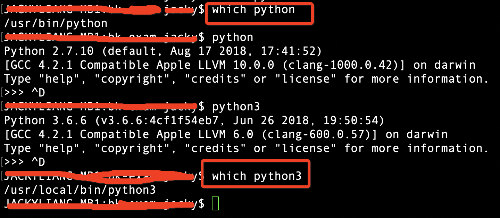

### 方案总体介绍

为了方便开发者使用利用已有的环境配置，下面的方案利用了 Python 的 virtualenv 模块可以创建多个独立 Python 环境的能力，解决了 Python2 与 Python3 开发环境之间的相互独立的问题。

同时，为了降低我们使用 virtualenv 的门槛，方案中也使用了 virtualenvwrapper 模块，方便我们创建、复制和删除各个虚拟环境。


当然，Python 生态中也有其他的解决方案，各位开发者可以参考使用：

- [pyenv](https://github.com/pyenv/pyenv)

- [pipenv](https://github.com/pypa/pipenv)

### 安装 Python3 & virtualenvwrapper

- 【MacOS 环境】

首先，我们去到 Python 官网下载最新的 Python 安装包：[Python 下载地址](https://www.python.org/downloads/)。

这里强烈建议大家使用安装器(Installer)的方式安装。因为如果使用源码安装时，会遇到 openssl 开发依赖环境及 macOS 系统限制，给你带来各种麻烦。

- 【Linux 环境】

建议大家可以使用 Python 的源码包进行安装，这样的好处在于我们可以指定 Python 的安装路径，确保新安装的 Python3 不会影响已有的系统工具，例如 yum 等。

这里，建议各位读者使用 Python 3.6.3 的源码安装，原因是 Python3.7 后对 openssl 的版本会有要求限制，但是公司内网 yum 源提供的 openssl 版本并不能满足要求，会导致安装 Python3.7 时 openssl 模块缺失，从而影响 pip 的使用。

源码安装命令如下:

```bash
tar -zxf Python-3.6.3.tgz
cd Python-3.6.3
# 自定义配置安装路径为/opt/python36
./configure --prefix=/opt/python36
# 编译并安装
make -j 4
make install
export PATH=/opt/python36/bin:$PATH
```

- 【Windows 环境】

Windows 安装的时候需要注意使用自定义的安装路径，可以参考以下视频：[windows 安装说明](https://www.youtube.com/watch?v=V_ACbv4329E)。

> 各位读者需要注意，安装后需要修改 PATH 环境变量。

- 【virtualevnwrapper 安装】

安装完成后，大家可以发现自己本地新增了一个【python3】的命令。当然，不用担心系统自身的 Python2 环境丢掉了，安装器会将这个 Python2 的保留下来。如下图所示：



接下来，我们需要安装 virtualenvwrapper 来协助我们创建独立的虚拟环境。Windows 用户需要注意安装的是 virtualenvwrapper-win。

```bash
# 安装virtualenvwrapper
# windows用户注意，安装 virtualwrapper-win
$ sudo pip install virtualenvwrapper
...
# 指定虚拟环境放置的目录，可以按需调整
$ export WORKON_HOME=~/Envs
# 创建好路径
$ mkdir -p $WORKON_HOME
# 添加virtualenvwrapper命令及环境准备，建议这个命令可以放置到~/.bash_profile中
$ source /usr/local/bin/virtualenvwrapper.sh
```

### 分割环境

安装后，我们可以先看一下 virtualenv 的帮助菜单，如下图所示：


-p 这个参数是整个方案实施的关键。我们可以通过这个参数，来指定虚拟环境使用的 Python 解释器路径，而默认情况下，参数使用的是 /usr/bin/python 这个解释器。

因此，我们可以指定不同的解释器路径，创建 Py2 和 Py3 不同的虚拟环境。操作如下：

```bash
$ mkvirtualenv test_python2_env
New python executable in /Users/.virtualenvs/test_python2_env/bin/python
Installing setuptools, pip, wheel...done.
virtualenvwrapper.user_scripts creating /Users/.virtualenvs/test_python2_env/bin/predeactivate
virtualenvwrapper.user_scripts creating /Users/.virtualenvs/test_python2_env/bin/postdeactivate
virtualenvwrapper.user_scripts creating /Users/.virtualenvs/test_python2_env/bin/preactivate
virtualenvwrapper.user_scripts creating /Users/.virtualenvs/test_python2_env/bin/postactivate
virtualenvwrapper.user_scripts creating /Users/.virtualenvs/test_python2_env/bin/get_env_details
(test_python2_env) $ python
Python 2.7.10 (default, Aug 17 2018, 17:41:52)
[GCC 4.2.1 Compatible Apple LLVM 10.0.0 (clang-1000.0.42)] on darwin
Type "help", "copyright", "credits" or "license" for more information.
>>> ^D
(test_python2_env) $ mkvirtualenv test_python3_env -p /usr/local/bin/python3
Running virtualenv with interpreter /usr/local/bin/python3
Using base prefix '/Library/Frameworks/Python.framework/Versions/3.6'
New python executable in /Users/.virtualenvs/test_python3_env/bin/python3
Also creating executable in /Users/.virtualenvs/test_python3_env/bin/python
Installing setuptools, pip, wheel...done.
virtualenvwrapper.user_scripts creating /Users/.virtualenvs/test_python3_env/bin/predeactivate
virtualenvwrapper.user_scripts creating /Users/.virtualenvs/test_python3_env/bin/postdeactivate
virtualenvwrapper.user_scripts creating /Users/.virtualenvs/test_python3_env/bin/preactivate
virtualenvwrapper.user_scripts creating /Users/.virtualenvs/test_python3_env/bin/postactivate
virtualenvwrapper.user_scripts creating /Users/.virtualenvs/test_python3_env/bin/get_env_details
(test_python3_env) $ python
Python 3.6.6 (v3.6.6:4cf1f54eb7, Jun 26 2018, 19:50:54)
[GCC 4.2.1 Compatible Apple LLVM 6.0 (clang-600.0.57)] on darwin
Type "help", "copyright", "credits" or "license" for more information.
>>>
```

上面的操作中，我们首先创建了一个使用默认 Python 解释器的虚拟环境。

创建完成后，我们进入 Python 可以观察到，对应的版本是 2.7.x。

紧接着，笔者再创建了一个使用指定 Python 解释器路径的虚拟环境，创建完成后我们进入 Python 可以观察到，对应的版本是 3.6.x。

至此，两个独立、互不干扰的 Py2 和 Py3 环境创建完成。

如果需要不同的环境切换，使用 workon 命令切换即可。
