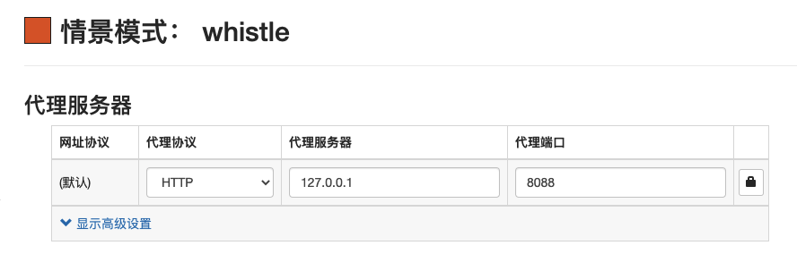
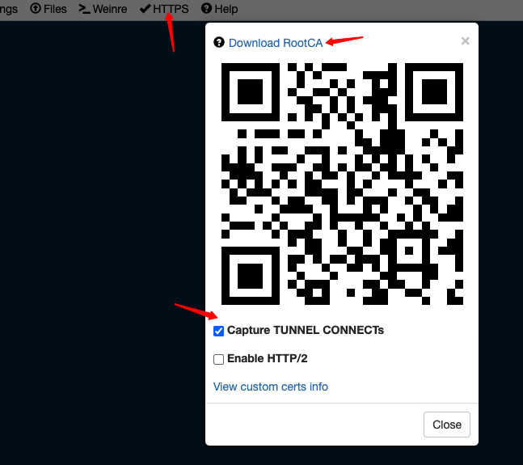

前端工程师在做 H5 的应用的时候，通常会在开发电脑上利用 chrome 浏览器的[设备模拟器](https://developers.google.com/web/tools/chrome-devtools/device-mode)来做开发，模拟器的功能很强大，它提供了大多数主流机型的选项，如果有特殊机型需求，自己也可以定义设备分辨率和 DPR，对于本地开发来说非常的便利。但是有的时候可能会出现这样一种情况，在模拟器上开发的预期效果，放到某些机型上会出现一些奇怪的问题，相信对大部分前端开发来说，大概都碰到过。这个时候就需要用真机来做调试，解决出现的问题。


移动端真机调试常用的方案大概有以下几种：

1.数据线连接调试：iOS 和 Android 设备可以用数据线连接开发电脑，打开对应系统工具的调试选项，可以通过电脑端的 safari、chrome 浏览器的 Web Inspector 来检查移动端设备浏览器的页面。

2.代理工具 + weinre：macOS 和 windows 下可以使用 [Charles](https://www.charlesproxy.com/) 或者 [Fiddler](https://www.telerik.com/fiddler) 作为代理工具，在同一网段下配置移动端 Wi-Fi 代理地址到开发电脑，电脑端通过对移动端的请求进行抓取，可以把电脑上的本地文件反向代理到移动端，再配合 [weinre](https://github.com/nupthale/weinre) 实现 Web Inspector 的功能。

3.whistle：[whistle](https://wproxy.org/whistle/) 集成了代理工具 + weinre 的方案，通过类似配置系统 hosts 的方式即可实现跨平台的调试。


数据线连接调试虽然使用 Web Inspector 检查页面比较方便，但是往往需要先把本地代码打包发布到线上环境，移动设备才可以看到效果，本地的更新没法实时同步到移动端设备上，在开发过程中采用这种调试方式会非常的繁琐。代理工具 + weinre 的方案功能强大，但是代理工具需要下载客户端（两个软件的正版 license 价格不菲），还要单独配置一个 weinre 服务，本地配置的成本比较高。所以，以上两种调试方式的具体配置就不具体展开了，接下来主要描述第 3 种方案。

### whistle 方案

whistle 是 avenwu 开发的一个 Node.js 工具，可跨多系统平台，配置项可共享，并且内部集成了 weinre，功能丰富、强大，可视化的配置方式使用也比较简单，非常适合前端来做真机调试。

#### 安装和命令

- 安装

```js
npm install -g whistle # 推荐使用最新的 Node.js LTS 版本
```


- 常用命令

安装完包后，可以在命令行工具使用 `whistle` 或 `w2` 

```js
w2 start # 启动
w2 start -p 8088 # 启动，配置监听端口为 8088
w2 stop # 停止
w2 run # 启动调试模式，用于查看异常和 whistle 插件开发
```

正常启动后的命令行：


访问 http://local.whistlejs.com 链接打开线上的配置和调试页面，whistle 主要的`rules` 、`values`、`weinre 调试` 、`https证书安装`都在上面操作。

#### 代理配置

需要保证移动设备和开发电脑在同一个局域网段内

- 浏览器代理配置

使用 chrome 并安装 SwitchyOmega 插件，新建一个情景模式将浏览器代理指向 whistle。



- 移动设备代理配置

首先在电脑端的命令行工具执行 `ifconfig` 查看本机 ip 地址，准备配置到移动端。

iOS 设备代理配置路径：`设置` > `无线局域网` > `点击当前连接网络右侧的 icon 进入详情` > `配置代理` > `手动` > `服务器填写开发机 ip 地址，端口填写开发机监听端口`  > `点击右上角保存`

Andriod 设备代理配置路径（以小米手机为例）：`设置` > `点击当前连接网络进入详情` > `代理` > `手动` > `主机名填写开发机 ip 地址，端口填写开发机监听端口` > `点击右上角保存` 


#### https 捕获

使用 whistle 代理 https 请求，开发机和移动端设备都需要安装根证书，在开发机配置页面点击 `https` 弹出对话框



点击 `Download RootCA` 下载开发机证书，移动端扫码或者在浏览器访问 `rootca.pro`来下载证书，如果不了解如何安装可[参考文档](http://wproxy.org/whistle/webui/https.html)。 **提醒一下，开发机使用 windows 安装证书时，一定要手动选择安装到 `受信任的根证书颁发机构` 目录下** 

#### 常用 rules 配置

- weinre 调试

移动端设备使用 weinre 提供的 Web Inspector 来调试页面，可以根据页面地址配置对应的 rule

```shell
# 本地调试页面被 weinre 捕获配置
# 协议采用 weinre，协议后的名称为分组名称，根据管理需求可自定义
https://m.jd.com	weinre://debug-h5
http://dev.weixinh5.com	weinre://debug-h5
```


- 插入文件

如果需要在移动端页面注入文件，可以使用 `js` 协议配置，例如使用 [vConsole](https://github.com/Tencent/vConsole)（不能与 weinre 同时使用）来模拟 PC 端浏览器的 console 的功能，可以配置：

```shell
dev.weixinh5.com	js://{vConsole.js}
```


#### Mock 数据

另外 whistle 也可以通过增加 `values`来构造数据，然后在 `rules`里面配置代理规则，通过转发来 mocks 移动端设备请求的返回数据。


#### 文档

1. [iOS](https://developer.apple.com/library/archive/documentation/AppleApplications/Conceptual/Safari_Developer_Guide/GettingStarted/GettingStarted.html)、[Android](https://developers.google.com/web/tools/chrome-devtools/remote-debugging) 设备数据线调试模式官方文档
2. [Charles + weinre 调试](https://www.cnblogs.com/hustskyking/p/remote-debug-in-mobile-development.html)
3. [avenwu：利于 whistle 调试移动端页面](https://juejin.im/post/5ad5f471518825557e78e623)

