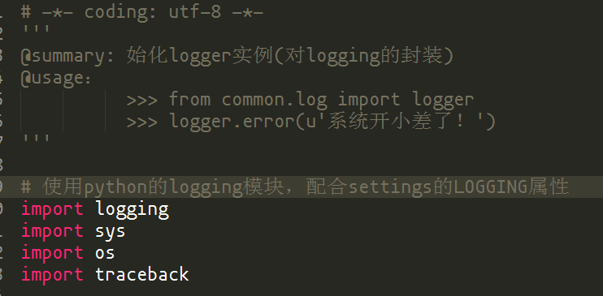

## 1 【必须】Python 代码注释

1. 方法必须使用标注注释，如果是公有方法或对外提供的 API 相关方法，则最好给出使用样例。如：

    

2. Module 注释：在开头要加入对该模块的注释。如：

    

3. 普通代码注释应该以 `#` 和单个空格开始

4. 如果有需要调整或者需要优化的地方，可以使用

```python
# TODO 这里是注释内容
a = func()
```
   进行注释，格式：'\#'+单个空格+'TODO'+单个空格+注释内容。

5. 方法的返回，如果数据结构比较复杂，则必须要对返回结果的每个属性做解释。

## 2 WEB API 文档规范

一份规范的、易用的 WEB API 文档对于前后端联调及其重要，能够减少沟通成本，提高开发效率。推荐使用[apidoc](http://apidocjs.com/)作为 Web API 文档生成工具。

apidoc 是通过源码中的注释来生成 Web API 文档。因此，apidoc 对现有代码可以无侵入性，并且支持多种编程语言。

### 2.1 apidoc 文档规范

一个规范的 apidoc 接口文档必须包含以下标签信息

#### @api

该标签是必填的，只有使用 @api 标签的注释块才会被解析生成文档内容。

##### 格式

```python
"""
@api {method} path [title]
"""
```

|   参数名称    | 描述 |
| ---------- | --- |
| method |  请求方法：`GET`, `POST`, `PUT`, `DELETE` |
| path   |  请求路径（相对路径） |
| `选填` title |  短标题，会被解析成二级导航栏菜单标题 |

##### 示例

```python
"""
@api {GET} /user/:id 获取用户信息
"""
```

#### @apiDescription

对 API 接口进行详细描述

##### 格式

```python
"""
@apiDescription text
"""
```

|   参数名称    | 描述 |
| ---------- | --- |
| text |  API 描述文本，支持多行 |

##### 示例

```python
"""
@apiDescription 根据用户ID获取用户信息
如果ID对应的用户不存在，则返回404
如果ID对应的用户无权限查看，则返回403
"""
```

#### @apiGroup

表示 API 所属分组名称，它会被解析成一级导航栏菜单标题。注意不能是中文，否则会解析错误

##### 格式

```python
"""
@apiGroup name
"""
```

|   参数名称    | 描述 |
| ---------- | --- |
| name |  API 分组名称 |

##### 示例

```python
"""
@api {GET} /user/:id 获取用户信息
@apiGroup 用户
"""
```

#### @apiName

API 接口标识名称。需要注意的是，在同一个 `@apiGroup` 下，具有相同的 `@apiName`的 `@api` 必须通过 `@apiVersion` 区分，否则后面定义的 `@api` 会覆盖前面定义的 `@api`。

##### 格式

```python
"""
@apiGroup name
"""
```

|   参数名称    | 描述 |
| ---------- | --- |
| name |  API 名称 |

##### 示例

```python
"""
@api {GET} /user/:id 获取用户信息
@apiName GetUser
"""
```

#### @apiParam

定义 API 接口需要的请求参数格式

##### 格式

```python
"""
@apiParam [(group)] [{type}] [field=defaultValue] [description]
"""
```

|   参数名称    | 描述 |
| ---------- | --- |
| `选填` (group)  |  参数分组 |
| `选填` {type}  |  参数类型，包括`{Boolean}`, `{Number}`, `{String}`, `{Object}`, `{String[]}`, ... |
| `选填` {type{size}})  |  可以声明参数范围，例如{string{..5}}， {string{2..5}}， {number{100-999}} |
| `选填` {type=allowedValues}  |  可以声明参数允许的枚举值，例如{string="small","huge"}， {number=1,2,3,99} |
| field |  参数名称 |
| [field] |  声明该参数可选 |
| `选填` =defaultValue |  声明该参数默认值 |
| `选填` description |  声明该参数描述 |

##### 示例

请求参数

```json
{
    "country": "",
    "age": 19,
    "name": {
        "firstname": "",
        "lastname": ""
    },
    "roles": [
        {
            "code": 1,
            "name": "superuser",
        },
        {
            "code": 2,
            "name": "admin",
        }
    ]
}
```

```python
"""
@api {POST} /user/ 创建用户
@apiName CreateUser

@apiParam {String}          country="DE"    地区名称，字符串类型，默认值为"DE"
@apiParam {Integer{1-100}}  [age=18]        年龄，整数类型，取值范围1~100，默认值为18，可选参数
@apiParam {Object}          name            用户名，Object（字典）类型
@apiParam {String}          name.firstname  名字，字符串类型
@apiParam {String}          name.lastname   姓氏，字符串类型
@apiParam {Object[]}        roles           所属角色，Object（字典）类表类型
@apiParam {Integer=1,2,3}   roles.code      角色代码，数值类型，取值为1, 2, 3任意一个
@apiParam {String}          roles.name      角色名称，字符串类型

"""
```

#### @apiSuccess

定义 API 接口请求成功时返回的数据格式

##### 格式

```bash
@apiSuccess [(group)] [{type}] field [description]
```

|   参数名称    | 描述 |
| ---------- | --- |
| `选填` (group)  |  参数分组，默认为`Success 200` |
| `选填` {type}  |  参数类型，包括`{Boolean}`, `{Number}`, `{String}`, `{Object}`, `{String[]}`, ... |
| field |  参数名称 |
| `选填` description |  声明该参数描述 |

##### 示例

返回参数

```json
{
    "id": 1,
    "country": "",
    "age": 19,
    "name": {
        "firstname": "",
        "lastname": ""
    },
    "roles": [
        {
            "code": 1,
            "name": "superuser",
        },
        {
            "code": 2,
            "name": "admin",
        }
    ]
}
```

```python
"""
@api {POST} /user/ 创建用户
@apiName CreateUser

@apiSuccess {Integer}   id              用户ID，整数类型
@apiSuccess {String}    country         地区名称，字符串类型
@apiSuccess {Integer}   age             年龄，整数类型
@apiSuccess {Object}    name            用户名，Object（字典）类型
@apiSuccess {String}    name.firstname  名字，字符串类型
@apiSuccess {String}    name.lastname   姓氏，字符串类型
@apiSuccess {Object[]}  roles           所属角色，Object（字典）类表类型
@apiSuccess {Integer}   roles.code      角色代码，数值类型
@apiSuccess {String}    roles.name      角色名称，字符串类型

"""
```

#### @apiSuccessExample

API 接口请求成功时返回样例数据。若返回参数结构和含义较为简单，则`@apiSuccess`和`@apiSuccessExample`任取其一定义即可。

##### 格式

```bash
@apiSuccessExample [{type}] [title]
                   example
```

|   参数名称    | 描述 |
| ---------- | --- |
| `选填` type  |  返回参数格式 |
| `选填` title  |  返回样例短标题 |
| example |  详细返回数据，支持多行 |

##### 示例

```python
"""
@api {POST} /user/ 创建用户
@apiName CreateUser

@apiSuccessExample {json} Success-Response:
    HTTP/1.1 200 OK
    {
        "id": 1,
        "country": "",
        "age": 19,
        "name": {
            "firstname": "",
            "lastname": ""
        },
        "roles": [
            {
                "code": 1,
                "name": "superuser",
            },
            {
                "code": 2,
                "name": "admin",
            }
        ]
    }
"""
```

#### 完整示例

```python
"""
@api {POST} /user/ 创建用户
@apiName CreateUser
@apiGroup User

@apiParam {String}          country="DE"    地区名称，字符串类型，默认值为"DE"
@apiParam {Integer{1-100}}  [age=18]        年龄，整数类型，取值范围1~100，默认值为18，可选参数
@apiParam {Object}          name            用户名，Object（字典）类型
@apiParam {String}          name.firstname  名字，字符串类型
@apiParam {String}          name.lastname   姓氏，字符串类型
@apiParam {Object[]}        roles           所属角色，Object（字典）类表类型
@apiParam {Integer=1,2,3}   roles.code      角色代码，数值类型，取值为1, 2, 3任意一个
@apiParam {String}          roles.name      角色名称，字符串类型

@apiSuccess {Integer}   id              用户ID，整数类型
@apiSuccess {String}    country         地区名称，字符串类型
@apiSuccess {Integer}   age             年龄，整数类型
@apiSuccess {Object}    name            用户名，Object（字典）类型
@apiSuccess {String}    name.firstname  名字，字符串类型
@apiSuccess {String}    name.lastname   姓氏，字符串类型
@apiSuccess {Object[]}  roles           所属角色，Object（字典）列表类型
@apiSuccess {Integer}   roles.code      角色代码，数值类型
@apiSuccess {String}    roles.name      角色名称，字符串类型

@apiSuccessExample {json} Success-Response:
    HTTP/1.1 200 OK
    {
        "id": 1,
        "country": "",
        "age": 19,
        "name": {
            "firstname": "",
            "lastname": ""
        },
        "roles": [
            {
                "code": 1,
                "name": "superuser",
            },
            {
                "code": 2,
                "name": "admin",
            }
        ]
    }

"""
```

##### 生成的 apidoc 文档实际效果


### 2.2 django API 注释规范

#### 1. Django Views

对于提供给前端使用的 views 函数，直接把 apidoc 作为函数注释，例如：

```python

def create_user(request):
    """
    @api {POST} /user/ 创建用户
    @apiName CreateUser
    @apiGroup 用户
    """

    # 创建用户的逻辑
    pass

```

#### 2. DRF Viewset

对于使用 Django Rest Framework 提供的接口，将 apidoc 写在对应的 action 函数中，例如：

```python
class UserViewSet(viewsets.ViewSet):

    def create(self, request):
        """
        @api {POST} /user/ 创建用户
        @apiName CreateUser
        @apiGroup 用户
        """

        # 创建用户的逻辑
        pass
```
