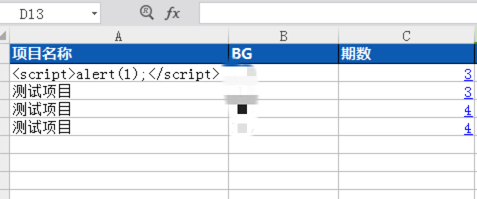
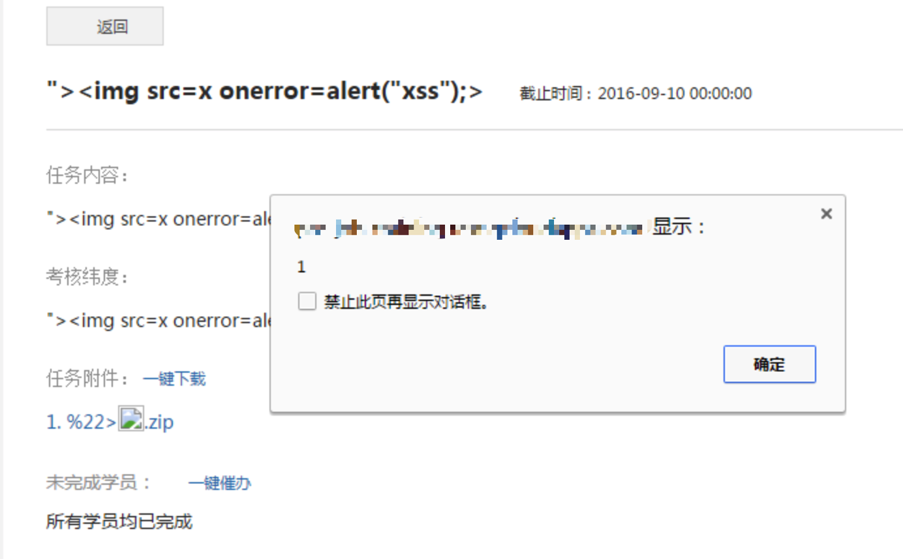
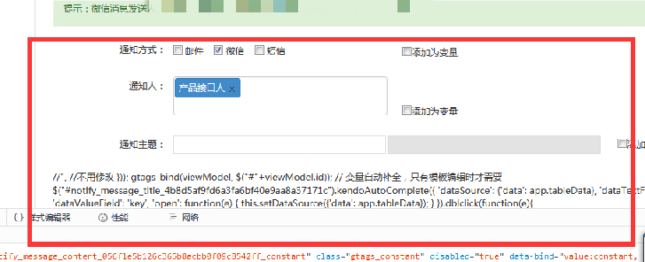

## 1 场景 1 存储型 XSS

### 1.1 定义

把用户输入的数据“存储”在服务器端，用户浏览页面时，再从服务器端读取生成页面展现给用户

### 1.2 示例

用户输入内容直接显示在前端标签里，例如 `<h1> some_user_input</h1>` 或者
`<input type="text" name="address1" value=${"address"}>`


### 1.3 解决

为了使浏览器能正确地显示这些字符，而不是去执行，我们需要使用 html 实体字符。

1. 在数据入库之前做转义，例如将`<script>`转义成`&lt;script&gl`,
这个在蓝鲸应用开发框架提供的中间件中有实现，要确保该中间件有在使用

2. 对输出到前端的内容，我们也要过滤，防止因为对输入过滤被绕后，可以使用 mako 模版的 h 参数`${ name\| h }`

3. 对于不是 mako 模版渲染展示的内容，需要做 html 特殊字符的转义，特别注意前端的`title`, `name`, `class`等属性的赋值同样需要做转换

### 1.4 测试

对所有用户输入部分进行检测，输入`<script>alert('xss');</script>`查看展示部分是否被弹窗。

## 2 场景 2 反射型 XSS

### 2.1 示例

对于用户的输入，我们有时并不是像场景 1 那样简单地显示在标签里，比如自动填充表单时，会用到`$("#my_input").val("some_message");`或者填充图片 src 时，会用到``

这里的 some_message 都是我们用户输入，并由后端填充的内容。此时可以通过输入如下代码提前闭合引号来进行 XSS 攻击`"><imgsrc=x onerror=alert(1);>`。

经过后端传到前端之后，前端代码变为`$("#my_input").val('">');`原本的赋值语句被破坏，如果是持久型的存储数据，将会持续影响正常业务。或者变为``

### 2.2 解决

同场景 1，对输入内容做特殊字符的过滤转义

### 2.3 测试

对所有用户输入部分进行检测，输入 `"\>\` 查看展示部分是否被弹窗，以及业务功能是否受影响。

## 3 场景 3：文件上传与导入

对于导入或者上传的文件，通常会忽略特殊字符的转义，这样当文件内容在前端显示的时候，会出现 XSS 攻击

### 3.1 示例

比如，Excel 导入用户数据并生成表格



信息导入后传至前端表格，造成场景 1 中的标签内 XSS

又比如，文件上传并展示


在非 windows 的操作系统（如 Lunix、OSX）中，文件名可以被命名为任意格式，可以包含 JS 代码，在上传完成后在前端显示时造成 XSS 攻击



### 3.2 解决

1. 对 Excel 和文件导入的数据进行校验，对特殊字符进行转义，包括不限于单引号、双引号、反引号、尖括号、&等。

2. 后台对上传文件的大小、内容、类型做校验，只允许上次符合要求的文件类型

3. 文件名在前端显示的时候，做 html 特殊字符转义

### 3.3 测试

在导入的 Excel 中尝试使用`<script>alert('xss');</script>`和`">`来检查是否弹窗和业务功能完整性。

将上传的文件名命名为`">.zip`或来检验是否弹窗和业务功能完整性。

常用 XSS 测试 payload

```html

```

## 4 场景 4 出错提示信息

### 4.1 示例

上传文件的路径写了`<script>alert(/xss/)</script>`,
执行的时候，路径出错，前端提示信息中有显示用户填写内容，未做过滤，导致 XSS 攻击


### 4.2 解决

同场景 1 前端显示用户输入的时候要做 html 特殊字符转义

### 4.3 测试

填写上传文件或者文件分发路径的地方，输入`<script>alert(/xss/)</script>`检查系统是否正常，结果是否符合预期

## 5 场景 5 通过用户输入提前闭合`<script>`代码

利用浏览器解析 html 的原理，通过用户输入内容将\<script\>标签提前闭合，导致后续的 js 代码直接暴露在前端页面

### 5.1 示例

如下简单的三段代码就可以导致 script 提前闭合，user_variable 的渲染正式使用 mako 渲染的常见场景：

```javascript
<script>
    var user_variable = "</script>";
</script>
```



### 5.2 解决

mako 渲染时，将用户输入的信息在 python 中以 base64 的形式输出到 html 中，这样用户输入的所有特殊符号都被转换成字母，不会导致 html 解析时 script 标签提前闭合。

最后运用用户变量之前使用 js 的 base64 解码转换一次


