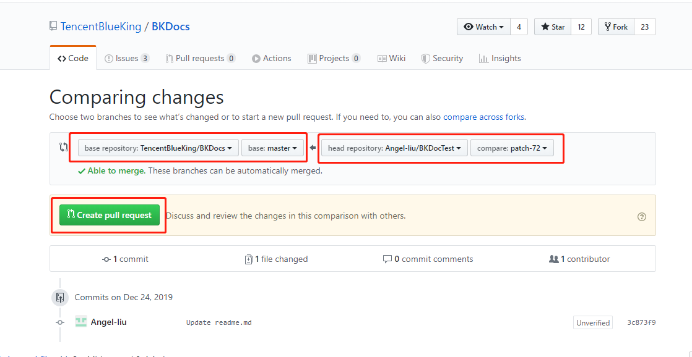
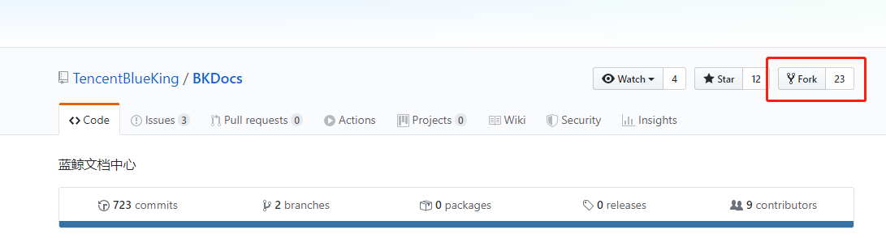

# 编辑文档

 如果您在浏览腾讯蓝鲸官方文档的时候发现任何需要修正或者改进的内容，请根据本文的操作步骤，提交变更内容到GitHub上。

## 前提条件

- 腾讯蓝鲸智云产品文档开源在[GitHub]( https://github.com/TencentBlueKing/BKDocs )上，您需要登录GitHub账号后才能编辑和提交内容。如果您还没有GitHub账号，请访问[Join GitHub](https://github.com/join)注册账号。

## 简单文字修改操作步骤

1.当您需要编辑文档内容是，只需要在单击文档页面右上角的**编辑**按钮，打开 GitHub 上对应文档。


 <center>图 1. 编辑开源文档 </center>

2.在GitHub页面，单击进入编辑状态。

3.在编辑框 **Edit file** 中修改文档内容，可以在单击上方或底部的  **Cancel** 取消保存 。


 <center> 图 2. 编辑内容 </center>

4.在预览框 **Preview changes** 中确认修改结果。

 <center> 图 3. 预览结果 </center>


5. 确认无误后，在**Propose file change**框中填写修改意见后，单击**Propose file change**提交修改建议

   

6.确认是从自己的库 master 到 **Tencent BlueKing** 的库，之后但单击 **Create pull request** 。




7.最终再点击一次 **Create pull request** ，即完成意见提交。


## 上传新的图片、文件操作步骤

如果修改文档需要上传新的图片，或者新的 md 文档，那么 GitHub 自带的页面编辑器就不再适用了。这时候我们需要把项目 pull 到本地进行修改。

下面是具体步骤：

1.如果没有 Fork 蓝鲸文档中心的仓库，首先 Fork 该 Git 仓库。[蓝鲸文档中心 GitHub](https://github.com/TencentBlueKing/BKDocTest)



 <center> 图 1. Fork 文档 </center>

2. Fork  后，在你的账号下也会出现一个蓝鲸文档中心的项目。再将你自己账号下的蓝鲸文档中心项目 **Clone** 到本地。


 <center> 图 2. Clone 到本地 </center>

3. 在本地项目你就可以修改了，再修改之后再将项目 **push** 到自己账号下的文档仓库。之后便是关键的一步了，创建 **Pull requests** 。


 <center> 图 3. 创建 Pull requests </center>

4.之后提交 **pull requests** 的操作与前面一样。

审核通过后会将你修改的内容展示到官网文档中心。


**注意：**

如果是再次在本地更新文档，需要在更新前同步官方文档中心仓库的内容。否则提交 **pull request** 容易发生冲突，导致不能  **merge ** 。

同步官方库内容步骤 （以下步骤在本地文档项目下操作 ）：

```
# gitbash
# 第一步，添加远程仓库。
git remote add blueking https://github.com/TencentBlueKing/BKDocTest.git
# 第二部，同步仓库内容。
git pull blueking master
```
