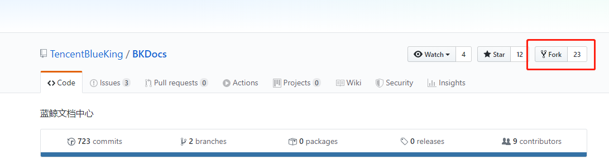
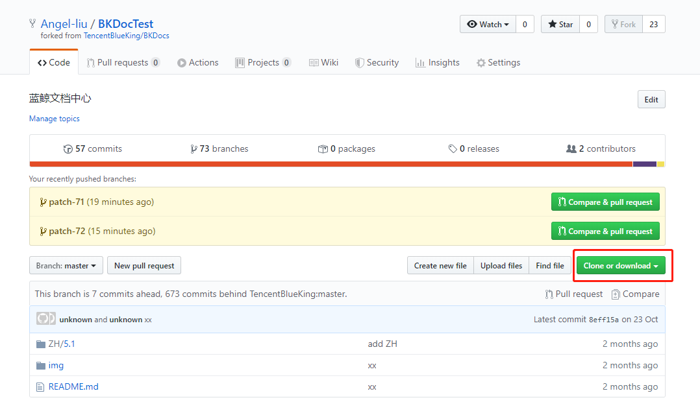
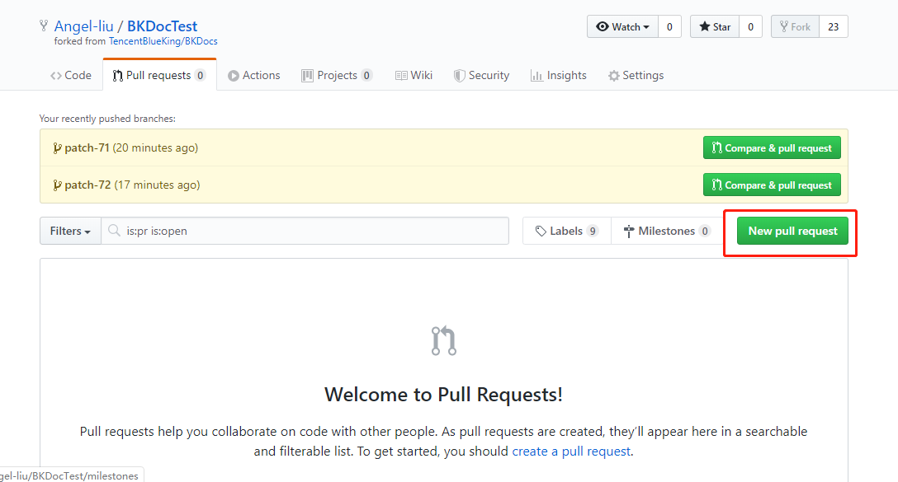

## 上传新的图片、文件操作步骤

如果修改文档需要上传新的图片，或者新的 md 文档，那么 GitHub 自带的页面编辑器就不再适用了。这时候我们需要把项目 pull 到本地进行修改。

下面是具体步骤：

1.如果没有 Fork 蓝鲸文档中心的仓库，首先 Fork 该 Git 仓库。[蓝鲸文档中心 GitHub](https://github.com/TencentBlueKing/BKDocs)



 <center> 图 1. Fork 文档 </center>

2. Fork  后，在你的账号下也会出现一个蓝鲸文档中心的项目。再将你自己账号下的蓝鲸文档中心项目 **Clone** 到本地。



 <center> 图 2. Clone 到本地 </center>

3. 在本地项目你就可以修改了，再修改之后再将项目 **push** 到自己账号下的文档仓库。之后便是关键的一步了，创建 **Pull requests** 。



 <center> 图 3. 创建 Pull requests </center>

4.之后提交 **pull requests** 的操作与[简单文字修改](5.1/文档共建/文档编辑步骤/简单文字修改.md)操作一样。

审核通过后会将你修改的内容展示到官网文档中心。


**注意：**

如果是再次在本地更新文档，需要在更新前同步官方文档中心仓库的内容。否则提交 **pull request** 容易发生冲突，导致不能  **merge** 。

同步官方库内容步骤 （以下步骤在本地文档项目下操作 ）：

```bash
# gitbash
# 第一步，添加远程仓库。
git remote add blueking https://github.com/TencentBlueKing/BKDocTest.git
# 第二部，同步仓库内容。
git pull blueking master
```
