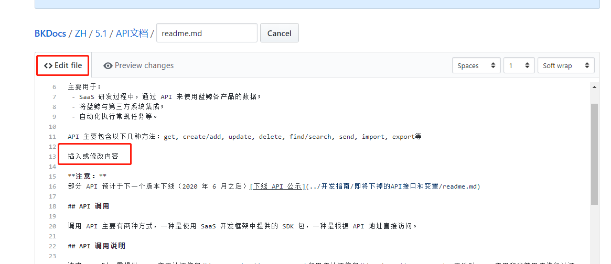
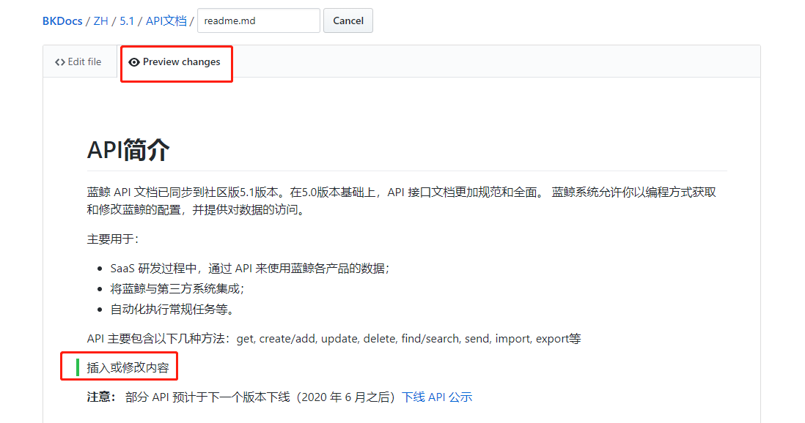
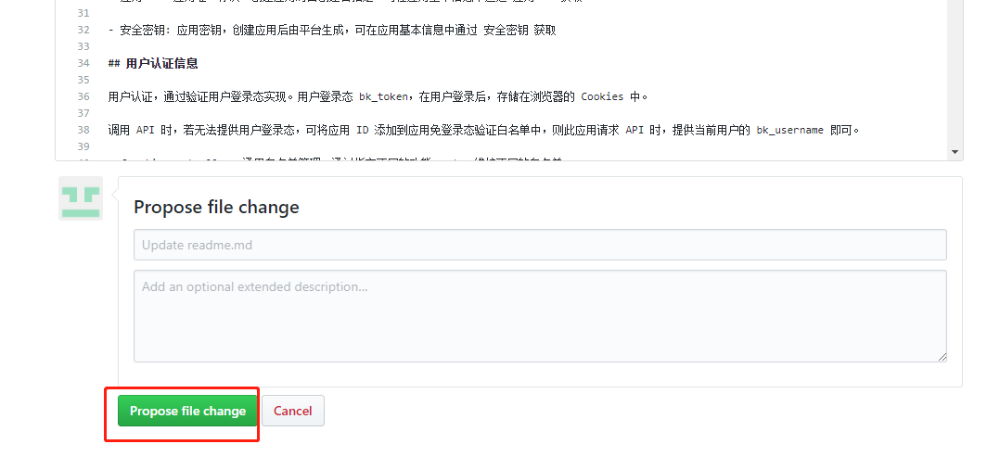
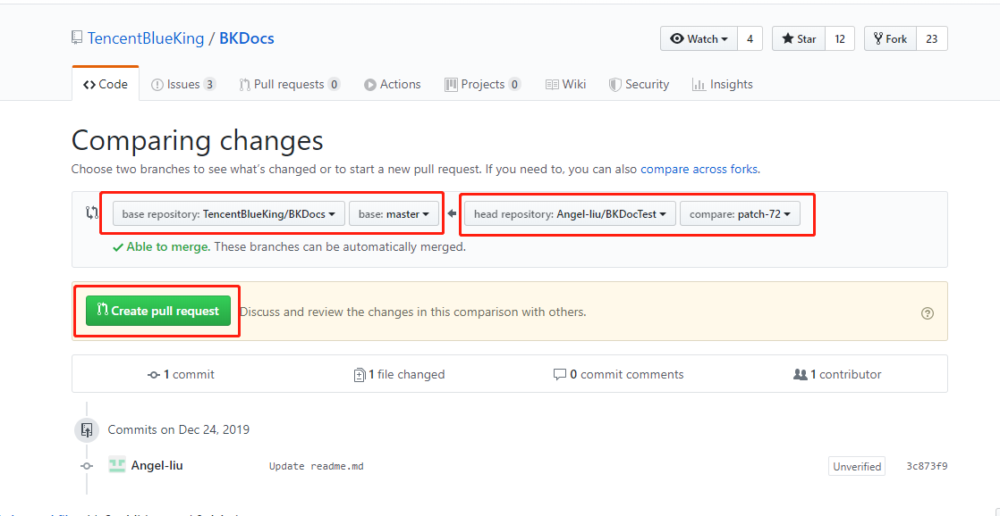
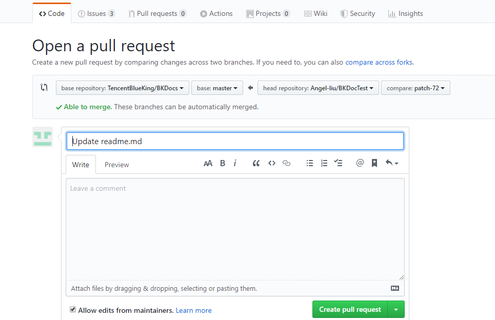

# 简单文字修改操作步骤

1.当您需要编辑文档内容是，只需要在单击文档页面右上角的**编辑**按钮，打开 GitHub 上对应文档。

 
图 1. 编辑开源文档 

2.在GitHub页面，单击进入编辑状态。

3.在编辑框 **Edit file** 中修改文档内容，可以在单击上方或底部的  **Cancel** 取消保存 。

 
 图 2. 编辑内容 

4.在预览框 **Preview changes** 中确认修改结果。

 
 图 3. 预览结果 

5.确认无误后，在**Propose file change**框中填写修改意见后，单击**Propose file change**提交修改建议

   

6.确认是从自己的库 master 到 **Tencent BlueKing** 的库，之后但单击 **Create pull request** 。

7.最终再点击一次 **Create pull request** ，即完成意见提交。

