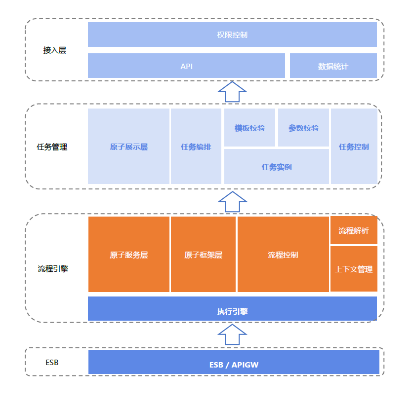

# 产品架构图

标准运维后台使用 Python 作为开发语言，使用 Django 开发框架；前端使用 Vue 开发页面，使用 jQuery 开发原子，通过配置式的开发模式，不断降低用户开发原子前端表单的难度。

标准运维的产品结构如图所示：

- 接入层：包含权限控制、API 接口和数据统计等；

- 任务管理层：主要对应标准运维的任务编排和任务控制功能，任务编排包含基础单元标准插件框架和标准插件展示层，任务控制包括创建任务实例的模板校验和参数校验，以及任务实例执行时给用户提供的操作接口如暂停、继续、撤销任务等；

- 流程引擎层：负责解析上层的任务实例，映射节点标准插件对应的服务，并通过底层的蓝鲸服务总线（ESB）调用其他系统的 API（如配置平台的创建集群，作业平台的快速执行脚本等），流程引擎层还包括了具体的任务执行引擎和流程控制、上下文管理等模块。
