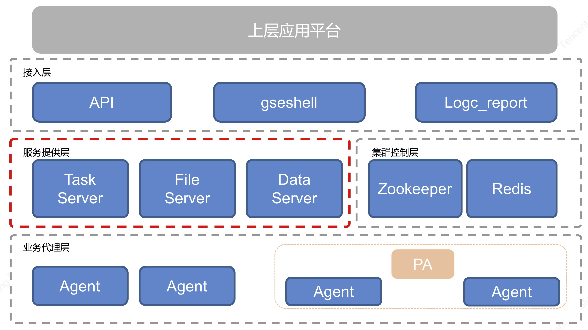

# 产品架构图

从网络框架层面来看，蓝鲸管控平台分为两层网络架构，分别为 **服务层** 和 **业务代理层** ，服务层由三种不同类型的服务集群构成：控制任务执行的 TaskServer 集群、负责数据采集传输服务的 DataServer 集群以及提供文件高速传输服务的 FileServer 集群，业务代理层则是部署在业务服务器上的蓝鲸Agent，承载了服务层提供的三种服务。

**Agent**：蓝鲸智能 Agent，可以安装在业务需要管控的 **实体机、虚拟机或者容器里面** ，BK Agent 是蓝鲸管控平台提供三大服务能力的实际执行者。

**PA**：蓝鲸管控平台跨云代理节点，为云区域 BK Agent 提供代理转发服务，提供跨云区域机器管控能力。

**TaskServer**：蓝鲸管控平台任务及控制服务端程序，该程序提供对集群内 Agent 的管理能力，并支持对 Agent 批量下发和执行发命令或脚本。

**FileServer**：蓝鲸管控平台文件传输控制服务端程序，该程序对指定范围内 Agent 节点提供 BT 种子服务，保证对传输的安全性、不同区域及业务模块间的隔离性，并控制 BT 传输在有限的贪婪特性范围内。

**DataServer**：蓝鲸管控平台数据传输服务端程序，该服务端主要提供对 Agent 采集的数据进行汇聚、分类、流转能力。对于普通的千兆网卡机器，BK DataServer 能够提供百兆级别的数据处理能力。

**Redis**：Redis 在本系统中提供工作区数据缓存作用。

**Zookeeper**：Zookeeper 主要提供对集群的管理能力，包括集群中不同节点间的相互发现，有效性探测等。
