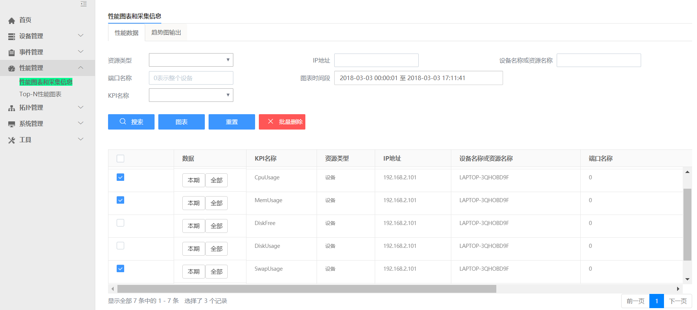
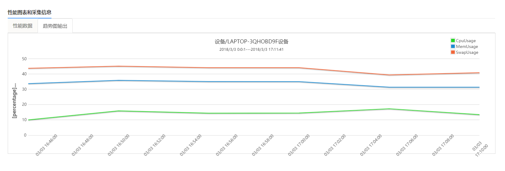

# 性能图表

系统内置支持采集网络设备的以下 KPI：

- 内存利用率

- CPU 利用率

- 端口流量

内置支持采集 Linux，Windows 服务器（已配置 snmp）的以下 KPI：

- CPU 利用率

- 内存利用率

- 端口流量

- 磁盘利用率

- 磁盘 IOPS

可以将不同设备，不同端口，不同 KPI 的数据任意组合在一起展现，从而可以进行各种横向比较，如下图所示：

