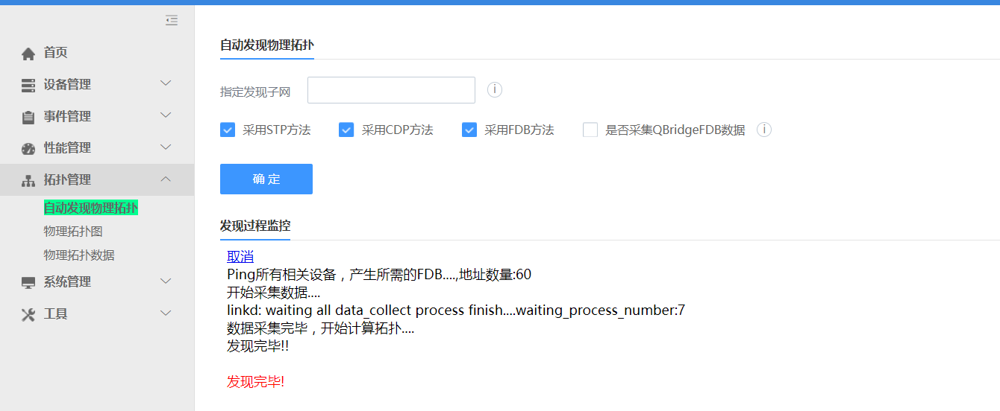

# 常见问题

## 如何开通设备的 snmp 和 syslog 服务

网络设备需要开通和设置好 snmp 和 syslog 服务，才能纳入监控管理。有 3 种情况：

- 请求网络管理员用手工方式开通和设置 Cisco，华为，H3C 等网络设备的 snmp 和 syslog 服务

- Linux 和 Windows 的 snmp 设置可参考系统的“开通 snmp 和 syslog” 功能页面中的说明

- 使用“开通 snmp 和 syslog”功能页面，采用 ssh 方式一台台开通设备的 snmp 和 syslog 服务

## 如何自动发现设备及其模块

首先设备要开通 snmp 服务。然后在“自动发现设备”页面中，输入起始 IP 地址和终止 IP 地址，点击“确认”，如下图所示。发现过程会提示本次新发现了多少设备，重新发现了多少设备。如果是重新发现的设备，可能会同时发现出设备名称的改变，也会做出提示，并生成一条事件信息。

发现完毕后，可以转到“设备信息”页面中查询新发现设备的详细信息。

## 如何自动发现物理拓扑和调整物理拓扑

系统采用了 CDP,STP 和 FDB 三种发现方式，以尽可能完整准确的发现异构网络环境的真实的物理拓扑结构。
选择“自动发现物理拓扑”菜单项，出现下面的页面：

然后**不要输入任何信息**，再直接点击“确认”，将显示发现过程，发现信息会提示本次发现的（新的或修改的）物理连接信息。发现完毕后，可转入“物理拓扑图”，查看物理拓扑。

 **没有进行拓扑图的发现前，物理拓扑图中显示的是散列的各个设备**。
 **物理拓扑图初始是没有进行布局调整的界面，所以会显得比较零乱，此时需要进行手工调整布局，然后保存下来即可**。

## 如何请求和使用其他应用功能

社区版提供了网络管理基本和实用的功能，能满足日常基本上的网络监控管理需要。而其他工作则需要升级到企业版或云版，它们提供了更为全面的功能，如：

- 统计报表

- 拓扑连接的手工可视化调整

- 客户化的 KPI 定义

- 客户化的阀值定义

- 流量管理

- 链路管理

- 专线管理

- 网络服务（ISM）管理

- 逻辑拓扑的自动发现

- 多租户支持
